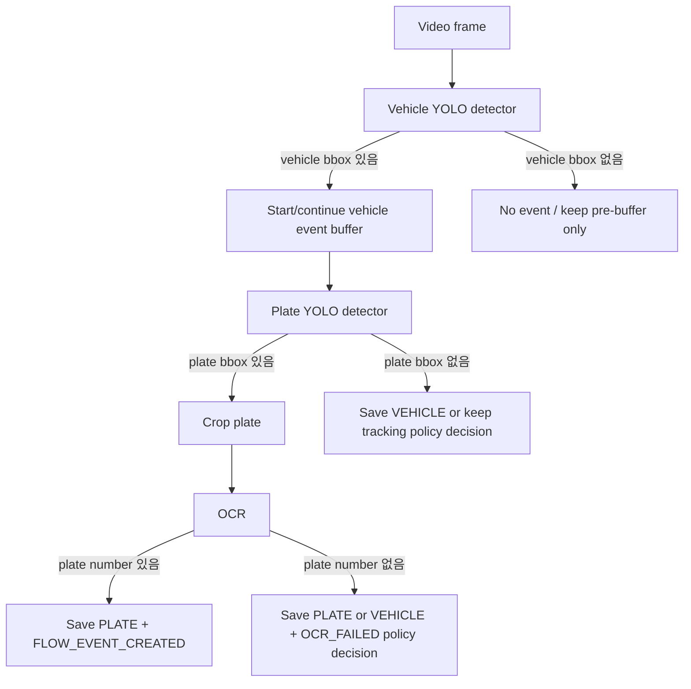

# Dual YOLO Vehicle + Plate Detection TODO

작성일: 2026-05-15

## 결정된 방향

현재 영상 이벤트는 번호판 YOLO 모델이 bbox를 잡은 경우에만 생성된다. 그래서 `detectionType`은 대부분 `PLATE`로 저장되고, 차량 자체를 감지한 결과인 `VEHICLE`은 실제로 만들어지지 않는다.

팀 협의 방향은 FastAPI 분석 파이프라인에 YOLO 모델을 2개 두는 것이다.

- 차량 탐지 모델: YOLO 기본/COCO 계열 모델을 사용해 `car`, `bus`, `truck`, `motorcycle` 같은 차량 객체를 탐지한다.
- 번호판 탐지 모델: 현재 커스텀 번호판 YOLO 모델을 유지한다.
- OCR 인식: 번호판 crop에 대해 기존 OCR을 수행한다.

즉, 최종 분석 단계는 `차량 탐지 -> 번호판 탐지 -> OCR`의 3단계가 된다.

## detectionType 정의

| detectionType | 의미 | 생성 조건 |
|---|---|---|
| `VEHICLE` | 차량은 감지됐지만 번호판은 확정하지 못함 | 차량 bbox 있음, 번호판 bbox 없음 또는 번호판/OCR 실패 정책상 차량 이벤트로 저장할 때 |
| `PLATE` | 번호판 후보가 감지됨 | 번호판 bbox 있음. OCR 성공 여부와 무관하게 번호판 객체 탐지는 성공 |
| `UNKNOWN` | 차량/번호판 모두 확정 불가 | 단건 이미지 분석에서는 가능하나, 영상 이벤트 저장에서는 일단 적극 사용하지 않음 |

주의: 영상 스트림에서 모든 미탐지 프레임을 `UNKNOWN`으로 저장하는 방식은 보류한다. 로그가 과도하게 늘고 이벤트 테이블 의미가 흐려질 수 있기 때문이다.

## 목표 이벤트 흐름



## 추천 정책

1. 이벤트 트리거 기준은 차량 bbox로 전환한다.
   - 현재는 번호판 bbox가 이벤트 시작 조건이다.
   - 차량 bbox를 기준으로 이벤트를 만들면 번호판이 작거나 흐려도 “차량 통과” 자체는 잡을 수 있다.

2. OCR 성공 시에는 `PLATE + FLOW_EVENT_CREATED`로 저장한다.
   - 기존 차량 흐름/중복 방지/번호판 기반 vehicle 생성 로직을 그대로 활용할 수 있다.

3. 차량은 감지됐지만 번호판이 없거나 OCR이 실패한 경우는 우선 `VEHICLE + OCR_FAILED`로 저장하는 방향을 검토한다.
   - 이 경우 plateNumber는 `null`이다.
   - `vehicles`, `vehicle_flow_events`를 만들지는 않는다. 현재 Spring 검증 규칙상 plateNumber 없는 요청은 `OCR_FAILED`만 허용한다.
   - `detection_logs`와 `detection_analysis_results`에는 저장되어 “차량은 있었지만 번호판 인식 실패”를 확인할 수 있다.

4. `UNKNOWN`은 영상 스트림 이벤트에서는 최소 사용한다.
   - 차량 detector도 번호판 detector도 실패한 경우는 DB 저장하지 않는 것이 현재 구조에 더 맞다.
   - 필요하면 나중에 별도 stream 통계 테이블로 미탐지 카운트를 저장한다.

## FastAPI TODO

1. 설정 분리
   - `MODEL_PATH`를 번호판 모델 전용으로 이름 변경 검토: `PLATE_MODEL_PATH`
   - 차량 모델 설정 추가:
     - `VEHICLE_MODEL_PATH=models/yolov8n.pt`
     - `VEHICLE_YOLO_CONF_THRESHOLD=0.35`
     - `VEHICLE_YOLO_IOU_THRESHOLD=0.45`
     - `VEHICLE_YOLO_MAX_DET=10`
     - `VEHICLE_CLASS_NAMES=car,bus,truck,motorcycle`

2. 차량 detector 추가
   - 새 파일 후보: `fastapi-server/app/services/vehicle_detector.py`
   - 반환 모델 후보:
     - `VehicleDetection`
     - `VehicleDetectionBox`
   - bbox 좌표, confidence, class name을 포함한다.

3. 번호판 detector 이름 정리
   - 현재 `PlateDetector`는 그대로 유지 가능.
   - 다만 설정 이름은 plate 전용임을 명확히 하는 것이 좋다.

4. InferenceService 분기 변경
   - 현재: `plate bbox -> OCR -> DetectionResult`
   - 변경: `vehicle bbox -> plate bbox -> OCR -> DetectionResult`
   - 차량 bbox가 있으면 `VEHICLE` 결과를 만들 수 있게 한다.
   - 번호판 bbox가 있으면 `PLATE` 결과를 우선한다.

5. StreamEventService 트리거 기준 변경
   - 현재 stream event는 번호판 bbox 기준으로 tracking/finalize 된다.
   - 차량 bbox 기준으로 event buffer를 시작하고, 이벤트 종료 시점에 best frame 또는 top N frame에 번호판/OCR을 수행한다.
   - 부하가 크면 모든 프레임에 두 모델을 돌리지 말고 아래 최적화 중 하나를 적용한다.

6. 성능 최적화 후보
   - 1단계: 차량 YOLO는 업로드된 샘플 프레임에만 수행한다. 현재 `--fps`로 제어 가능.
   - 2단계: 차량 bbox가 잡힌 frame 또는 event finalize 시점에만 번호판 YOLO/OCR을 수행한다.
   - 3단계: 차량 bbox 영역 안에서만 번호판 YOLO를 수행해 입력 크기를 줄인다.
   - 4단계: CPU 환경에서는 `yolov8n.pt` 같은 nano 모델 우선 사용.
   - 5단계: 부하가 크면 dual YOLO를 보류하고 기존 plate-only + stream 통계 방식으로 fallback.

## Spring TODO

1. 현재 enum은 이미 `VEHICLE`, `PLATE`, `UNKNOWN`을 수용한다.

2. 저장 정책 확인
   - `VEHICLE + OCR_FAILED + plateNumber=null` 저장은 가능해야 한다.
   - flow event는 plateNumber가 있을 때만 생성한다.
   - 이 정책은 현재 구조와 잘 맞는다.

3. 화면 표시 검토
   - Vue 로그 화면에서 `VEHICLE`을 “차량 감지 / 번호판 미인식”으로 표시할지 확인한다.
   - `UNKNOWN`은 “미확인”으로 표시할 수 있으면 충분하다.

## Docker / 환경 TODO

1. 모델 파일 배치
   - 번호판 모델: `fastapi-server/models/best.pt`
   - 차량 모델: `fastapi-server/models/yolov8n.pt` 또는 컨테이너에서 자동 다운로드 가능한지 검토

2. `docker-compose.yml` 환경변수 추가
   - `PLATE_MODEL_PATH=/app/models/best.pt`
   - `VEHICLE_MODEL_PATH=/app/models/yolov8n.pt`
   - 기존 `MODEL_PATH`는 호환을 위해 당분간 유지하거나 plate model fallback으로 사용한다.

3. CPU 부하 측정
   - 테스트 명령은 처음에는 낮게 시작한다.
   - 권장 시작값:
     - `--fps 3`
     - `--jpeg-quality 65`
     - `--scale 0.35`
     - `--preview-bbox`

## 구현 시작 순서 추천

1. VehicleDetector 단독 구현과 단위 테스트
   - 가장 먼저 “기본 YOLO 모델로 차량 bbox가 나오는지”만 확인한다.
   - 이 단계에서는 OCR이나 stream buffer를 건드리지 않는다.

2. DetectionResult에 vehicle bbox 정보를 실을지 결정
   - Spring 저장에는 bbox 컬럼이 없으므로 필수는 아니다.
   - OpenCV GUI preview에는 차량 bbox와 번호판 bbox를 둘 다 보여주면 테스트가 쉬워진다.

3. InferenceService를 단건 이미지 기준으로 dual model 처리
   - `/api/detections/image`에서 차량/번호판/OCR 결과가 의도대로 나오는지 먼저 검증한다.

4. StreamEventService 트리거 기준을 차량 bbox로 교체
   - 여기서부터 실제 영상 이벤트 흐름이 바뀐다.
   - 기존 bbox trigger buffering 구조는 유지하되 trigger source만 plate에서 vehicle로 바꾼다.

5. 성능 측정 후 최적화
   - 차량 detector와 plate detector를 매 프레임 모두 실행하면 현재 노트북 CPU에서는 부담이 클 수 있다.
   - 실제 부하를 보고 “vehicle every sampled frame + plate only on candidate/finalize” 구조로 조정한다.

## 보류된 fallback

dual YOLO가 너무 느리면 최후 방안으로 아래 방향을 검토한다.

- 기존 번호판 YOLO 기반 이벤트 유지
- `UNKNOWN` 로그를 쌓지 않음
- 대신 stream 처리 통계 테이블을 별도로 만들어 처리 프레임 수, bbox 감지 수, OCR 성공/실패 수를 집계

이 fallback은 DB가 깔끔하고 부하가 낮지만, 차량 자체 감지 기능은 제공하지 못한다.

## 다음 컨텍스트 첫 작업

다음 작업자는 `VehicleDetector`를 먼저 추가하는 것부터 시작하는 것이 좋다.

권장 첫 PR/커밋 범위:

- `fastapi-server/app/services/vehicle_detector.py` 추가
- `fastapi-server/app/core/config.py`에 vehicle model 설정 추가
- `.env.example`, `docker-compose.yml`에 vehicle model path 추가
- vehicle detector 단위 테스트 추가

이 범위까지만 먼저 끝내면, dual YOLO가 실제 환경에서 돌아갈 수 있는지 빠르게 판단할 수 있다.

## 작업내용 정리

### 1. 현재 탐지 구조 확인

- 현재 FastAPI 영상 처리 흐름은 번호판 YOLO bbox를 기준으로 stream event를 시작하고 종료한다.
- 따라서 차량 탐지 기능은 아직 없고, 실제 DB에 저장되는 성공 이벤트는 대부분 `PLATE`가 된다.
- 번호판 bbox가 없는 프레임은 이벤트로 저장하지 않으므로 영상 테스트 중 `UNKNOWN` 로그가 거의 생성되지 않는다.

정리:

- `PLATE`: 현재 주 탐지 결과.
- `VEHICLE`: 차량 detector가 추가되기 전까지는 거의 생성되지 않음.
- `UNKNOWN`: 단건 이미지 분석에서는 의미가 있지만, 영상 stream에서는 미탐지 프레임을 전부 저장하지 않기로 보류.

### 2. detectionType 정책 정리

- `UNKNOWN` enum은 FastAPI/Spring/DB에 추가되어 수용 가능하다.
- 하지만 영상 스트림에서 미탐지 프레임을 `UNKNOWN`으로 계속 저장하면 DB 로그가 과도하게 늘 수 있다.
- 팀 협의 후, `UNKNOWN` 로그를 늘리는 방식 대신 차량 YOLO를 추가해 `VEHICLE` 결과를 실제로 만들 수 있게 하는 방향으로 결정했다.

추천 저장 정책:

- 차량 bbox 없음: DB 저장하지 않음.
- 차량 bbox 있음 + 번호판 bbox 없음: `VEHICLE + OCR_FAILED`.
- 차량 bbox 있음 + 번호판 bbox 있음 + OCR 실패: 정책 선택 필요. 우선은 `PLATE + OCR_FAILED` 또는 `VEHICLE + OCR_FAILED` 중 화면 설명이 쉬운 쪽으로 결정.
- 차량 bbox 있음 + 번호판 OCR 성공: `PLATE + FLOW_EVENT_CREATED`.

### 3. traffic_analysis_index 정리

- `traffic_analysis_index`는 로그를 계속 쌓는 테이블이 아니라 zone별 마지막 처리 위치를 저장하는 체크포인트 테이블이다.
- 같은 zone에서 테스트하면 row가 하나만 생성되고, 새 flow event가 생길 때 기존 row가 갱신되는 것이 정상이다.
- 현재 flow event 생성 시 `last_seq`, `last_log_id`, `last_log_time`, `fetched_time`을 갱신하도록 연결되어 있다.

테이블별 역할:

| 테이블 | 역할 |
|---|---|
| `detection_logs` | 원본 탐지 요청 로그 |
| `detection_analysis_results` | OCR/탐지 분석 결과 |
| `vehicle_flow_events` | 번호판 인식 성공 후 차량 흐름 이벤트 |
| `hourly_traffic_stats` | 시간별 집계 |
| `traffic_analysis_index` | zone별 마지막 처리 체크포인트 |

### 4. GUI 테스트 개선

- OpenCV GUI에서 720 표시 시 overlay 글자가 너무 크게 보이는 문제가 있었다.
- `stream_video_file.py`에서 표시 프레임 높이에 따라 글자 크기를 자동 조절하도록 개선했다.
- `--scale`은 GUI 표시 크기만 줄이고, 서버로 업로드되는 프레임 해상도는 줄이지 않는다.

권장 테스트 명령:

```powershell
.\.venv\Scripts\python.exe scripts\stream_video_file.py `
  --video ..\test-media\videos\sample.mp4 `
  --camera-code CAM_001 `
  --realtime `
  --preview-bbox
```

부하가 심하면 아래 옵션을 명시한다.

```powershell
.\.venv\Scripts\python.exe scripts\stream_video_file.py `
  --video ..\test-media\videos\sample.mp4 `
  --camera-code CAM_001 `
  --fps 3 `
  --jpeg-quality 65 `
  --scale 0.35 `
  --realtime `
  --preview-bbox
```

### 5. speed / stay_time 정리

- `vehicle_flow_events.speed`, `vehicle_flow_events.stay_time`은 아직 실제 계산 로직이 없다.
- 기존처럼 기본값 `0`으로 저장하면 “실제 속도 0 / 체류시간 0”처럼 오해될 수 있다.
- 그래서 추정 로직이 생기기 전까지는 `NULL`로 두고, 통계 집계 시 NULL 값은 평균 계산에서 제외하도록 변경했다.

향후 계산 후보:

- 같은 차량이 여러 카메라/zone을 통과한 시간 차이 기반 속도 추정.
- 같은 zone 안에서 IN/OUT 이벤트 시간 차이 기반 stay time 추정.
- 단일 카메라만 있는 경우에는 실제 속도 추정이 어렵기 때문에 보류하거나 별도 가정이 필요하다.

## 트러블슈팅

### 1. 영상 테스트에서 `UNKNOWN`이 안 생김

현상:

- DB에는 `PLATE`만 계속 저장되고 `UNKNOWN`이 거의 보이지 않는다.

원인:

- 현재 stream event의 시작 조건이 번호판 bbox이다.
- 번호판 bbox가 없으면 이벤트로 저장하지 않고 지나간다.
- 따라서 미탐지 프레임은 DB 로그로 남지 않는다.

판단:

- 현재 구조에서는 정상 동작이다.
- `UNKNOWN`을 억지로 저장하기보다 차량 YOLO를 추가해 실제 `VEHICLE` 결과를 만드는 방향이 더 적절하다.

### 2. `traffic_analysis_index` row가 하나만 생성됨

현상:

- 영상 테스트를 여러 번 해도 `traffic_analysis_index` row가 하나만 보인다.

원인:

- 이 테이블은 이벤트 이력 테이블이 아니라 zone별 체크포인트 테이블이다.
- 같은 zone이면 새 row를 추가하지 않고 기존 row를 갱신한다.

판단:

- 정상 동작이다.
- 이벤트 이력은 `vehicle_flow_events`, 탐지 이력은 `detection_logs`와 `detection_analysis_results`에서 확인한다.

### 3. 720 화질에서 번호판 인식률이 떨어지는 느낌

현상:

- 2160x1080 원본보다 720급 영상에서 번호판 인식이 덜 되는 것처럼 보인다.

원인:

- `--scale`만 줄인 경우는 GUI 표시만 줄어들기 때문에 인식률에 직접 영향이 없다.
- 하지만 영상 파일 자체를 720으로 낮추면 FastAPI가 받는 원본 프레임도 낮아진다.
- 번호판 crop 픽셀이 줄어들면 YOLO/OCR 모두 어려워질 수 있다.

판단:

- 성능 때문에 화면 표시만 줄일 때는 `--scale`을 사용한다.
- 인식률 검증은 가능한 한 원본 영상 해상도를 유지한 상태에서 진행한다.

### 4. GUI가 끊김

현상:

- GUI 영상 속 1초가 실제로 5~10초처럼 느리게 재생됨.

원인:

- CPU 환경에서 영상 표시, JPEG 인코딩, FastAPI 업로드, YOLO/OCR 처리가 동시에 진행된다.
- 사용 PC에는 CUDA GPU가 없고 Intel 내장 그래픽만 있다.

해결:

- `--fps 3`, `--jpeg-quality 65`, `--scale 0.35`, async upload 구조를 사용한다.
- 현재 기본값은 저사양 CPU 테스트에 맞춰 낮게 잡혀 있다.
- dual YOLO 추가 후에는 부하가 더 커질 수 있으므로 먼저 VehicleDetector 단독 성능을 측정해야 한다.

### 5. bbox가 늦게 따라오는 문제

현상:

- 차가 화면을 지나간 뒤에 bbox가 표시되어 의미가 떨어짐.

원인:

- FastAPI 응답은 YOLO/OCR 처리 이후 돌아오므로 GUI 프레임보다 늦다.
- 기존 preview delay 방식은 부드러움과 정확한 bbox 동기화 사이에서 한계가 있었다.

해결:

- OpenCV tracker를 사용해 서버 응답 bbox를 받은 뒤 현재 프레임까지 추적하도록 개선했다.
- 완벽한 위치 정합은 아니지만 GUI 부하를 줄이면서 bbox가 따라오는 느낌을 보완한다.

### 6. dual YOLO 부하 우려

현상:

- 차량 YOLO + 번호판 YOLO + OCR을 모두 수행하면 현재 PC에서 느려질 가능성이 높다.

원인:

- 현재 환경은 CPU inference 중심이다.
- 기존 번호판 YOLO/OCR만으로도 GUI와 함께 실행하면 부하가 있었다.

대응 순서:

1. VehicleDetector 단독 실행 시간 측정.
2. 차량 bbox가 있는 프레임에서만 plate detector 실행.
3. 차량 bbox crop 내부에서 plate detector 실행해 입력 범위 축소.
4. event finalize 시점 또는 top N frame에서만 OCR 실행.
5. 그래도 어렵다면 dual YOLO를 보류하고 plate-only + stream 통계 fallback을 검토.

### 7. Docker 재빌드 주의

FastAPI와 Spring 코드가 함께 바뀌면 아래처럼 재빌드한다.

```powershell
cd C:\jwdev\Traffic_Analytics_Proposal

docker compose build fastapi-server spring-backend
docker compose up -d fastapi-server spring-backend
```

프론트 표시까지 변경했다면 frontend도 포함한다.

```powershell
docker compose build frontend fastapi-server spring-backend
docker compose up -d frontend fastapi-server spring-backend
```

### 8. 테스트 전 DB/이미지 초기화

깨끗한 상태에서 다시 테스트하려면 아래를 사용한다.

```powershell
docker exec traffic-postgres psql -U postgres -d traffic -c "TRUNCATE TABLE detection_analysis_results, vehicle_flow_events, hourly_traffic_stats, traffic_analysis_index, detection_logs, vehicles RESTART IDENTITY CASCADE;"
```

```powershell
$target = Resolve-Path -LiteralPath 'C:\jwdev\Traffic_Analytics_Proposal\fastapi-server\storage\detections'
$root = Resolve-Path -LiteralPath 'C:\jwdev\Traffic_Analytics_Proposal\fastapi-server\storage'
if (-not $target.Path.StartsWith($root.Path, [System.StringComparison]::OrdinalIgnoreCase)) { throw "Refusing to clean outside storage: $($target.Path)" }
Get-ChildItem -LiteralPath $target.Path -Force | Remove-Item -Recurse -Force
```
