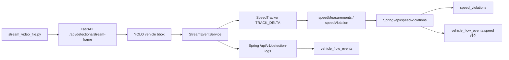

# Artifact 11 - 과속 탐지 최종 복기 및 팀 공유 자료

작성일: 2026-05-20

## 1. 이번 작업의 최종 목적

이번 작업은 기존 번호판 OCR 기반 차량 흐름 이벤트에 과속 탐지 기능을 붙이고, 테스트 영상 기준으로 속도 측정값이 실제처럼 나오도록 보정하는 것이 목적이었다.

최종 상태는 다음과 같다.

- FastAPI가 스트리밍 프레임에서 차량 bbox를 추적한다.
- bbox의 bottom-center 이동량으로 속도를 추정한다.
- homography 보정점이 있으면 이미지 좌표를 실제 평면 미터 좌표로 변환해 거리 품질을 높인다.
- 과속이면 Spring Boot의 `speed_violations` 테이블에 저장한다.
- Spring Boot는 과속 저장 성공 시 `vehicle_flow_events.speed`도 함께 갱신한다.
- 테스트 산출 이미지는 `fastapi-server/storage/detections`에 저장되며, 테스트 종료 후 삭제 대상이다.

## 2. 최종 채택된 방식

### TRACK_DELTA

처음에는 Line A/B를 차량이 통과하는 시점을 기준으로 속도를 재려 했다. 하지만 테스트 영상에서는 line 통과 순간이 불안정하고, 선을 화면에 계속 표시하는 것도 보기 좋지 않았다.

최종적으로는 `TRACK_DELTA` 방식을 기본값으로 채택했다.

- 차량 bbox의 bottom-center 위치를 추적한다.
- 일정 시간 동안 이동한 거리를 계산한다.
- `거리 / 시간 * 3.6`으로 km/h를 구한다.
- Line A/B는 호환용 설정으로 남아 있지만 기본 측정에는 사용하지 않는다.

### Homography

homography는 이미지 위 4개 점을 실제 평면 좌표 4개 점에 대응시키는 보정 방식이다.

예를 들어 영상 좌표의 사각형 ROI를 실제 도로의 14m x 14m 영역으로 가정하면, bbox 위치를 픽셀이 아니라 미터 좌표로 변환할 수 있다. 그래서 단순 픽셀 이동보다 속도 품질이 좋아진다.

현재도 실측 검증 전이므로 법적 단속값이 아니라 테스트/참고값이다. 다만 `distanceMeters` 고정값만 쓰던 방식보다 현장 보정에 가까운 구조다.

### ROI

ROI는 원래 특정 영역 안의 차량만 속도 측정 대상으로 삼기 위해 넣었다. 하지만 bbox가 ROI를 잠깐 벗어나면 화면상으로도 어색하고 추적이 끊길 수 있어, 현재 운용은 전체 화면 기준을 기본으로 둔다.

스크립트에서는 `--configure-speed-zone` 실행 후 Enter만 누르면 전체 프레임 ROI가 자동 설정된다. 직접 지정하고 싶으면 ROI 4점을 찍으면 된다.

## 3. 추가됐다가 정리된 것들

### Line A/B 직접 지정

처음에는 GUI에서 ROI 4점, Line A 2점, Line B 2점을 모두 찍는 방식이었다.

정리 후에는 Line A/B 직접 클릭은 제거했다. `TRACK_DELTA`에서는 선 통과가 핵심이 아니기 때문이다. 설정 JSON에는 호환용 line 값이 남지만, 기본 모드에서는 미리보기에도 선을 그리지 않는다.

### 로그 상세값

초기 튜닝 중에는 다음 값들을 로그에 붙였다.

- `[homography-est]`
- `mode=TRACK_DELTA`
- `dist=...`
- `elapsed=...`
- `accuracy=HOMOGRAPHY_ESTIMATED`

튜닝이 끝난 뒤에는 기본 로그를 줄였다.

현재 로그는 다음 정도만 남긴다.

```text
speed=VIOLATION:66.34/50.0 overSpeed=True speedSent=True
speed=36.0/50.0 overSpeed=False speedSent=False
```

`speedSent`는 과속 여부가 아니라 Spring Boot 과속 저장 성공 여부다.

## 4. 주요 데이터 흐름



## 5. Spring Boot 저장 정책

### vehicle_flow_events

`vehicle_flow_events`는 번호판 OCR이 성공하고 중복이 아닌 경우 생성된다.

이번 작업 전에는 `speed`, `stay_time` 컬럼이 있어도 실제로 채워지지 않았다. 최종 수정 후에는 과속 저장 성공 시 `vehicle_flow_events.speed`가 `measuredSpeed`로 갱신된다.

주의할 점:

- 과속이 아닌 정상 속도 차량은 아직 `vehicle_flow_events.speed`에 저장하지 않는다.
- 이미 저장돼 있던 기존 데이터는 자동 backfill되지 않는다.
- `stay_time`은 아직 계산 기준이 없어서 `NULL` 유지가 맞다.

### speed_violations

과속 저장은 `speed_violations`에 별도로 남긴다.

동일 flow event에 이미 과속 기록이 있으면 새로 만들지 않고 기존 기록을 반환한다. 그래서 같은 이벤트에 대해 중복 POST가 와도 멱등하게 처리된다.

## 6. 주요 용어 정리

| 용어 | 의미 |
| --- | --- |
| bbox | YOLO가 찾은 차량 박스 좌표 |
| bottom-center | bbox 하단 중앙점. 차량이 도로 위에 닿는 지점에 가깝다고 보고 추적 기준으로 사용 |
| ROI | 속도 측정 대상으로 삼을 화면 영역 |
| Line A/B | 예전 line crossing 방식의 가상 통과선. 현재 기본 모드에서는 호환용 |
| Homography | 이미지 좌표를 실제 평면 좌표로 변환하는 4점 보정 |
| TRACK_DELTA | 일정 시간 동안 bbox 기준점이 이동한 거리로 속도를 추정하는 모드 |
| speedSent | Spring Boot 과속 저장 API 호출 성공 여부 |
| flowEventId | Spring Boot `vehicle_flow_events`의 PK. 과속 저장 시 연결 키 |

## 7. 테스트 실행 명령

FastAPI 스크립트는 `fastapi-server` 디렉토리에서 실행한다.

```powershell
.\.venv\Scripts\python.exe scripts\stream_video_file.py `
  --video ..\test-media\videos\sample.mp4 `
  --camera-code CAM_001 `
  --fps 2 `
  --preview-fps 6 `
  --jpeg-quality 60 `
  --upload-scale 0.50 `
  --scale 0.22 `
  --preview-delay-seconds 10.0 `
  --bbox-hold-seconds 1.5 `
  --no-preview-tracker `
  --realtime `
  --preview-bbox `
  --video-speed-ratio 0.30
```

ROI/homography를 실행마다 직접 지정하려면 다음 옵션을 추가한다.

```powershell
--configure-speed-zone `
--roi-width-meters 14.0 `
--roi-height-meters 14.0 `
--speed-limit-kmh 50.0
```

Enter만 누르면 전체 화면 ROI로 시작한다. 4점을 찍으면 그 ROI가 이번 실행에만 적용된다.

## 8. 운영 및 커밋 전 체크리스트

- Docker 이미지는 Codex가 직접 빌드하지 않는다. 필요하면 사용자가 `docker compose up -d --build ...`를 실행한다.
- 테스트 후 DB 로그와 산출 이미지는 커밋 전에 비운다.
- `fastapi-server/storage/detections` 아래 생성 이미지는 커밋 대상이 아니다.
- `vehicle_flow_events.speed`는 과속 저장 이후에만 채워진다.
- `vehicle_flow_events.stay_time`은 아직 의도적으로 비워둔다.
- 실제 현장 적용 전에는 ROI/homography 기준점과 실제 도로 거리 측정값을 다시 잡아야 한다.

## 9. 남은 리스크

- homography의 `worldPointsMeters`는 현재 테스트용 값이다. 현장 차선/거리 실측이 없으면 절대 속도 정확도는 보장할 수 없다.
- 차량이 겹치거나 bbox가 튀면 track id가 바뀌면서 속도가 흔들릴 수 있다.
- 현재 `vehicle_flow_events.speed`는 과속 차량에 대해서만 채워진다. 전체 평균 속도 통계가 필요하면 정상 속도 측정값 저장 정책을 별도로 추가해야 한다.
- `stay_time`은 IN/OUT 매칭 또는 zone 진입/이탈 이벤트 정의가 생긴 뒤 구현하는 것이 맞다.
