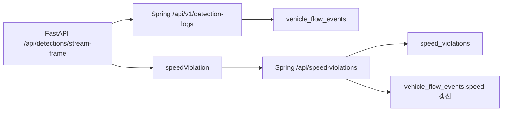

# Frontend Speed API Contract

작성일: 2026-05-21

## 목적

프론트 병합 전에 속도/과속 관련 API 계약과 표시 정책을 정리한다.

프론트 레이아웃 파일은 아직 전달받기 전이므로, 이 문서는 화면 구조가 아니라 백엔드 데이터 계약 기준으로 작성한다. 새 레이아웃에서도 아래 정책은 그대로 적용한다.

## 현재 확정된 데이터 흐름



1. FastAPI가 영상 프레임에서 차량 bbox를 추적하고 속도를 추정한다.
2. OCR 성공 또는 중복 감지 결과를 Spring `/api/v1/detection-logs`로 저장한다.
3. Spring 응답에 `flowEventId`가 있을 때만 FastAPI가 `/api/speed-violations`로 과속 기록을 보낸다.
4. Spring은 과속 기록 저장 성공 시 `speed_violations`를 생성하고 같은 `flowEventId`의 `vehicle_flow_events.speed`를 `measuredSpeed`로 갱신한다.

## 프론트 표시 정책

### 속도 표시 기준

과속 목록/과속 상세 화면:

- `speed_violations.measured_speed`
- API 응답 필드: `measuredSpeed`

차량 흐름 이벤트 화면:

- `vehicle_flow_events.speed`
- API 응답 필드: `speed`
- 현재는 과속 저장이 성공한 이벤트에만 값이 들어간다.

### 과속 여부 판단

현재 확정 기준:

- `speed_violations` 레코드가 있으면 과속 이벤트다.
- `speed_violations` 레코드가 없으면 과속 없음 또는 미측정으로 본다.
- FastAPI 로그의 `overSpeed=True`는 스트리밍 처리 중 측정된 과속 후보 신호다.
- DB에는 `overSpeed` 컬럼이 없으며, Spring 저장 이후에는 `speed_violations` 행 존재 여부와 `violationStatus`로 관리한다.

주의:

- `vehicle_flow_events.speed`가 `null`이면 정상 속도라고 단정하지 않는다.
- 현재 정상 속도 차량은 DB에 속도를 저장하지 않는다.

### 정상 속도 차량

현재 정책:

- 정상 속도 차량의 속도는 저장하지 않는다.
- 따라서 프론트에서 전체 차량의 속도 목록이나 평균 속도를 보여주려면 추가 백엔드 정책이 필요하다.
- 정상 속도 차량은 review 페이지에서 다루지 않는다.
- 정상 속도 차량은 추후 별도 교통 흐름 분석 페이지에서 미과속/과속 차량과 함께 데이터로 다룬다.

프론트 병합 전 권장:

- review 페이지는 `speed_violations` 기반 과속 후보만 표시한다.
- 정상 차량은 추후 교통 흐름 분석 UI에서 다룬다.

## 과속 심사 탭 정책

프론트에 "과속 확정 / 보류 / 미과속" 분류 탭이 있다면, `speed_violations`를 원천 데이터로 사용한다.

현재 DB 의미:

- `speed_violations`에 들어온 차량은 모두 "과속 후보"다.
- `measuredSpeed > speedLimit` 검증은 Spring 저장 시 이미 수행한다.
- 정상 속도 차량은 `speed_violations`에 저장하지 않는다.

현재 Spring enum 기준 매핑:

| 프론트 탭 | 상태 | 의미 |
| --- | --- | --- |
| 보류 | `UNPROCESSED` | 과속 후보가 들어왔지만 사람이 아직 확정하지 않음 |
| 과속 확정 | `NOTIFIED` | 과속으로 확정하고 고지/처리 완료 |
| 미과속 | `REJECTED` | 과속 후보였지만 사람이 검토 후 과속 아님으로 판정 |
| 종결/보관 | `CLOSED` | 처리 종료 |

적용 완료:

- 백엔드 enum과 상태 변경 API는 `REJECTED`를 포함한다.
- 프론트는 백엔드 필드명을 유지하고 표시 모델로 변환해 사용한다.

최종 탭 매핑:

| 프론트 탭 | 권장 상태 |
| --- | --- |
| 보류 | `UNPROCESSED` |
| 과속 확정 | `NOTIFIED` |
| 미과속 | `REJECTED` |
| 종결/보관 | `CLOSED` |

주의:

- 프론트에서 `measuredSpeed <= speedLimit`로 미과속을 판단하는 방식은 현재 구조와 맞지 않는다. Spring이 그런 요청을 저장 전에 거절한다.
- 미과속은 "속도 계산상 정상"이 아니라 "과속 후보였지만 사람 검토로 반려"라는 심사 상태로 정의하는 것이 맞다.
- `vehicle_flow_events.speed`만 보고 과속 확정/미과속을 결정하지 않는다.

### stayTime

현재 정책:

- `vehicle_flow_events.stay_time`은 미사용이다.
- 계산 기준이 없으므로 `NULL` 유지가 맞다.
- 프론트 표시에서 제외한다.

## Spring API

### 과속 목록 조회

```http
GET /api/speed-violations?start=2026-05-21T00:00:00&end=2026-05-21T23:59:59
Authorization: Bearer <token>
```

응답:

```json
{
  "success": true,
  "data": [
    {
      "violationId": 1,
      "flowEventId": 301,
      "vehicleId": 10,
      "cameraId": 1,
      "cameraName": "CAM_001",
      "plateNumber": "123가4567",
      "measuredSpeed": 72.35,
      "speedLimit": 50.0,
      "violationImagePath": "storage/detections/2026/05/21/CAM_001_frame.jpg",
      "confidenceScore": 0.9321,
      "plateCropImagePath": "storage/detections/2026/05/21/CAM_001_plate_crop.jpg",
      "plateCropImageUrl": "/static/detections/2026/05/21/CAM_001_plate_crop.jpg",
      "violationStatus": "UNPROCESSED",
      "violatedAt": "2026-05-21T15:20:00",
      "createdAt": "2026-05-21T15:20:01"
    }
  ],
  "message": "기간별 속도위반 이력 조회 성공"
}
```

프론트 사용 필드:

| 필드 | 용도 |
| --- | --- |
| `violationId` | 과속 레코드 key |
| `flowEventId` | 차량 흐름 이벤트 연결 key |
| `plateNumber` | 차량 번호 |
| `cameraName` | 카메라 표시명 |
| `measuredSpeed` | 표시 속도 |
| `speedLimit` | 제한 속도 |
| `confidenceScore` | OCR 신뢰도 원본값, DB와 API는 0~1 유지 |
| `plateCropImagePath` / `plateCropImageUrl` | 번호판 crop 이미지 표시 |
| `violationStatus` | 처리 상태 badge |
| `violatedAt` | 발생 시각 |
| `violationImagePath` | 증거 이미지 경로, URL 필드는 아직 응답에 없음 |

OCR 신뢰도 프론트 표시:

- `confidenceScore * 100` 후 소수점 1자리까지만 표시한다.
- 예: `0.9321` -> `93.2%`
- 원본 소수점 값은 DB/API에서만 유지하고 화면에는 노출하지 않는다.

현재 보안 상태:

- `GET /api/speed-violations...`는 Spring Security상 인증 필요다.
- 프론트 JWT 연결 전 임시 공개가 필요하면 별도 협의가 필요하다.
- `POST /api/speed-violations`는 FastAPI 내부 호출용이며 프론트에서 직접 호출하지 않는다.

### 차량별 과속 조회

```http
GET /api/speed-violations/vehicle/{vehicleId}
Authorization: Bearer <token>
```

응답 `data`는 `SpeedViolationResponse[]`이며 위 과속 목록과 같은 필드를 가진다.

### 카메라별 과속 조회

```http
GET /api/speed-violations/camera/{cameraId}
Authorization: Bearer <token>
```

응답 `data`는 `SpeedViolationResponse[]`다.

### 상태별 과속 조회

```http
GET /api/speed-violations/status/UNPROCESSED
Authorization: Bearer <token>
```

현재 enum:

```text
UNPROCESSED
NOTIFIED
REJECTED
CLOSED
```

프론트 표시 라벨 권장:

| 값 | 표시 라벨 |
| --- | --- |
| `UNPROCESSED` | 보류 |
| `NOTIFIED` | 과속 확정 |
| `REJECTED` | 미과속 |
| `CLOSED` | 종결/보관 |

### 과속 심사 상태 변경

```http
PATCH /api/speed-violations/{violationId}/status
Authorization: Bearer <token>
Content-Type: application/json
```

요청:

```json
{
  "violationStatus": "REJECTED",
  "reason": "장비 오류로 인한 오탐",
  "memo": "번호판과 속도 재검토 후 미과속 처리",
  "reviewer": "단속관리팀"
}
```

응답:

```json
{
  "success": true,
  "data": {
    "violationId": 1,
    "flowEventId": 301,
    "vehicleId": 10,
    "cameraId": 1,
    "cameraName": "CAM_001",
    "plateNumber": "123가4567",
    "measuredSpeed": 72.35,
    "speedLimit": 50.0,
    "violationImagePath": "storage/detections/2026/05/21/CAM_001_frame.jpg",
    "confidenceScore": 0.9321,
    "plateCropImagePath": "storage/detections/2026/05/21/CAM_001_plate_crop.jpg",
    "plateCropImageUrl": "/static/detections/2026/05/21/CAM_001_plate_crop.jpg",
    "violationStatus": "REJECTED",
    "reviewedManually": true,
    "latestReviewStatus": "REJECTED",
    "latestReviewReason": "장비 오류로 인한 오탐",
    "latestReviewMemo": "번호판과 속도 재검토 후 미과속 처리",
    "latestReviewedBy": "단속관리팀",
    "latestReviewedAt": "2026-05-21T15:25:00",
    "violatedAt": "2026-05-21T15:20:00",
    "createdAt": "2026-05-21T15:20:01"
  },
  "message": "Speed violation status updated."
}
```

프론트 탭에서 상태를 바꿀 때 이 API를 사용한다.

명시 보류 처리:

- `UNPROCESSED`를 다시 선택한 경우에도 PATCH를 호출한다.
- 백엔드는 `speed_violation_reviews`에 검증 이력을 저장한다.
- 프론트는 `reviewedManually=true`이고 `latestReviewStatus=UNPROCESSED`이면 목록 상태를 `보류`로 표시한다.
- 더 이상 프론트 localStorage로 명시 보류 상태를 보정하지 않는다.

### 기간별 과속 개수

```http
GET /api/speed-violations/stats/count?start=2026-05-21T00:00:00&end=2026-05-21T23:59:59
Authorization: Bearer <token>
```

응답:

```json
12
```

### 차량별 흐름 이벤트 조회

```http
GET /api/flow-events/vehicle/{vehicleId}
Authorization: Bearer <token>
```

응답:

```json
{
  "success": true,
  "data": [
    {
      "flowEventId": 301,
      "plateNumber": "123가4567",
      "zoneName": "강남구",
      "cameraName": "CAM_001",
      "flowDirection": "IN",
      "eventAt": "2026-05-21T15:20:00",
      "speed": 72.35,
      "stayTime": null
    }
  ],
  "message": "차량 통과 이력 조회 성공"
}
```

프론트 사용 정책:

- `speed`가 있으면 차량 흐름 이벤트의 추정 속도로 표시 가능하다.
- `speed`가 `null`이면 `미측정` 또는 `-`로 표시한다.
- `stayTime`은 표시하지 않는다.
- 이 응답만으로는 `isViolation`, `speedLimit`, `violationStatus`를 알 수 없다.

## FastAPI 응답 참고

영상 스트리밍 테스트 중 `/api/detections/stream-frame` 응답에는 아래 필드가 포함된다.

```json
{
  "streamStatus": "FINALIZED",
  "speedMeasurements": [
    {
      "trackId": 1,
      "measuredSpeed": 72.35,
      "speedLimit": 50.0,
      "distanceMeters": 14.0,
      "elapsedSeconds": 0.7,
      "isViolation": true,
      "isEstimated": true,
      "speedMode": "TRACK_DELTA",
      "accuracyLevel": "HOMOGRAPHY_ESTIMATED",
      "accuracyNote": "Estimated...",
      "measuredAt": "2026-05-21T15:20:00"
    }
  ],
  "speedViolation": {
    "measuredSpeed": 72.35,
    "speedLimit": 50.0,
    "isViolation": true
  },
  "speedViolationSent": true,
  "speedViolationSendError": null
}
```

주의:

- 이 응답은 스트리밍/디버그 확인용이다.
- 일반 프론트 화면은 Spring DB 조회 API를 기준으로 붙이는 것이 안정적이다.

## 현재 API gap

새 프론트 레이아웃에서 이벤트 테이블에 과속 badge를 바로 표시하려면 현재 API만으로는 불편하다.

현재 가능한 방식:

1. 과속 목록 화면은 `/api/speed-violations`만 사용한다.
2. 차량 흐름 상세는 `/api/flow-events/vehicle/{vehicleId}`를 사용한다.
3. 이벤트 목록 + 과속 여부를 한 테이블에 합치려면 프론트에서 `flowEventId` 기준으로 매핑하거나, 백엔드에 join DTO API를 추가한다.

권장 추가 API:

```http
GET /api/flow-events?start=...&end=...&cameraId=...&violationOnly=false
```

권장 응답 DTO:

```json
{
  "flowEventId": 301,
  "plateNumber": "123가4567",
  "cameraName": "CAM_001",
  "zoneName": "강남구",
  "flowDirection": "IN",
  "eventAt": "2026-05-21T15:20:00",
  "speed": 72.35,
  "isViolation": true,
  "measuredSpeed": 72.35,
  "speedLimit": 50.0,
  "violationStatus": "UNPROCESSED",
  "violationId": 1
}
```

이 API는 현재 구현되어 있지 않다. 프론트 요구 화면이 확정되면 추가 구현 여부를 결정한다.

## 빈 값 UI 처리 기준

| 상황 | 프론트 표시 |
| --- | --- |
| 과속 목록이 비어 있음 | `과속 이벤트 없음` |
| `speed`가 `null` | `미측정` 또는 `-` |
| `stayTime`이 `null` | 표시 제외 |
| `speedViolationSent=false` | 스트리밍 테스트 화면에서만 `과속 저장 실패` |
| `speedViolationSendError` 존재 | 스트리밍 테스트 화면에서만 에러 메시지 표시 |
| `violationImagePath` 없음 | 이미지 영역 숨김 또는 `이미지 없음` |

## DB 검증 SQL

최근 과속 저장과 flow event speed 갱신 확인:

```sql
SELECT
  sv.violation_id,
  sv.flow_event_id,
  sv.plate_number,
  sv.measured_speed,
  sv.speed_limit,
  sv.violation_status,
  vfe.speed AS flow_event_speed,
  vfe.stay_time,
  sv.violated_at,
  sv.created_at
FROM speed_violations sv
JOIN vehicle_flow_events vfe
  ON vfe.flow_event_id = sv.flow_event_id
ORDER BY sv.created_at DESC
LIMIT 20;
```

`speed_violations.measured_speed`와 `vehicle_flow_events.speed` 불일치 확인:

```sql
SELECT
  sv.violation_id,
  sv.flow_event_id,
  sv.measured_speed,
  vfe.speed AS flow_event_speed
FROM speed_violations sv
JOIN vehicle_flow_events vfe
  ON vfe.flow_event_id = sv.flow_event_id
WHERE sv.measured_speed IS DISTINCT FROM vfe.speed;
```

`stay_time`이 의도대로 비어 있는지 확인:

```sql
SELECT
  flow_event_id,
  speed,
  stay_time,
  event_at
FROM vehicle_flow_events
ORDER BY event_at DESC
LIMIT 20;
```

## 프론트 팀 전달 요약

- 과속 목록은 `GET /api/speed-violations?start=&end=` 기준으로 붙인다.
- 표시 속도는 과속 화면에서는 `measuredSpeed`를 사용한다.
- 차량 흐름 이벤트의 `speed`는 과속 저장 성공 시에만 채워지는 값이다.
- 정상 속도 차량의 속도는 현재 저장하지 않는다.
- 정상 속도 차량은 review 페이지에 표시하지 않는다.
- `stayTime`은 현재 미사용이므로 화면에서 제외한다.
- 이벤트 테이블에서 과속 여부를 한 번에 보여야 하면 백엔드 join API 추가가 필요하다.
- 현재 과속 조회 GET API는 인증이 필요하므로 JWT 연결 또는 임시 permitAll 협의가 필요하다.
- 심사 상태 변경은 `PATCH /api/speed-violations/{violationId}/status`를 사용한다.
