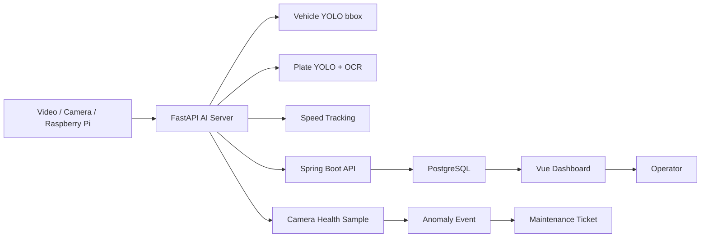
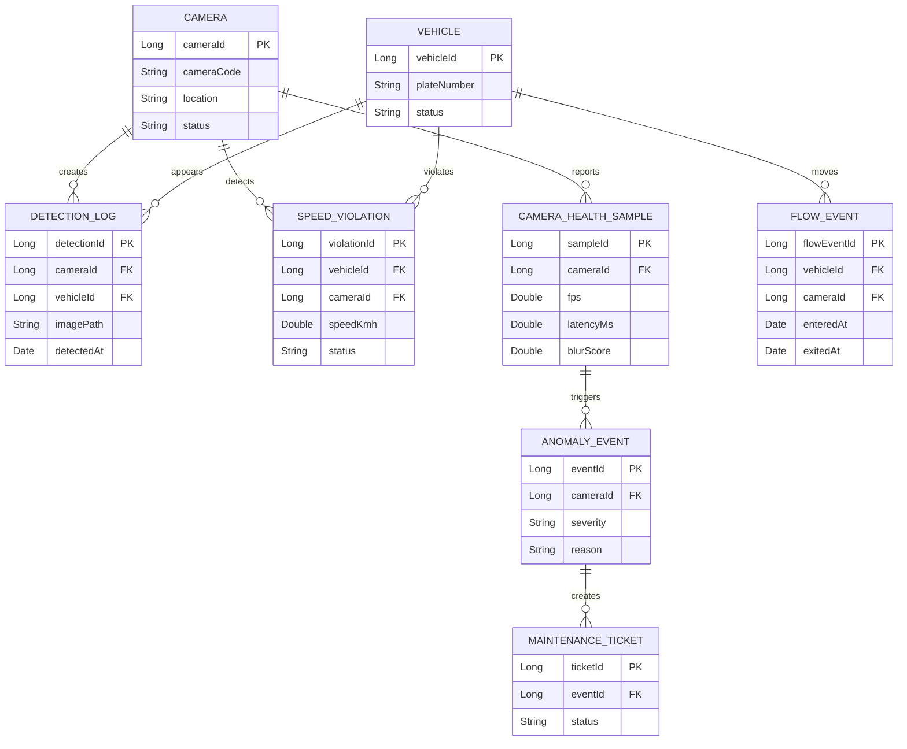

# Traffic Analytics Services

YOLO/OCR 기반 차량·번호판 인식, 과속 탐지, Spring Boot 저장 API, PostgreSQL 통계, Vue 관제 화면, 시계열 예지보전 확장을 포함한 교통 분석 서비스입니다. 단순 AI 추론 데모가 아니라 분석 결과를 API, DB, 대시보드, 운영 품질 관리 흐름으로 연결하는 데 초점을 둔 팀 프로젝트입니다.

## 1. 프로젝트 개요

- 프로젝트명: Traffic Analytics Services
- 개발 기간: 5~6개월차 팀 프로젝트
- 핵심 도메인: 교통 영상 분석, 번호판 OCR, 과속 위반 관리, 교통 통계, 카메라 상태 예지보전
- 개발 방식: Vue frontend, Spring Boot backend, FastAPI AI server, PostgreSQL, Docker Compose 분리형 구조
- 저장소: https://github.com/angela860807/Traffic_Analytics_Proposal

## 2. 주요 기능

- 카메라 영상 또는 테스트 영상에서 차량 bbox 감지
- 번호판 영역 탐지와 OCR 결과 추출
- 차량 흐름 이벤트, best frame, high-resolution OCR 처리
- 속도 계산과 과속 위반 이벤트 저장
- Spring Boot API를 통한 detection log, flow event, speed violation 저장
- PostgreSQL 기반 시간대별 통계와 차량/카메라별 조회
- Vue 기반 관제 대시보드와 부서별 화면 구성
- 카메라 FPS, frame drop, latency, blur 등 상태 지표 기반 예지보전 확장

## 3. 담당 역할

- FastAPI AI 서버와 Spring Boot 저장 API 간 request/response 데이터 계약 정리
- detection log, flow event, speed violation 저장 흐름 기준 API 통합 구조 검증
- 차량 bbox 이벤트, best frame, high-resolution OCR 흐름을 시연 가능한 파이프라인으로 정리
- Docker Compose 기반 실행 순서와 Swagger/FastAPI Docs 테스트 절차 문서화
- 예지보전 확장에서 health sample → anomaly event → maintenance ticket 흐름 설계 보조

## 4. 기술 스택

| 영역 | 기술 |
| --- | --- |
| Frontend | Vue 3, Vite, Pinia, Axios, ECharts, Leaflet |
| Backend | Java, Spring Boot, Spring Security, JPA, JWT, Swagger |
| AI Server | Python, FastAPI, OpenCV, YOLO, PaddleOCR |
| Database | PostgreSQL |
| Infra | Docker Compose |
| ML Extension | time-series feature, rule/trend detection, predictive maintenance pipeline |

## 5. 시스템 아키텍처



## 6. ERD



실제 table/entity 이름은 Spring Boot backend와 예지보전 확장 모듈 기준으로 확인합니다. README ERD는 핵심 데이터 흐름 요약입니다.

## 7. API 명세

### FastAPI AI Server

| 기능 | Method | Endpoint |
| --- | --- | --- |
| Health check | GET | `/health` |
| 모델 warmup | POST | `/api/detections/warmup` |
| 이미지 분석 | POST | `/api/detections/image` |
| 이미지 분석 후 저장 | POST | `/api/detections/image/send` |
| stream frame 처리 | POST | `/api/detections/stream-frame` |
| OCR 상태 조회 | GET | `/api/detections/stream-events/{event_id}/ocr-status` |
| high-res OCR 저장 | POST | `/api/detections/stream-events/{event_id}/highres-ocr` |
| Raspberry Pi frame 갱신 | POST | `/api/camera/frame` |
| Raspberry Pi latest image | GET | `/api/camera/latest.jpg` |
| Raspberry Pi live page | GET | `/api/camera/live` |

### Spring Boot API

| 기능 | Method | Endpoint |
| --- | --- | --- |
| 회원가입 | POST | `/api/auth/signup` |
| 로그인 | POST | `/api/auth/login` |
| 감지 로그 수신/조회 | POST/GET | `/api/v1/detection-logs` |
| 감지 로그 검색 | GET | `/api/v1/detection-logs/search` |
| 과속 위반 저장/조회 | POST/GET | `/api/speed-violations` |
| 과속 위반 상태 변경 | PATCH | `/api/speed-violations/{violationId}/status` |
| 시간대별 통계 조회/집계 | GET/POST | `/api/stats/hourly` |
| 카메라 등록/조회/수정 | POST/GET/PUT | `/api/cameras` |
| 구역 등록/조회/수정 | POST/GET/PUT | `/api/zones` |
| 차량 상세/상태 변경 | GET/PATCH | `/api/vehicles/{vehicleId}` |
| 차량 흐름 통계 | GET | `/api/flow-events/stats/count` |

### 예지보전 운영 API

| 기능 | Method | Endpoint |
| --- | --- | --- |
| 운영 요약 | GET | `/api/v1/predictive/summary` |
| 카메라 운영 상태 | GET | `/api/v1/predictive/cameras` |
| 카메라 상태 이력 | GET | `/api/v1/predictive/cameras/{cameraId}/health-history` |
| 이상 이벤트 목록/상세 | GET | `/api/v1/predictive/anomaly-events`, `/api/v1/predictive/anomaly-events/{eventId}` |
| 이상 이벤트 처리 | POST | `/api/v1/predictive/anomaly-events/{eventId}/acknowledge`, `/resolve`, `/dismiss` |
| 정비 건 목록/생성 | GET/POST | `/api/v1/predictive/maintenance-tickets` |
| 정비 담당자 후보 | GET | `/api/v1/predictive/assignees` |
| 정비 건 상태/이력 | POST/GET | `/api/v1/predictive/maintenance-tickets/{ticketId}/status`, `/histories` |
| 정책 조회/수정 | GET/PATCH | `/api/v1/predictive/policies`, `/api/v1/predictive/policies/{policyCode}` |

서버 간 내부 호출은 `X-Internal-Api-Key` 헤더로 검증합니다.

## 8. 실행 방법

프로젝트 루트에서 Docker Compose 실행을 권장합니다.

```powershell
docker compose up -d postgres-db spring-backend fastapi-server frontend
```

주요 URL:

- Frontend: http://localhost:5174
- Spring Boot: http://localhost:8080
- Spring Swagger: http://localhost:8080/swagger-ui/index.html
- FastAPI Docs: http://127.0.0.1:8000/docs

FastAPI만 로컬 실행:

```powershell
cd fastapi-server
.\.venv\Scripts\Activate.ps1
uvicorn app.main:app --reload --host 0.0.0.0 --port 8000
```

Frontend만 로컬 실행:

```bash
cd trafficAS-b
npm install
npm run dev
```

## 9. 테스트 / 검증 방법

FastAPI 회귀 테스트:

```powershell
cd fastapi-server
.\.venv\Scripts\python.exe -m py_compile scripts\stream_video_file.py app\api\routes\detection.py
.\.venv\Scripts\python.exe -m pytest tests\test_detection_api.py -q
```

Spring Boot 테스트:

```powershell
cd backend\traffic
.\gradlew.bat test
```

Docker 설정 검증:

```powershell
docker compose config --quiet
docker compose ps
```

예지보전 단독 시연 검증:

```powershell
docker compose up -d postgres-db spring-backend fastapi-server frontend

powershell -ExecutionPolicy Bypass -File .\tools\predictive_demo\check_health_demo.ps1
```

기대 결과:

- reset 직후 `REAL` 기준 이상 이벤트 0건, 정비 건 0건
- health sample import 후 `REAL` 기준 이상 이벤트 6건, 정비 건 3건
- `/admin/ops`에서 `admin@email.com / 1234`로 로그인 후 실데이터 기준 이상 이벤트 확인

YOLO/OCR 포함 전체 시연 검증:

- FastAPI Docs에서 stream frame, high-res OCR API 확인
- Spring Swagger에서 detection log, speed violation 저장/조회 확인
- Vue dashboard에서 통계와 이벤트 표시 확인
- 샘플 영상으로 bbox/OCR/과속 탐지 흐름 재현

## 10. 트러블슈팅

- 번호판 중심 이벤트만 사용하면 탐지를 놓칠 수 있어 차량 bbox 이벤트와 번호판 OCR을 분리한 Dual YOLO 흐름으로 정리했습니다.
- OCR 품질 저하를 줄이기 위해 저해상도 preview와 원본 best frame 기반 high-resolution OCR을 분리했습니다.
- FastAPI 내부는 `snake_case`, 외부 JSON/API 계약은 Spring/Vue와 맞추기 위해 `camelCase`로 정리했습니다.
- 예지보전 단계에서는 교통량 감소와 장비 이상을 구분하고, 이상 이벤트가 정비 이력으로 이어지도록 책임 경계를 잡았습니다.
- Docker Compose에서는 frontend, Spring backend, FastAPI, PostgreSQL 간 포트와 base URL을 명시적으로 분리했습니다.

## 11. 배포 / 링크

- GitHub: https://github.com/angela860807/Traffic_Analytics_Proposal
- FastAPI Docs(local): http://127.0.0.1:8000/docs
- Spring Swagger(local): http://localhost:8080/swagger-ui/index.html

백엔드/API/AI 서버가 함께 필요한 프로젝트라 Live Page보다 GitHub, Swagger/FastAPI Docs, 캡처, 시연 영상 중심으로 검증합니다.

## 12. 한계와 개선 방향

- 실제 도로 환경 데이터가 아니라 발표/시연용 영상과 샘플 데이터를 중심으로 검증했습니다.
- OCR과 속도 추정 정확도는 카메라 각도, 조명, 해상도, 번호판 가림에 영향을 받습니다.
- 예지보전 모델은 운영 API 교체가 아니라 구조 확장과 검증 파이프라인 중심입니다.
- 향후 실제 장비 데이터 수집, 모델 평가 지표, 알림 정책, 정비 티켓 워크플로우를 더 정교화할 수 있습니다.
