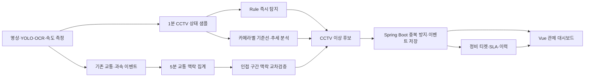

# TAS 2차 프로젝트 요구사항 정의서

## 1. 문서 정보

| 항목 | 내용 |
|---|---|
| 프로젝트명 | TAS-PM: AI 교통 관제 CCTV 예지보전 서비스 |
| 문서 버전 | 1.1 |
| 기준일 | 2026-06-09 |
| 구현 기간 | 2026-06-09 ~ 2026-06-19 |
| 기반 시스템 | TAS 1차 프로젝트 |

본 문서는 ERD, API 계약서, Frontend, Spring Boot, FastAPI 작업의 최상위 기준이다. 계약을 변경할 때는 6개 문서를 함께 수정한다.

## 2. 프로젝트 정의

### 2-1. 한 문장 정의

> 기존 TAS의 YOLO 차량 탐지, OCR, 속도·과속탐지 데이터를 유지하면서 CCTV와 영상·AI 처리 파이프라인의 상태를 시계열로 누적하고, 고장 징후를 조기에 탐지하여 정비 업무까지 연결하는 운영 서비스다.

### 2-2. 범위 구분

| 구분 | 역할 | 정비 이벤트 생성 |
|---|---|---|
| CCTV 예지보전 | 프레임, FPS, 지연, 화질, OCR 품질, CPU·메모리·네트워크 상태의 이상과 악화 추세 탐지 | 생성 |
| 교통 흐름 분석 | 차량 수, 평균 속도, 과속 건수 등 기존 관제 기능 제공 | 생성하지 않음 |
| 교통 맥락 교차검증 | 탐지량 감소가 실제 교통량 감소인지 CCTV·분석 장애인지 판별하는 보조 근거 | CCTV 이상 근거로만 사용 |

교통 혼잡, 사고, 우회 운행은 관제 대상이지만 장비 정비 대상은 아니다. MVP에서 교통 이상만으로 `MaintenanceTicket`을 만들지 않는다.

### 2-3. 사업적 가치

- 다수 CCTV를 사람이 상시 확인하는 비용을 줄인다.
- 완전 중단 전 성능 저하 추세를 발견하여 선제 점검 시간을 확보한다.
- 실제 교통량 감소와 카메라·AI 분석 장애를 구분해 오탐을 줄인다.
- 이상 발견, 확인, 담당자 배정, 조치, 복구까지 이력을 남긴다.
- 카메라별 반복 장애와 평균 확인·복구 시간을 산출해 교체 우선순위를 제시한다.

### 2-4. 대상 사용자

| 역할 | 주요 업무 |
|---|---|
| `USER` | 기존 교통 흐름과 과속 현황 조회 |
| `OPERATOR` | CCTV 상태·이상 확인, 이벤트 승인·종료, 티켓 발행 |
| `MAINTAINER` | 정비 티켓 수락, 조치, 복구 결과 기록 |
| `ADMIN` | 정책·권한·전체 운영 지표 관리 |

## 3. 구현 범위

### 3-1. MVP 필수 범위

- 카메라별 1분 상태 샘플 수집
- 5분 교통 맥락 집계
- Rule 기반 즉시 장애 탐지
- 카메라별 robust z-score 기반 평소 패턴 이탈 탐지
- 최근 추세 기반 향후 10분 임계치 도달 예측
- 인접 카메라 교통 맥락을 이용한 원인 교차검증
- CCTV Health Score와 상태 등급 제공
- 이상 이벤트 중복 방지, 확인, 복구, 종료
- CRITICAL 또는 지속 WARNING의 정비 티켓 자동 생성
- 담당자 배정, 상태 변경, 조치 이력, MTTA·MTTR 집계
- 운영 대시보드, 카메라 상세, 이상 이벤트, 정비 티켓 화면
- 실제·공개·시뮬레이션·장애 주입 데이터의 출처 구분

### 3-2. 선택 고도화

- Isolation Forest 결과 비교
- 날씨·조도 데이터 기반 화질 기준 보정
- 실제 고장 라벨 축적 후 LightGBM/XGBoost 고장 위험 분류
- 알림 채널 연동

LSTM AutoEncoder는 연구 후보이며 이번 완료 기준에 포함하지 않는다. 현재 일정과 데이터량에서는 설명 가능한 Rule, 통계, 추세 예측을 우선한다.

### 3-3. 제외 범위

- 차량 자체 고장 예측
- 교통사고 원인의 자동 확정
- 혼잡도만으로 정비 티켓 생성
- 운영자 승인 없는 자동 장비 재시작
- 공개 산업 설비 데이터로 학습한 모델의 운영 배포

## 4. 전체 업무 흐름



Frontend는 Spring Boot만 호출한다. FastAPI 내부 탐지 API는 브라우저에서 직접 호출하지 않는다.

## 5. 공통 데이터 정책

### 5-1. 데이터 Grain

| 데이터 | Grain | 주기 |
|---|---|---|
| `CameraHealthSample` | `cameraId + sampledAt` | 1분 |
| `TrafficContextSample` | `cameraId + zoneId + sampledAt` | 5분 |
| `AnomalyEvent` | 카메라 하나의 동일 이상 유형 | 이벤트 |
| `MaintenanceTicket` | 운영자가 처리하는 작업 하나 | 업무 |

원천 이벤트, 집계 샘플, 탐지 결과, 정비 결과를 같은 테이블에 저장하지 않는다.

### 5-2. 시간

- DB는 PostgreSQL `TIMESTAMPTZ`, Java는 `OffsetDateTime`을 사용한다.
- API는 ISO-8601 offset 형식만 허용한다.
- 예: `2026-06-09T14:05:00+09:00`
- 화면 표시는 `Asia/Seoul` 기준이다.
- 분석 기준은 서버 수신 시간이 아니라 `sampledAt`이다.
- 5분 구간은 시작 포함, 종료 제외다.
- 10분을 초과해 지연된 샘플은 저장하되 실시간 탐지에서는 제외한다.

### 5-3. 데이터 출처

```text
REAL
OPEN_DATA
SIMULATED
FAULT_INJECTED
MOCK
```

- 운영 기본 필터는 `REAL`이다.
- 비실제 데이터는 화면에 출처 배지를 표시한다.
- 다른 출처의 데이터는 하나의 기준선에 혼합하지 않는다.
- 공개 데이터는 교통 맥락 분석 검증에만 사용하며 CCTV 운영 기준선으로 사용하지 않는다.

### 5-4. 결측·품질

```text
COMPLETE
PARTIAL
INSUFFICIENT
```

- 데이터 없음과 측정값 `0`을 구분한다.
- 계산 불가 값은 `null`로 저장한다.
- 보간 값은 `isImputed=true`로 표시하고 장애 확정 근거에서는 제외한다.
- OCR 시도 20건 미만이면 OCR 실패율 이상을 확정하지 않는다.
- 최근 15분 중 유효 1분 샘플이 12개 미만이면 추세 예측을 실행하지 않는다.
- 기준선 표본이 30개 미만이면 상태를 `BASELINE_LEARNING`으로 표시하고 Rule만 적용한다.

### 5-5. 멱등성

- 상태 샘플: `UNIQUE(camera_id, sampled_at)`
- 교통 맥락: `UNIQUE(camera_id, zone_id, sampled_at)`
- 내부 수집 요청은 `idempotencyKey`가 필수다.
- 재전송은 새 행을 만들지 않고 upsert한다.

### 5-6. 기준선

- 카메라별, 30분 시간대별 기준선을 분리한다.
- 최근 14일의 `REAL`, `COMPLETE`, 정상 승인 샘플만 사용한다.
- 활성 이상 이벤트 구간, 장애 주입, 보간 샘플은 제외한다.
- 최소 30개 표본이 필요하다.
- 중앙값과 MAD를 저장·사용한다.

## 6. CCTV 예지보전 탐지 정책

### 6-1. 공통 Enum

탐지 대상:

```text
CAMERA
```

탐지 방식:

```text
RULE
ROBUST_Z_SCORE
TREND_PROJECTION
CROSS_VALIDATION
```

이상 유형:

```text
CAMERA_OFFLINE
FPS_DEGRADATION
FRAME_DROP_DEGRADATION
LATENCY_DEGRADATION
BLUR_DEGRADATION
OCR_QUALITY_DEGRADATION
RESOURCE_SATURATION
NETWORK_INSTABILITY
```

심각도:

```text
WARNING
CRITICAL
```

### 6-2. Rule 초기 기준

정책값은 DB에서 관리한다.

| 이상 유형 | WARNING | CRITICAL | 추가 조건 |
|---|---|---|---|
| `CAMERA_OFFLINE` | 해당 없음 | 마지막 프레임 60초 초과 | 즉시 이벤트 |
| `FPS_DEGRADATION` | FPS 10 미만 3분 | FPS 5 미만 3분 | 1분 샘플 |
| `FRAME_DROP_DEGRADATION` | 0.30 초과 3분 | 0.60 초과 3분 | 비율 0~1 |
| `LATENCY_DEGRADATION` | p95 2,000ms 초과 3분 | p95 5,000ms 초과 3분 | 1분 샘플 |
| `BLUR_DEGRADATION` | 0.75 초과 2분 | 0.90 초과 2분 | 높을수록 흐림 |
| `OCR_QUALITY_DEGRADATION` | 실패율 0.70 초과 2구간 | 0.90 초과 2구간 | 5분 OCR 시도 20건 이상 |
| `RESOURCE_SATURATION` | CPU 또는 메모리 85% 초과 5분 | 95% 초과 3분 | 분석 프로세서 단위 |
| `NETWORK_INSTABILITY` | RTT 500ms 초과 3분 | RTT 1,000ms 초과 또는 프레임 단절 | 네트워크 측정 가능 시 |

### 6-3. Robust z-score

```text
robust_z = (current - median) / (1.4826 * MAD)
```

- 카메라별 14일·동일 30분 시간대 기준선을 사용한다.
- 악화 방향으로 `|robust_z| >= 3.5`이면 WARNING 후보로 판단한다.
- `|robust_z| >= 5.0`이거나 Rule CRITICAL을 충족하면 CRITICAL 후보로 판단한다.
- MAD가 0이면 비율 변화 Rule로 대체한다.
- 기준선, 표본 수, detector version을 이벤트에 저장한다.

### 6-4. 추세 예측

목적은 이미 발생한 장애뿐 아니라 가까운 시간 안에 임계치에 도달할 악화 추세를 찾는 것이다.

| 항목 | 정책 |
|---|---|
| 입력 구간 | 최근 15분의 1분 샘플 |
| 최소 유효 표본 | 12개 |
| 평활화 | EWMA, `alpha=0.3` |
| 추세 | 강건 선형 기울기 |
| 예측 구간 | 향후 10분 |
| 신뢰도 기준 | `trendConfidence >= 0.60` |
| 후보 조건 | 악화 방향이며 10분 내 WARNING 또는 CRITICAL 임계치 도달 예상 |

이벤트에는 `trendSlope`, `trendConfidence`, `predictionHorizonMinutes`, `projectedThresholdCrossingAt`을 저장한다. 예측 이벤트는 실제 임계치 초과와 구분하여 화면에 `악화 예측`으로 표시한다.

### 6-5. 교통 맥락 교차검증

`TrafficContextSample`과 `camera_links`는 원인 판별 보조 자료다.

| 관측 | 판단 |
|---|---|
| 특정 카메라의 탐지량만 급감하고 인접 카메라는 정상이며 CCTV 지표가 악화 | CCTV·분석 장애 가능성 상향 |
| 여러 인접 카메라의 교통량이 함께 감소하고 CCTV 상태는 정상 | 실제 교통 상황 변화로 판단, 정비 이벤트 미생성 |
| OCR 성공률만 하락하고 차량 탐지량·영상 상태는 정상 | OCR 파이프라인 저하 후보 |
| FPS·지연·CPU가 동시에 악화 | AI 처리 과부하 후보 |

교통 맥락은 `CROSS_VALIDATION` 근거로 저장할 수 있지만 독립적인 `AnomalyEvent`를 만들지 않는다.

### 6-6. 원인 후보

```text
CAMERA_POWER_OR_NETWORK
CAMERA_LENS_OR_FOCUS
LOW_ILLUMINATION
AI_PROCESSING_OVERLOAD
OCR_PIPELINE_DEGRADATION
NETWORK_CONGESTION
EXTERNAL_TRAFFIC_CHANGE
INSUFFICIENT_DATA
UNKNOWN
```

시스템은 `suspectedCauses`만 제시한다. 운영자는 종료 시 `confirmedCause`를 입력한다.

## 7. 이벤트·정비 정책

### 7-1. 이상 이벤트

```text
OPEN
ACKNOWLEDGED
RECOVERED
RESOLVED
DISMISSED
```

```text
OPEN -> ACKNOWLEDGED
OPEN/ACKNOWLEDGED -> RECOVERED
OPEN/ACKNOWLEDGED/RECOVERED -> RESOLVED
OPEN/ACKNOWLEDGED -> DISMISSED
```

- 카메라·이상 유형별 활성 이벤트는 하나만 허용한다.
- 재탐지 시 `lastDetectedAt`, 점수, 심각도, 근거를 갱신한다.
- 정상 3회 연속이면 `RECOVERED`로 자동 변경한다.
- 30분 이내 재발하면 기존 이벤트를 다시 `OPEN`으로 전환하고 재발 횟수를 증가시킨다.
- `RESOLVED`는 `confirmedCause`와 해결 메모가 필수다.
- `DISMISSED`는 오탐 사유가 필수이며 모델 평가의 오탐으로 집계한다.

### 7-2. 정비 티켓

```text
OPEN
ASSIGNED
IN_PROGRESS
RESOLVED
CLOSED
```

| 우선순위 | 생성 조건 | 확인 SLA | 작업 시작 SLA |
|---|---|---:|---:|
| `P1` | CRITICAL 또는 카메라 오프라인 | 10분 | 30분 |
| `P2` | WARNING 15분 지속, 24시간 내 3회 재발, 10분 내 CRITICAL 도달 예측 | 30분 | 2시간 |
| `P3` | 운영자 수동 점검 | 4시간 | 1영업일 |

- 이상 이벤트 하나에 활성 티켓 하나만 허용한다.
- 모든 상태 변경은 append-only history에 남긴다.
- `RESOLVED` 변경 시 조치 내용이 필수다.
- `CLOSED`는 `OPERATOR` 또는 `ADMIN`만 수행한다.
- MTTA는 이벤트 발생부터 확인까지, MTTR은 이벤트 발생부터 복구까지 계산한다.

## 8. Health Score

| 지표 | 가중치 |
|---|---:|
| FPS | 20 |
| latency p95 | 15 |
| frame drop | 15 |
| OCR 실패율 | 15 |
| blur score | 15 |
| CPU·메모리 | 10 |
| network RTT·last frame | 10 |

- 각 지표를 정책의 정상·WARNING·CRITICAL 구간에 따라 0~100으로 정규화한다.
- 유효 지표가 4개 미만이면 점수는 `null`이다.
- `CAMERA_OFFLINE` 활성 시 점수는 0이다.

```text
NORMAL: 80~100
DEGRADED: 50~79
CRITICAL: 0~49
OFFLINE: CAMERA_OFFLINE 활성
BASELINE_LEARNING: 기준선 표본 부족
INSUFFICIENT_DATA: 계산 불가
```

## 9. 기능 요구사항

| ID | 요구사항 | 완료 조건 |
|---|---|---|
| FR-DATA-001 | FastAPI가 카메라별 1분 상태 샘플을 전송한다. | 재전송 시 중복 행이 생기지 않는다. |
| FR-DATA-002 | Spring Boot가 기존 탐지·OCR·과속 데이터를 5분 교통 맥락으로 집계한다. | 원천 시간 범위와 출처를 추적할 수 있다. |
| FR-DATA-003 | 출처, 품질, 결측 여부를 저장한다. | 실제·시험 데이터를 필터링할 수 있다. |
| FR-DET-001 | Rule로 즉시 CCTV 장애를 탐지한다. | 정책 임계치와 연속 횟수가 적용된다. |
| FR-DET-002 | 카메라별 robust z-score로 평소 패턴 이탈을 탐지한다. | 기준선 부족 시 Rule만 실행한다. |
| FR-DET-003 | 최근 15분 추세로 10분 내 임계치 도달을 예측한다. | 기울기·신뢰도·예상 시각이 저장된다. |
| FR-DET-004 | 교통 맥락으로 실제 교통 변화와 CCTV 장애를 교차검증한다. | 교통 맥락만으로 정비 이벤트를 만들지 않는다. |
| FR-EVT-001 | 탐지 후보를 중복 방지 정책에 따라 이벤트로 저장한다. | 활성 중복 이벤트가 없다. |
| FR-EVT-002 | 관측값, 기준값, 임계값, 버전, 원인 후보를 저장한다. | 상세 화면에서 판단 근거를 조회한다. |
| FR-EVT-003 | 정상 3회 연속 시 자동 복구 처리한다. | 복구 시각이 기록된다. |
| FR-MNT-001 | 심각도·지속시간·예측 위험에 따라 티켓을 자동 생성한다. | 이벤트당 활성 티켓은 하나다. |
| FR-MNT-002 | 배정, 상태, 조치, MTTA·MTTR을 관리한다. | 모든 변경이 history에 남는다. |
| FR-UI-001 | 카메라 Health Score, 상태, 예측 위험을 요약한다. | loading·empty·error 상태가 있다. |
| FR-UI-002 | 이상 이벤트를 필터·정렬·페이지 조회한다. | URL query와 화면 상태가 일치한다. |
| FR-UI-003 | 이벤트 상세에서 시계열·기준선·예측·교통 맥락을 비교한다. | 장애 판단 근거를 한 화면에서 확인한다. |
| FR-UI-004 | 티켓을 배정하고 상태와 조치 내용을 변경한다. | 권한·상태 전이를 위반할 수 없다. |
| FR-ADM-001 | 관리자가 탐지 정책을 조회·수정한다. | 변경자와 변경 시각이 기록된다. |
| FR-ML-001 | 모든 결과에 detector version을 기록한다. | 버전별 결과 비교가 가능하다. |

## 10. 비기능 요구사항

| ID | 요구사항 |
|---|---|
| NFR-PERF-001 | 100개 카메라의 1분 샘플 수집과 5분 분석을 처리한다. |
| NFR-PERF-002 | Rule 이벤트는 샘플 수신 후 60초 안에 생성한다. |
| NFR-PERF-003 | 목록·요약 API p95 응답시간은 로컬 PoC 기준 2초 이하로 한다. |
| NFR-SEC-001 | 내부 API는 `X-Internal-Api-Key`를 검증한다. |
| NFR-SEC-002 | 운영 API는 JWT와 역할 권한을 적용한다. |
| NFR-OBS-001 | requestId, cameraId, policyCode, detectorVersion을 구조화 로그에 남긴다. |
| NFR-DATA-001 | 샘플 90일, 이벤트·정비 이력 1년을 보관한다. |
| NFR-DATA-002 | 신규 스키마는 Flyway migration으로만 변경한다. |
| NFR-TEST-001 | Rule, 기준선, 추세, 중복, 상태 전이 테스트를 자동화한다. |
| NFR-REPRO-001 | `docker compose up`과 seed profile로 데모 시나리오를 재현한다. |

## 11. 모델·평가 정책

### 11-1. MVP detector

```text
Rule Detector
Robust Z-Score Detector
Trend Projection Detector
Traffic Context Cross Validator
```

Isolation Forest는 동일 테스트셋에서 비교만 한다. 실제 고장 라벨이 충분히 쌓인 뒤 LightGBM/XGBoost를 검토한다.

### 11-2. 평가

- 카메라와 시간을 함께 고려한 train/validation/test 분리
- 미래 데이터가 기준선·특징 윈도우에 섞이지 않도록 누수 방지
- Precision, Recall, F1, PR-AUC, ROC-AUC
- 카메라 1대·1일당 오탐 수와 false alarm rate
- 장애 주입 시점부터 탐지까지의 lead time
- 혼동행렬과 `DISMISSED` 비율
- detector version별 지표와 처리 지연

### 11-3. 데이터셋 사용

| 데이터 | 목적 | 운영 적용 |
|---|---|---|
| TAS 실제 실행 로그 | 카메라 기준선, 임계치, 처리 지연 검증 | 사용 |
| TAS 장애 주입 데이터 | 오프라인, FPS, 지연, 흐림, OCR, 자원 포화 재현 | 사용 |
| TAS 교통 이벤트 | 실제 교통 변화 교차검증 | 사용 |
| Caltrans PeMS | 교통 맥락 시계열 처리 실험 | 참고·변환 실험 |
| Numenta NAB | 시계열 평가 방식 참고 | 참고 |
| MetroPT-3, AI4I | 예지보전 분석 절차 학습 | 운영 모델 직접 적용 금지 |

## 12. 역할별 책임

| 담당 | 책임 |
|---|---|
| 전보경 | 총괄, 데이터 계약, ERD·Flyway, Docker·통합 QA |
| 박재웅 | FastAPI Rule·통계·추세 detector, Spring 연동 |
| 박지영 | 데이터셋·장애 주입·데이터 품질 검증, Frontend 지원 |
| 최동윤 | Vue 관제 대시보드, 이벤트·티켓 UX |
| 김승민 | Spring Boot 이벤트·티켓·SLA·MTTA/MTTR API |

## 13. 완료 기준

1. `CameraHealthSample`, `TrafficContextSample`, `AnomalyEvent`, `MaintenanceTicket`이 DB와 API로 연결된다.
2. 카메라 장애 시나리오 6종 이상을 재현한다.
3. Rule, robust z-score, 추세 예측 결과와 버전·근거가 저장된다.
4. 교통 맥락은 CCTV 원인 검증에 사용되고 독립 정비 이벤트를 만들지 않는다.
5. 동일 이상 이벤트와 티켓이 중복 생성되지 않는다.
6. CRITICAL과 지속·예측 WARNING에 티켓이 자동 생성된다.
7. 운영자가 티켓을 배정하고 조치·종료할 수 있다.
8. 실제·시뮬레이션·장애 주입 데이터를 화면에서 구분한다.
9. 핵심 자동 테스트와 Docker 데모 시나리오가 통과한다.
10. 발표에서 정확도만이 아니라 오탐 수, lead time, MTTA, MTTR을 제시한다.
