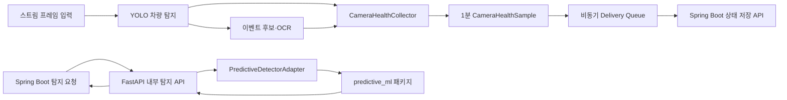

# TAS-PM FastAPI 예지보전 개발 Workflow

작성일: 2026-06-10

## 1. 문서 목적

2026-06-10 진행한 TAS-PM FastAPI 파트의 1~5번 작업을 코드 흐름에 맞춰 정리한다.

이 문서는 다음 컨텍스트에서 현재 구현 상태를 다시 분석하지 않고, AI 패키지 통합부터 바로 이어서 작업하기 위한 인계 문서다.

## 2. 커밋 제목

```text
feat(fastapi): CCTV 상태 수집·전송 및 예지보전 내부 탐지 API 구현
```

## 3. 오늘 완료한 범위

### 3.1 예지보전 환경설정

코드 수정 내용:

- `app/core/config.py`에 상태 수집 주기, Spring 전송 경로, timeout, retry, queue, processor, AI artifact 설정을 추가했다.
- `.env.example`에 실행 환경변수 예시를 추가했다.
- `CAMERA_ID_MAP_JSON`으로 기존 `cameraCode`와 Spring의 `cameraId`를 연결하도록 구성했다.

이유와 목적:

- 코드 수정 없이 로컬·Docker 환경을 전환하고, 과속탐지 설정과 예지보전 설정을 분리하기 위함이다.

결과 기대값:

- 환경변수만으로 상태 수집과 Spring 전송 기능을 켜고 끌 수 있다.

문법적 설명:

- `os.getenv()`로 문자열 환경변수를 읽고 `int()`, `float()`로 실행 타입을 변환한다.
- `json.loads()`로 카메라 ID 매핑을 구조화된 값으로 읽는다.

한 줄 요약:

1. 예지보전 실행에 필요한 환경변수와 카메라 ID 매핑을 추가했다.

### 3.2 Pydantic 요청·응답 계약

코드 수정 내용:

- `app/schemas/camera_health.py`를 추가했다.
- `app/schemas/predictive_detection.py`를 추가했다.
- 상태 샘플, Rule 평가, 기준선·추세 평가, SHADOW 결과, detector health 모델을 정의했다.

이유와 목적:

- Spring Boot와 AI 모델 사이의 필드명, Enum, 날짜, 값 범위를 FastAPI 진입 단계에서 고정하기 위함이다.

결과 기대값:

- JSON은 camelCase로 직렬화되고 계약에 없는 필드와 잘못된 값은 거부된다.

문법적 설명:

- `Field(alias=...)`로 Python snake_case와 JSON camelCase를 분리한다.
- `AwareDatetime`으로 timezone이 포함된 시각만 허용한다.
- `Literal`로 API Enum을 제한한다.
- `extra="forbid"`로 정의되지 않은 필드를 차단한다.

한 줄 요약:

1. 상태 수집과 탐지 API의 Pydantic 계약을 구현했다.

### 3.3 CCTV 1분 상태 수집기

코드 수정 내용:

- `app/services/camera_health_collector.py`를 추가했다.
- `stream_event_service.py`에서 프레임 처리 결과를 수집기에 기록한다.
- `inference_service.py`에서 OCR 시도·실패 결과를 기록한다.
- CPU, 메모리, 디스크 수집을 위해 `psutil` 의존성을 추가했다.

수집 지표:

```text
fpsAvg
frameDropRate
latencyP95Ms
blurScoreAvg
brightnessScoreAvg
detectionCount
ocrAttemptCount
ocrFailureCount
ocrFailRate
cpuUsagePct
memoryUsagePct
diskUsagePct
networkRttMs
lastFrameAt
qualityStatus
```

이유와 목적:

- 기존 YOLO·OCR 처리 흐름을 변경하지 않고 CCTV 처리 상태를 1분 시계열 데이터로 만들기 위함이다.

결과 기대값:

- 정상 window는 `COMPLETE`, 일부 부족은 `PARTIAL`, 프레임 미수신은 `INSUFFICIENT`로 구분된다.
- OCR 시도가 없으면 `ocrFailRate`는 `null`이다.

문법적 설명:

- `dataclass`로 카메라별 누적 상태를 관리한다.
- `threading.RLock`으로 동시 요청의 누적값 충돌을 막는다.
- `numpy.percentile(..., 95)`로 처리 지연 p95를 계산한다.

한 줄 요약:

1. 기존 영상 처리 결과를 카메라별 1분 상태 샘플로 집계하도록 연결했다.

### 3.4 Spring 상태 샘플 전송

코드 수정 내용:

- `app/services/backend_health_client.py`를 추가했다.
- `app/services/delivery_queue.py`를 추가했다.
- `main.py` lifespan에 수집·전송 worker의 시작과 종료를 연결했다.

전송 정책:

```text
timeout: 3초
retry: 최대 3회
backoff: 0.5초 기준 지수 증가
queue: 최대 1,000건
retry status: 429, 5xx, network error
```

이유와 목적:

- Spring Boot 장애가 YOLO·OCR 요청 처리를 지연시키지 않도록 상태 전송을 별도 background worker로 분리하기 위함이다.

결과 기대값:

- 재시도 중에도 기존 `sampledAt`, `idempotencyKey`, `X-Request-Id`가 유지된다.
- queue가 가득 차면 영상 처리는 유지하고 상태 샘플 drop 수치만 증가한다.
- 최근 정상 Spring 왕복 시간이 다음 샘플의 `networkRttMs`에 사용된다.

문법적 설명:

- `asyncio.Queue`로 요청 처리와 전송 작업을 분리한다.
- `asyncio.create_task()`로 수집·전송 worker를 실행한다.
- `httpx.AsyncClient`로 Spring API를 비동기 호출한다.

한 줄 요약:

1. 상태 샘플을 비동기 queue와 재시도 정책으로 Spring에 전송하도록 구현했다.

### 3.5 내부 탐지 API

코드 수정 내용:

- `app/api/routes/predictive_detection.py`를 추가했다.
- `app/services/predictive_detector_adapter.py`를 추가했다.
- `app/core/security.py`에 내부 API key 검증을 추가했다.
- `app/core/exceptions.py`에 계약형 오류 응답을 추가했다.

구현 endpoint:

```http
POST /internal/v1/anomaly-detection/camera-health/evaluate
POST /internal/v1/anomaly-detection/camera-degradation/evaluate
GET  /internal/v1/anomaly-detection/health
```

이유와 목적:

- Spring Boot가 AI 패키지를 직접 호출하지 않고 고정된 FastAPI 계약으로 탐지 결과를 받도록 만들기 위함이다.

결과 기대값:

- 내부 API key가 없거나 다르면 `401 UNAUTHORIZED`가 반환된다.
- AI 패키지가 없으면 평가 API는 `503 INTERNAL_DETECTOR_UNAVAILABLE`를 반환한다.
- AI 패키지가 없어도 FastAPI 서버는 시작되고 health는 `200 DEGRADED`를 반환한다.
- SHADOW 모델 결과는 `shadowCandidates`에만 포함된다.

문법적 설명:

- `Depends()`로 router 전체에 내부 인증을 적용한다.
- `run_in_threadpool()`로 동기 AI 연산이 이벤트 루프를 막지 않게 한다.
- `import_module("predictive_ml")`로 AI 패키지를 동적 로딩한다.

한 줄 요약:

1. Spring이 호출할 Rule·추세·health 내부 API와 AI adapter 경계를 구현했다.

## 4. 현재 데이터 흐름



## 5. 검증 결과

- 상태 샘플 계약 JSON 파싱과 camelCase 직렬화 확인
- timezone 없는 시각과 범위 오류 입력 거부 확인
- 정상 1분 window의 `COMPLETE` 생성 확인
- 프레임 누락률과 OCR 실패율 계산 확인
- 프레임 미수신 window의 `INSUFFICIENT` 생성 확인
- Spring 500 응답 후 재시도 성공 확인
- Spring 400 응답 미재시도 확인
- 재시도 중 멱등성 키와 request ID 유지 확인
- queue 포화 시 drop 수치 증가 확인
- 내부 API 인증 실패와 AI 패키지 미설치 응답 확인
- fake adapter 기반 Rule·추세·SHADOW 정상 응답 확인
- 기존 FastAPI 테스트 `64 passed`

## 6. 짧은 Troubleshooting

### 6.1 health가 계속 DEGRADED인 경우

원인:

- 현재 저장소에 `predictive_ml` 패키지가 없다.

확인:

```powershell
.\.venv\Scripts\python.exe -c "import predictive_ml"
```

대응:

- AI 파트가 전달한 wheel 또는 local package를 설치한 뒤 FastAPI를 재시작한다.

### 6.2 카메라 상태가 Spring으로 전송되지 않는 경우

확인할 환경변수:

```env
CAMERA_HEALTH_DELIVERY_ENABLED=true
CAMERA_ID_MAP_JSON={"CAM_001":1}
BACKEND_INTERNAL_API_KEY=<Spring과 동일한 키>
SPRING_BACKEND_BASE_URL=http://127.0.0.1:8080
```

주의:

- `CAMERA_HEALTH_DELIVERY_ENABLED` 기본값은 `false`다.
- `.env.example`만 수정되었으며 실제 `.env`와 Docker 환경은 별도로 반영해야 한다.

### 6.3 Windows에서 Asia/Seoul timezone 오류가 발생하는 경우

- collector는 `tzdata`가 없는 Windows 환경에서 `UTC+09:00`으로 대체한다.
- 다른 IANA timezone을 사용하려면 `tzdata` 패키지를 설치해야 한다.

### 6.4 queue의 현재 한계

- queue는 프로세스 메모리에만 존재한다.
- FastAPI가 종료되면 미전송 샘플은 복구되지 않는다.
- 최대 재시도 이후 실패한 샘플은 실패 수치만 증가하고 자동 재적재되지 않는다.

## 7. 다음 컨텍스트 TODO

### 우선순위 1. AI 패키지와 artifact 실제 통합

- [ ] AI 파트에서 `predictive_ml` wheel 또는 local package를 전달받는다.
- [ ] 실제 공개 함수의 인자 타입과 반환 타입을 확인한다.
- [ ] FastAPI Pydantic 객체를 AI 패키지 입력 객체로 명시적으로 변환한다.
- [ ] Rule과 degradation 결과를 실제 fixture로 검증한다.
- [ ] `predict_anomaly()` 결과가 `shadowCandidates`로만 반환되는지 확인한다.
- [ ] `get_detector_manifest()`의 package version과 detector version을 분리한다.

### 우선순위 2. LSTM artifact 시작 로딩

- [ ] `PREDICTIVE_MODEL_DIR`에서 `.pt`, scaler, threshold, feature schema를 읽는다.
- [ ] artifact SHA-256을 검증한다.
- [ ] feature 순서와 schema version이 다르면 추론을 거부한다.
- [ ] FastAPI lifespan에서 artifact를 한 번만 적재한다.
- [ ] artifact 오류를 health의 `DEGRADED` 또는 `DOWN` 상태에 반영한다.

### 우선순위 3. Spring·Docker 실행환경 반영

- [ ] 실제 `.env`에 camera ID 매핑과 전송 활성화 값을 추가한다.
- [ ] `docker-compose.yml`에 예지보전 환경변수를 추가한다.
- [ ] Docker 이미지에 `predictive_ml` wheel과 artifact를 포함한다.
- [ ] Spring의 `/internal/v1/camera-health-samples` 구현 상태를 확인한다.
- [ ] FastAPI와 Spring의 `BACKEND_INTERNAL_API_KEY` 값을 맞춘다.

### 우선순위 4. 오류·관측성 보강

- [ ] FastAPI 기본 `422` validation 오류를 공통 오류 계약으로 변환한다.
- [ ] requestId, cameraId, detectorVersion, 처리 시간을 구조화 로그로 남긴다.
- [ ] queue 성공·재시도·실패·drop 수치를 health 또는 metric endpoint에서 노출한다.
- [ ] 요청 body 크기 제한을 적용한다.

### 우선순위 5. queue 보존 정책 결정

- [ ] 최대 재시도 이후 샘플을 다시 queue에 넣을지 결정한다.
- [ ] 프로세스 재시작에도 보존해야 하면 SQLite 또는 파일 기반 spool을 검토한다.
- [ ] MVP가 메모리 queue만 사용한다면 데이터 유실 가능성을 발표 자료에 명시한다.

### 우선순위 6. 최소 테스트 3개 완성

- [ ] 1분 상태 집계·결측값·idempotency key 테스트
- [ ] AI artifact·feature schema·SHADOW 변환 테스트
- [ ] AI fixture와 Spring mock을 사용한 두 탐지 endpoint 인계 스모크 테스트

## 8. 다음 작업 시작점

다음 컨텍스트에서는 먼저 AI 파트 산출물의 실제 파일 위치와 공개 인터페이스를 확인한다.

AI 패키지가 아직 없다면 artifact loader와 adapter Protocol을 먼저 구현하고, fake fixture로 계약 테스트를 작성한다. AI 패키지가 도착했다면 `predictive_detector_adapter.py`의 실제 입력·출력 변환부터 연결한다.
