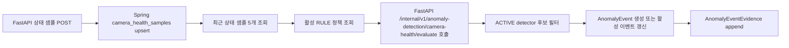

# TAS 2차 병합 수정 Workflow / Troubleshooting

작성일: 2026-06-18

## 0. 이번 단계 목표

이번 작업은 전체 예지보전 기능 완성이 아니라, 병합 즉시 깨지는 P0 계약을 먼저 줄이는 1단계 수정이다.

범위:

- FastAPI `Rule` 평가 요청 필드명을 API 계약서 ver2에 맞춤
- FastAPI adapter가 실제 `predictive_ml` dataclass 계약으로 변환하도록 수정
- 실제 `predictive_ml` dataclass 결과를 FastAPI API 응답 계약으로 정규화
- Spring Boot에 `POST /internal/v1/camera-health-samples` 수신 API 추가
- Spring Boot 상태 샘플 저장은 PostgreSQL `ON CONFLICT` upsert 사용

아직 하지 않은 범위:

- Spring Boot `/api/v1/predictive/**` 공개 API
- Spring Boot 5분 교통 맥락 집계 scheduler
- Spring Boot FastAPI 탐지 orchestration
- AnomalyEvent / MaintenanceTicket 전체 lifecycle
- demo/shared profile의 `ddl-auto=validate` 분리

## 1. 수정 파일 요약

### FastAPI

- `fastapi-server/app/schemas/predictive_detection.py`
  - `RulePolicy`의 `consecutiveWindows`를 제거하고 계약서 기준 필드로 변경
  - 추가 필드:
    - `warningConsecutiveWindows`
    - `criticalConsecutiveWindows`
  - evidence `context` 값 타입을 확장해 배열/객체형 근거도 받을 수 있게 조정

- `fastapi-server/app/services/predictive_detector_adapter.py`
  - FastAPI 요청 DTO를 그대로 `predictive_ml`에 넘기지 않도록 변경
  - `RuleDetectionInput` 변환:
    - 최신 상태 샘플을 `CameraSample`로 변환
    - 정책 코드 기준으로 metric별 consecutive window 계산
  - `DegradationDetectionInput` 변환:
    - 최신 상태 샘플을 `CameraSample`로 변환
    - API baseline을 `BaselineMetric` map으로 변환
    - 최근 상태 샘플을 metric별 `TrendPoint` list로 변환
  - `ModelPredictionInput` 변환:
    - 최근 상태 샘플 sequence를 `CameraSample` list로 변환
  - 실제 `predictive_ml`의 `DetectionResult`, `DetectionCandidate`, `Evidence`, `ShadowPredictionResult`를 API 응답 DTO 형태로 정규화
  - Rule detector가 sample 시각을 반환해도 API 응답의 `evaluatedAt`은 요청의 `evaluatedAt`으로 유지

- `fastapi-server/tests/predictive/test_predictive_adapter.py`
  - fake contract를 새 adapter 구조에 맞게 수정
  - 테스트 fixture의 Rule policy 필드를 ver2 계약명으로 변경

- `predictive_ml/fixtures/fastapi_handoff/camera_health_rule_warning_request.json`
  - `consecutiveWindows`를 `warningConsecutiveWindows`, `criticalConsecutiveWindows`로 변경

### Spring Boot

- `backend/traffic/src/main/java/com/example/traffic/controller/CameraHealthSampleInternalController.java`
  - 신규 추가
  - `POST /internal/v1/camera-health-samples`
  - `X-Internal-Api-Key` 검증
  - 응답은 계약서의 `{ sampleId, created }` 형태

- `backend/traffic/src/main/java/com/example/traffic/service/CameraHealthSampleIngestionService.java`
  - 신규 추가
  - camera 존재 여부 검증
  - `OffsetDateTime`을 서비스 기준 `Asia/Seoul LocalDateTime`으로 변환
  - 10분 초과 지연 샘플은 `is_late_sample=true`
  - `INSERT ... ON CONFLICT (camera_id, sampled_at) DO UPDATE ... RETURNING id, created` 방식으로 멱등 저장

### DB

- 이번 단계에서 DB migration 파일은 수정하지 않았다.
- 전제 schema:
  - `backend/traffic/src/main/resources/db/migration/007_predictive_maintenance_schema.sql`
  - `camera_health_samples` 테이블과 `UNIQUE(camera_id, sampled_at)` 제약이 필요하다.

## 2. 현재 실행 Workflow

### 2-1. DB 적용

현재 프로젝트에는 Flyway/Liquibase 자동 runner가 없다.

수동 적용 기준:

```powershell
docker compose up -d postgres-db

docker cp backend/traffic/src/main/resources/db/migration/007_predictive_maintenance_schema.sql traffic-postgres:/tmp/007.sql
docker cp backend/traffic/src/main/resources/db/migration/008_predictive_seed_policies.sql traffic-postgres:/tmp/008.sql

docker exec traffic-postgres psql -U postgres -d traffic -v ON_ERROR_STOP=1 -f /tmp/007.sql
docker exec traffic-postgres psql -U postgres -d traffic -v ON_ERROR_STOP=1 -f /tmp/008.sql
```

확인:

```powershell
docker exec traffic-postgres psql -U postgres -d traffic -c "\d camera_health_samples"
docker exec traffic-postgres psql -U postgres -d traffic -c "select detector_name, version, operating_mode, active from detector_versions;"
```

### 2-2. Spring Boot 빠른 확인

이번 수정 후 확인한 명령:

```powershell
cd backend/traffic
.\gradlew.bat compileJava
```

결과:

- `compileJava` 통과

### 2-3. FastAPI 빠른 확인

이번 수정 후 확인한 명령:

```powershell
python -m py_compile fastapi-server\app\schemas\predictive_detection.py fastapi-server\app\services\predictive_detector_adapter.py fastapi-server\tests\predictive\test_predictive_adapter.py
```

결과:

- Python 문법 compile 통과

주의:

- 현재 기본 Python 환경에는 `pydantic`이 없어 실제 FastAPI 테스트 실행은 하지 못했다.
- FastAPI 테스트는 프로젝트 의존성이 설치된 venv 또는 Docker 이미지 안에서 실행해야 한다.

## 3. 상태 샘플 수신 Smoke Test

Spring Boot와 DB가 떠 있고 007 migration이 적용된 뒤 다음 요청을 보낸다.

```powershell
$body = @{
  idempotencyKey = "camera-1-20260618T120000+0900"
  cameraId = 1
  processorCode = "edge-01"
  sampledAt = "2026-06-18T12:00:00+09:00"
  sampleWindowSeconds = 60
  fpsAvg = 11.2
  frameDropRate = 0.21
  latencyP95Ms = 1600
  blurScoreAvg = 0.42
  brightnessScoreAvg = 0.51
  detectionCount = 9
  ocrAttemptCount = 8
  ocrFailureCount = 2
  ocrFailRate = 0.25
  cpuUsagePct = 91.3
  memoryUsagePct = 74.1
  diskUsagePct = 61.5
  networkRttMs = 84
  lastFrameAt = "2026-06-18T12:00:58+09:00"
  dataSource = "REAL"
  qualityStatus = "COMPLETE"
  isImputed = $false
} | ConvertTo-Json

Invoke-RestMethod `
  -Method Post `
  -Uri "http://localhost:8080/internal/v1/camera-health-samples" `
  -Headers @{ "X-Internal-Api-Key" = "traffic-ai-internal-key-2026" } `
  -ContentType "application/json" `
  -Body $body
```

기대 응답:

```json
{
  "sampleId": 1,
  "created": true
}
```

같은 `cameraId + sampledAt`으로 다시 보내면 같은 row를 update하고 `created=false`가 나와야 한다.

## 4. Troubleshooting

### 4-1. `POST /internal/v1/camera-health-samples`가 404

가능 원인:

- Spring Boot 코드가 최신이 아님
- `CameraHealthSampleInternalController`가 compile/classpath에 포함되지 않음

확인:

```powershell
cd backend/traffic
.\gradlew.bat compileJava
```

### 4-2. 401 또는 403

가능 원인:

- `X-Internal-Api-Key` 누락 또는 값 불일치
- Spring 설정의 `app.api.internal-key`와 FastAPI `BACKEND_INTERNAL_API_KEY`가 다름

확인 위치:

- Spring: `backend/traffic/src/main/resources/application.yml`
- Docker: `docker-compose.yml`의 `BACKEND_INTERNAL_API_KEY`

### 4-3. `camera_health_samples` 테이블 없음

가능 원인:

- 007 migration 미적용
- 빈 DB volume에서 Spring만 먼저 실행됨

조치:

- 007/008 SQL을 수동 적용
- 시연 전에는 DB volume을 초기화할지 유지할지 결정

### 4-4. unique violation 발생

가능 원인:

- 같은 `idempotencyKey`를 다른 `cameraId + sampledAt` 조합으로 재사용
- 계약상 idempotency key는 샘플 고유키와 일관되어야 한다.

조치:

- FastAPI의 idempotency key 생성 규칙 확인
- 현재 규칙: `camera-{cameraId}-{sampledAt}`

### 4-5. FastAPI Rule 평가가 400 validation error

가능 원인:

- 요청 policy가 아직 구버전 `consecutiveWindows`를 사용

수정:

```json
{
  "policyCode": "FPS_DEGRADATION_RULE_V1",
  "warningThreshold": 10.0,
  "criticalThreshold": 5.0,
  "warningConsecutiveWindows": 3,
  "criticalConsecutiveWindows": 3
}
```

### 4-6. FastAPI가 `predictive_ml.* 입력 계약을 사용할 수 없습니다` 반환

가능 원인:

- FastAPI 컨테이너에 `predictive_ml` wheel이 설치되지 않음
- `fastapi-server/vendor/*.whl`이 비어 있음

확인:

```powershell
docker exec traffic-fastapi-server python -c "import predictive_ml; print(predictive_ml.__file__)"
```

조치:

- `predictive_ml` wheel을 빌드해서 `fastapi-server/vendor`에 넣거나
- Dockerfile에서 로컬 `predictive_ml` 패키지를 설치하도록 변경

## 5. 2단계 진행 내역: Spring Boot 공개 조회 API

2단계에서는 Frontend가 mock 없이 예지보전 조회 화면을 붙일 수 있도록 공개 조회 API 5개를 먼저 열었다.

추가 파일:

- `backend/traffic/src/main/java/com/example/traffic/controller/PredictiveDashboardController.java`
- `backend/traffic/src/main/java/com/example/traffic/service/PredictiveDashboardQueryService.java`

수정 파일:

- `backend/traffic/src/main/java/com/example/traffic/repository/AnomalyPolicyRepository.java`

추가된 endpoint:

```http
GET /api/v1/predictive/summary?dataSource=REAL
GET /api/v1/predictive/cameras?zoneId=3&healthStatus=DEGRADED&dataSource=REAL&page=0&size=20&sort=healthScore,asc
GET /api/v1/predictive/cameras/{cameraId}/health-history?from=2026-06-18T11:00:00%2B09:00&to=2026-06-18T12:00:00%2B09:00&dataSource=REAL
GET /api/v1/predictive/traffic-context?cameraId=1&zoneId=3&from=2026-06-18T00:00:00%2B09:00&to=2026-06-19T00:00:00%2B09:00&dataSource=REAL
GET /api/v1/predictive/policies?enabled=true
```

구현 방식:

- 최신 카메라 상태는 `camera_health_samples`의 카메라별 최신 row를 PostgreSQL `LATERAL` query로 조회한다.
- Health Score는 최신 샘플의 FPS, frame drop, latency, blur, OCR fail rate, CPU, memory, network RTT를 현재 정책 threshold에 가까운 고정 기준으로 점수화한다.
- 샘플이 없거나 유효 지표가 4개 미만이면 `INSUFFICIENT_DATA`로 응답한다.
- anomaly/ticket/model prediction 카운트는 현재 DB 원장 테이블 기준으로 집계한다.
- 조회 API는 Entity를 직접 반환하지 않고 기존 response DTO를 사용한다.

제한 사항:

- 아직 `AnomalyEvent` 생성 흐름이 연결되지 않았으므로 `openAnomalies`는 기존 DB에 들어온 값이 없으면 0이다.
- 아직 `TrafficContextSample` 집계 scheduler가 없으므로 `/traffic-context`는 샘플이 적재되어 있어야 응답 데이터가 나온다.
- Health Score는 1차 조회용 최소 구현이며, 계약서의 전체 가중치/정책 기반 정교화는 다음 단계에서 보강해야 한다.
- `/api/v1/predictive/**`는 `SecurityConfig` 기준 `OPERATOR`, `MAINTAINER`, `ADMIN` 권한 JWT가 필요하다.

2단계 검증:

```powershell
cd backend/traffic
.\gradlew.bat compileJava
```

결과:

- `compileJava` 통과

### 5-1. 공개 API Troubleshooting

#### `/api/v1/predictive/**`가 403

가능 원인:

- JWT가 없거나 role이 `OPERATOR`, `MAINTAINER`, `ADMIN`이 아님

확인:

- `backend/traffic/src/main/java/com/example/traffic/config/SecurityConfig.java`

#### `/api/v1/predictive/cameras`가 500

가능 원인:

- 007 migration이 적용되지 않아 `camera_health_samples`, `anomaly_events`, `model_prediction_logs` 테이블이 없음

조치:

- 007/008 migration 적용 후 Spring 재기동

#### `/api/v1/predictive/cameras` 정렬 요청이 400

허용 sort:

```text
cameraName, healthScore, latestSampledAt
```

예:

```http
GET /api/v1/predictive/cameras?sort=latestSampledAt,desc
```

#### `/api/v1/predictive/traffic-context`가 빈 배열

가능 원인:

- 아직 `traffic_context_samples`에 집계 데이터가 없음
- 5분 집계 scheduler는 다음 단계 작업 범위

조치:

- demo seed 또는 수동 insert로 `traffic_context_samples`를 먼저 채운다.

## 6. 3단계 진행 내역: Spring Boot Rule 탐지 orchestration

3단계에서는 상태 샘플 저장 후 즉시 Rule 평가를 FastAPI에 넘기고, ACTIVE detector 후보를 `AnomalyEvent`와 `AnomalyEventEvidence`로 저장하는 최소 흐름을 연결했다.

추가 파일:

- `backend/traffic/src/main/java/com/example/traffic/service/PredictiveRuleEvaluationOrchestrationService.java`
- `backend/traffic/src/main/java/com/example/traffic/service/PredictiveAnomalyEventIngestionService.java`

수정 파일:

- `backend/traffic/src/main/java/com/example/traffic/controller/CameraHealthSampleInternalController.java`
- `backend/traffic/src/main/java/com/example/traffic/client/PredictiveDetectionClient.java`
- `backend/traffic/src/main/java/com/example/traffic/domain/AnomalyEvent.java`
- `backend/traffic/src/main/java/com/example/traffic/repository/CameraHealthSampleRepository.java`
- `backend/traffic/src/main/java/com/example/traffic/repository/AnomalyEventRepository.java`
- `backend/traffic/src/main/java/com/example/traffic/repository/AnomalyPolicyRepository.java`

동작 흐름:



구현 기준:

- 상태 샘플 저장은 먼저 완료한다.
- Rule 평가 실패는 상태 샘플 저장을 롤백하지 않는다.
- FastAPI 호출 실패, 정책 seed 누락, detector version 누락 등은 warning log로 남기고 수집 응답은 유지한다.
- FastAPI 요청에는 최근 eligible 상태 샘플 최대 5개를 보낸다.
- eligible 조건:
  - 같은 `cameraId`
  - 같은 `dataSource`
  - `is_late_sample=false`
- 정책은 `anomaly_policies`에서 `detection_method=RULE`, `enabled=true`만 사용한다.
- 동일 카메라/이상유형의 활성 이벤트가 있으면 새 이벤트를 만들지 않고 기존 이벤트를 갱신한다.
- 활성 상태 기준:
  - `OPEN`
  - `ACKNOWLEDGED`
  - `RECOVERED`
- `RECOVERED` 이벤트가 다시 감지되면 `OPEN`으로 복귀시키고 recurrence count를 증가시킨다.
- evidence는 append-only로 추가한다.

아직 하지 않은 범위:

- 기준선/추세 5분 평가 orchestration
- `shadowCandidates`를 `model_prediction_logs`에 저장하는 degradation 평가 흐름 연결
- 정상 3회 연속 자동 `RECOVERED`
- 30분 내 재발 cooldown 정교화
- MaintenanceTicket 자동 생성
- Rule 평가 실패 재처리 queue

3단계 검증:

```powershell
cd backend/traffic
.\gradlew.bat compileJava
```

결과:

- `compileJava` 통과

### 6-1. Rule orchestration Troubleshooting

#### 상태 샘플은 저장되는데 이벤트가 생성되지 않음

가능 원인:

- FastAPI가 내려가 있음
- `anomaly_policies`에 RULE seed가 없음
- `detector_versions`에 `camera-rule / 1.1.0 / ACTIVE` seed가 없음
- 최근 샘플 개수가 정책의 consecutive window 조건보다 부족함
- 샘플 `qualityStatus`가 `COMPLETE`가 아님

확인:

```powershell
docker exec traffic-postgres psql -U postgres -d traffic -c "select policy_code, detection_method, enabled from anomaly_policies order by policy_code;"
docker exec traffic-postgres psql -U postgres -d traffic -c "select detector_name, version, operating_mode, active from detector_versions;"
```

#### FastAPI 호출이 401

가능 원인:

- Spring `app.api.internal-key`와 FastAPI `BACKEND_INTERNAL_API_KEY` 불일치

확인:

- Spring: `backend/traffic/src/main/resources/application.yml`
- Docker: `docker-compose.yml`

#### 같은 이벤트가 계속 새로 생김

기대 동작:

- 같은 `cameraId + anomalyType`의 활성 이벤트가 있으면 기존 이벤트 갱신

확인 SQL:

```powershell
docker exec traffic-postgres psql -U postgres -d traffic -c "select target_camera_id, anomaly_type, status, count(*) from anomaly_events group by target_camera_id, anomaly_type, status order by 1,2,3;"
```

활성 상태에서 중복이 보이면 partial unique index 적용 여부를 확인한다.

```powershell
docker exec traffic-postgres psql -U postgres -d traffic -c "\d anomaly_events"
```

#### evidence가 많아짐

현재 구현은 판단 근거를 append-only로 남긴다.
같은 활성 이벤트가 반복 감지되면 evidence row가 누적되는 것이 정상이다.
정리 정책은 보관 정책 단계에서 별도로 다룬다.

## 7. 4단계 수정 내역: 기준선/추세/SHADOW/집계/티켓

### 7-1. 수정 파일

Spring Boot:

- `backend/traffic/src/main/java/com/example/traffic/service/PredictiveDegradationEvaluationOrchestrationService.java`
- `backend/traffic/src/main/java/com/example/traffic/service/TrafficContextAggregationService.java`
- `backend/traffic/src/main/java/com/example/traffic/etc/PredictiveMaintenanceScheduler.java`
- `backend/traffic/src/main/java/com/example/traffic/service/PredictiveShadowPredictionService.java`
- `backend/traffic/src/main/java/com/example/traffic/service/PredictiveAnomalyEventIngestionService.java`
- `backend/traffic/src/main/java/com/example/traffic/repository/MaintenanceTicketRepository.java`
- `backend/traffic/src/main/java/com/example/traffic/repository/CameraRepository.java`
- `backend/traffic/src/main/java/com/example/traffic/client/PredictiveDetectionClient.java`

### 7-2. Degradation orchestration

추가된 동작:

1. 5분마다 활성 카메라를 순회한다.
2. `camera_health_samples`에서 최근 60분 상태 샘플을 조회한다.
3. 최근 14일 상태 샘플로 metric별 `median`, `mad` 기준선을 만든다.
4. 최신 `traffic_context_samples`를 보조 컨텍스트로 붙인다.
5. FastAPI `/internal/v1/anomaly-detection/camera-degradation/evaluate`를 호출한다.
6. ACTIVE 후보는 `anomaly_events`, `anomaly_event_evidence`에 저장한다.
7. SHADOW 후보는 `model_prediction_logs`에 저장한다.

주의:

- 기준선은 현재 14일 전체 샘플 기준이다. 계약서의 “동일 시간대 bucket”까지 엄밀히 맞추는 고도화는 다음 개선 범위다.
- 최근 60분 상태 샘플이 없거나 `CAMERA_TREND_PROJECTION_V1` 정책이 없으면 평가를 건너뛴다.
- FastAPI 장애는 카메라 단위로 로그만 남기고 다음 카메라 처리를 계속한다.

### 7-3. TrafficContext 5분 집계

추가된 동작:

1. 매 5분마다 직전 완료 window를 계산한다.
2. `vehicle_flow_events`에서 차량 수, 평균 속도, IN/OUT 수를 집계한다.
3. `detection_analysis_results`와 `detection_logs`에서 OCR 성공/실패를 집계한다.
4. `speed_violations`에서 과속 건수를 집계한다.
5. `traffic_context_samples`에 `ON CONFLICT (camera_id, zone_id, sampled_at) DO UPDATE`로 upsert한다.

확인 SQL:

```powershell
docker exec traffic-postgres psql -U postgres -d traffic -c "select camera_id, zone_id, sampled_at, vehicle_count, ocr_attempt_count, speed_violation_count, quality_status from traffic_context_samples order by sampled_at desc limit 20;"
```

### 7-4. SHADOW 저장 정책

변경된 동작:

- FastAPI 응답의 `shadowCandidates`는 event/ticket을 만들지 않는다.
- `camera-lstm-autoencoder / 1.0.0` detector version으로 `model_prediction_logs`에 저장한다.
- shadow 후보에 필수 score/threshold 값이 없으면 저장하지 않는다.

확인 SQL:

```powershell
docker exec traffic-postgres psql -U postgres -d traffic -c "select camera_id, predicted_anomaly, predicted_severity, evaluated_at from model_prediction_logs order by evaluated_at desc limit 20;"
```

### 7-5. MaintenanceTicket 자동 생성

추가된 동작:

- ACTIVE 후보 중 `severity=CRITICAL`이면 P1 티켓을 자동 생성한다.
- 같은 anomaly event에 이미 티켓이 있으면 중복 생성하지 않는다.
- 티켓 번호는 `maintenance_ticket_number_seq`를 사용해 `MNT-YYYYMMDD-0001` 형태로 만든다.
- P1 SLA 기본값:
  - `due_ack_at`: 감지 시각 + 15분
  - `due_start_at`: 감지 시각 + 1시간

확인 SQL:

```powershell
docker exec traffic-postgres psql -U postgres -d traffic -c "select ticket_number, anomaly_event_id, priority, status, due_ack_at, due_start_at from maintenance_tickets order by created_at desc limit 20;"
```

### 7-6. 4단계 Troubleshooting

#### Degradation 이벤트가 생성되지 않음

확인 대상:

- `camera_health_samples`에 최근 60분 샘플이 있는지 확인한다.
- `anomaly_policies`에 `CAMERA_TREND_PROJECTION_V1`이 있는지 확인한다.
- `detector_versions`에 FastAPI 응답 detector와 같은 `detector_name/version`이 있는지 확인한다.
- Spring `app.fastapi.base-url`, `app.api.internal-key`와 FastAPI 환경변수가 일치하는지 확인한다.

#### TrafficContext가 생성되지 않음

확인 대상:

- 직전 5분 window에 `vehicle_flow_events`, `detection_analysis_results`, `speed_violations` 중 하나라도 데이터가 있는지 확인한다.
- 데이터가 전혀 없으면 현재 집계 서비스는 빈 context row를 만들지 않는다.
- `traffic_context_samples`의 `idempotency_key` unique 충돌이 있으면 로그와 DB 제약을 확인한다.

#### 티켓이 생성되지 않음

확인 대상:

- 후보 severity가 `CRITICAL`인지 확인한다. `WARNING`은 티켓 자동 생성 대상이 아니다.
- 같은 `anomaly_event_id`로 이미 티켓이 있으면 중복 생성하지 않는다.
- DB에 `maintenance_ticket_number_seq`가 있어야 한다.

## 8. 5단계 진행 내역: Spring Boot 운영 API

진행일: 2026-06-19

이번 단계에서는 이미 연결된 수집/평가/자동 티켓 생성 흐름 위에 운영자가 사용할 공개 API를 추가했다.
빌드는 사용자가 별도로 진행 중이므로, Codex는 코드 수정과 가벼운 정적 확인만 수행했다.

### 8-1. 추가 파일

- `backend/traffic/src/main/java/com/example/traffic/controller/PredictiveOperationsController.java`
- `backend/traffic/src/main/java/com/example/traffic/service/PredictiveOperationsService.java`

### 8-2. 수정 파일

- `backend/traffic/src/main/java/com/example/traffic/domain/AnomalyEvent.java`
  - `acknowledge`, `resolve`, `dismiss` 상태 변경 메서드 추가
  - 서비스가 JPA 필드를 직접 조작하지 않도록 도메인 메서드로 상태 전이를 제한

- `backend/traffic/src/main/java/com/example/traffic/domain/MaintenanceTicket.java`
  - `assign`, `changeStatus` 메서드 추가
  - 상태 변경 시 `acknowledgedAt`, `startedAt`, `resolvedAt`, `closedAt` 시각을 함께 기록

- `backend/traffic/src/main/java/com/example/traffic/domain/AnomalyPolicy.java`
  - `updateRuntimePolicy` 추가
  - 정책 수정 API가 `predictionHorizonMinutes`, `minimumSampleCount`, `config`, `enabled`만 좁게 바꾸도록 제한

- `backend/traffic/src/main/java/com/example/traffic/dto/request/predictive/AnomalyEventSearchRequest.java`
  - `from`, `to` query parameter에 ISO date-time 바인딩 명시

- `backend/traffic/src/main/java/com/example/traffic/repository/AnomalyEventRepository.java`
- `backend/traffic/src/main/java/com/example/traffic/repository/MaintenanceTicketRepository.java`
  - 목록 필터링을 위해 `JpaSpecificationExecutor` 추가

- `backend/traffic/src/main/java/com/example/traffic/repository/AnomalyEventEvidenceRepository.java`
  - 이벤트 상세 근거 목록 조회 추가

- `backend/traffic/src/main/java/com/example/traffic/repository/ModelPredictionLogRepository.java`
  - 이벤트 상세에서 같은 카메라의 최신 SHADOW 결과를 표시하기 위한 조회 추가

### 8-3. 추가된 endpoint

```http
GET /api/v1/predictive/anomaly-events
GET /api/v1/predictive/anomaly-events/{eventId}
POST /api/v1/predictive/anomaly-events/{eventId}/acknowledge
POST /api/v1/predictive/anomaly-events/{eventId}/resolve
POST /api/v1/predictive/anomaly-events/{eventId}/dismiss
GET /api/v1/predictive/maintenance-tickets
POST /api/v1/predictive/maintenance-tickets
POST /api/v1/predictive/maintenance-tickets/{ticketId}/assign
POST /api/v1/predictive/maintenance-tickets/{ticketId}/status
PATCH /api/v1/predictive/policies/{policyCode}
```

구현 기준:

- Controller, Service, Repository, DTO 계층을 분리했다.
- JPA entity를 API 응답으로 직접 반환하지 않고 기존 predictive response DTO로 변환한다.
- 목록 API는 계약서 기준 sort whitelist를 적용한다.
  - anomaly-events: `firstDetectedAt`, `lastDetectedAt`, `severity`, `anomalyScore`
  - maintenance-tickets: `createdAt`, `dueAckAt`, `dueStartAt`, `priority`
- 권한은 기존 `SecurityConfig` 규칙을 따른다.
  - 이벤트 acknowledge/resolve/dismiss: `OPERATOR`, `ADMIN`
  - 티켓 생성/배정: `OPERATOR`, `ADMIN`
  - 티켓 상태 변경: `OPERATOR`, `MAINTAINER`, `ADMIN`
  - 정책 수정: `ADMIN`
- 인증 사용자는 JWT의 email로 `Member`를 다시 조회해 `updatedBy`, `createdBy`, `changedBy`, `acknowledgedBy`, `resolvedBy`에 반영한다.
- 수동 티켓 생성은 같은 `anomalyEventId`에 기존 티켓이 있으면 `409 CONFLICT`로 중복 생성을 막는다.
- 티켓 상태 변경은 기존 `MaintenanceTicketStateTransitionService`의 허용 전이/권한 검사를 사용한다.
- 티켓 생성/배정/상태 변경은 `MaintenanceTicketHistory`에 append-only로 남긴다.

### 8-4. 현재 한계

- 이상 이벤트 acknowledge/resolve/dismiss 자체에는 별도 event history 테이블이 없어 이벤트 필드만 갱신한다.
- 이벤트 상세의 `shadowModel`은 현재 같은 카메라/dataSource의 최신 SHADOW 결과를 붙인다. 계약서의 “이벤트 평가 시각과 가장 가까운 SHADOW 결과 매칭”은 다음 고도화 범위다.
- `RECOVERED` 자동 전환, WARNING 지속/재발 기반 P2 자동 티켓 생성은 아직 미구현이다.
- Spring `compileJava`/테스트/실행 검증은 사용자가 별도 build에서 확인해야 한다.

### 8-5. 5단계 Troubleshooting

#### 목록 API sort 요청이 400

허용된 sort만 사용해야 한다.

```http
GET /api/v1/predictive/anomaly-events?sort=firstDetectedAt,desc
GET /api/v1/predictive/maintenance-tickets?sort=createdAt,desc
```

#### 이벤트 acknowledge가 409

현재 구현은 `OPEN` 이벤트만 acknowledge할 수 있다.
이미 `ACKNOWLEDGED`, `RESOLVED`, `DISMISSED` 상태인 이벤트인지 확인한다.

#### 티켓 생성이 409

같은 `anomalyEventId`에 이미 티켓이 있으면 중복 생성하지 않는다.

확인 SQL:

```powershell
docker exec traffic-postgres psql -U postgres -d traffic -c "select id, anomaly_event_id, ticket_number, status from maintenance_tickets where anomaly_event_id = 101;"
```

#### 티켓 상태 변경이 409

허용 상태 전이만 처리한다.

```text
OPEN -> ASSIGNED -> IN_PROGRESS -> RESOLVED -> CLOSED
```

`RESOLVED`로 변경할 때는 `note`가 필수다.

## 9. 다음 단계 제안

### 6단계: 실제 시연 테스트 준비

우선순위:

1. PostgreSQL에 007/008 migration 적용
2. Spring, FastAPI 환경변수의 internal key 일치 확인
3. FastAPI 서버 기동
4. Spring 서버 기동
5. 상태 샘플 ingest 요청 후 event/evidence/ticket 생성 확인
6. 대시보드 조회 API 확인

### 7단계: demo profile 정리

우선순위:

1. `application-demo.yml` 추가
2. `ddl-auto=validate`
3. `spring.sql.init.mode=never`
4. docker compose에서 demo profile 사용
5. seed 재실행 없이 migration 기반 기동 확인

### 8단계: 테스트 보강

우선순위:

1. Rule orchestration service 단위 테스트
2. Degradation orchestration service 단위 테스트
3. SHADOW 후보가 event/ticket을 만들지 않는 테스트
4. TrafficContext aggregation SQL 통합 테스트
5. MaintenanceTicket 중복 생성 방지 테스트

## 10. 현재까지 검증 결과

통과:

- Spring `compileJava`
- FastAPI 관련 Python 파일 `py_compile`
- 2026-06-19 코드 수정 후 `git diff --check`

미실행:

- Spring full build/test
- FastAPI pytest
- Docker compose E2E
- 실제 FastAPI -> Spring 상태 샘플 전송

미실행 사유:

- 현재 기본 Python 환경에 `pydantic` 등 FastAPI 의존성이 설치되어 있지 않음
- 사용자가 전체 build는 직접 진행 예정

## 11. 최종 병합 검수 메모

검수일: 2026-06-18

계약서와 일치하는 범위:

- `POST /internal/v1/camera-health-samples` 수신, 내부 API key 검증, `ON CONFLICT` upsert
- 상태 샘플 저장 후 FastAPI Rule 평가 호출
- FastAPI Rule 정책 필드 `warningConsecutiveWindows`, `criticalConsecutiveWindows`
- FastAPI `/internal/v1/anomaly-detection/camera-health/evaluate`
- FastAPI `/internal/v1/anomaly-detection/camera-degradation/evaluate`
- Spring public 조회 API 중 summary, cameras, health-history, traffic-context, policies
- `traffic_context_samples` 5분 집계와 upsert
- ACTIVE 후보만 `anomaly_events`와 evidence로 저장
- SHADOW 후보는 `model_prediction_logs`에만 저장
- CRITICAL ACTIVE 이벤트의 P1 유지보수 티켓 자동 생성
- 이상 이벤트 목록/상세/acknowledge/resolve/dismiss API
- 유지보수 티켓 목록/생성/배정/상태 변경 API
- 정책 수정 `PATCH /api/v1/predictive/policies/{policyCode}`

계약서 대비 남은 범위:

- 기준선 산출의 동일 30분 시간대 bucket 정밀화
- 정상 3회 연속 `RECOVERED`, WARNING 지속/재발 기반 P2 티켓 정책
- SHADOW와 이벤트 상세 화면의 근접 평가 시각 매칭
- 통합 테스트와 실제 시연 데이터 검증

다음 컨텍스트 인계 파일:

- `docs/phase2-predictive-maintenance/next_context_todo_2026-06-18.md`

### 2026-06-19 `/api/v1/predictive/summary` 500 - PostgreSQL nullable parameter

증상:

- `GET /api/v1/predictive/summary?dataSource=REAL` 호출 시 500
- Spring 로그에 `BadSqlGrammarException`, PostgreSQL `could not determine data type of parameter $4`
- 테이블은 `camera_health_samples`, `anomaly_events`, `model_prediction_logs`, `maintenance_tickets` 모두 존재

원인:

- summary가 내부에서 카메라 상태 목록을 `zoneId=null`로 조회함
- `PredictiveDashboardQueryService.getCameraStatuses`의 SQL이 `(:zoneId IS NULL OR c.zone_id = :zoneId)` 형태라 PostgreSQL이 null 바인딩 파라미터 타입을 추론하지 못함

조치:

- SQL의 null 검사를 `zoneId` 파라미터에 직접 걸지 않고 `zoneFilterDisabled` Boolean 파라미터로 분리
- 변경 파일: `backend/traffic/src/main/java/com/example/traffic/service/PredictiveDashboardQueryService.java`

추가 500:

- 위 수정 후 `calculateHealthScore`에서 `NullPointerException` 발생
- `fps`, `latency`, `ocr` 등 일부 지표가 `null`일 수 있는데 `List.of(...)`가 null 원소를 허용하지 않음
- `Stream.of(...)`로 바꿔 null 지표를 필터링한 뒤 유효 지표가 4개 미만이면 기존 계약대로 `healthScore=null`, `healthStatus=INSUFFICIENT_DATA`가 되게 수정
- summary에서 `INSUFFICIENT_DATA` 카메라가 어떤 집계에도 포함되지 않던 문제를 `baselineLearningCameras`에 포함하도록 수정
- 현재 summary 계약에는 `insufficientDataCameras` 별도 필드가 없으므로, 학습/데이터 부족 상태는 운영상 `baselineLearningCameras`로 묶어 표현

확인:

```powershell
Invoke-RestMethod `
  -Uri "http://localhost:8080/api/v1/predictive/summary?dataSource=REAL" `
  -Headers $headers
```

### 2026-06-19 시연/테스트 기준 정리

이전 프로젝트:

- CCTV 영상에서 차량 bbox 탐지
- 차량 이동 거리/시간으로 속도 계산
- 제한속도 초과 여부를 과속 이벤트로 탐지

이번 프로젝트:

- 차량 개별 탐지가 아니라 운영 중인 CCTV/AI 파이프라인의 상태를 감시
- FPS, 프레임 드롭, 지연시간, blur, OCR 실패율, CPU/메모리, 네트워크 RTT 등 운영 지표를 수집
- 지표 부족/저하/위험 상태를 카메라 단위 health status로 보여줌
- 이상 이벤트와 정비 티켓을 생성/조회/상태 변경하는 운영 흐름을 시연

시연 흐름:

1. `/admin/ops` 진입
2. summary 카드에서 전체 카메라, 데이터 부족/학습 중, 열린 이상, 예측 위험, 지연 티켓 확인
3. 카메라 목록에서 `NORMAL`, `DEGRADED`, `CRITICAL`, `INSUFFICIENT_DATA` 상태 확인
4. 특정 카메라의 health history/traffic context 추이 확인
5. anomaly event 목록에서 OPEN/ACKNOWLEDGED/RESOLVED/DISMISSED 상태 흐름 확인
6. maintenance ticket 목록에서 OPEN/ASSIGNED/IN_PROGRESS/RESOLVED/CLOSED 상태 흐름 확인
7. policy 목록에서 threshold, window, enabled 상태 확인

프론트 확인 이슈:

- `/admin/ops` 설정 탭에서 ADMIN이어도 정책 임계값 입력이 비활성화될 수 있음
- 원인: `OpsView.vue` 템플릿이 `canEditPolicy`를 사용하지만 script에서 `usePredictivePerm()` 반환값을 꺼내오지 않음
- 조치: `canEditPolicy` destructuring 추가, `usePredictivePerm` role 판정을 `ROLE_ADMIN`/`ADMIN` 모두 인식하도록 정규화

터미널 API 확인 순서:

```powershell
Invoke-RestMethod `
  -Uri "http://localhost:8080/api/v1/predictive/summary?dataSource=REAL" `
  -Headers $headers

Invoke-RestMethod `
  -Uri "http://localhost:8080/api/v1/predictive/cameras?dataSource=REAL&page=0&size=20&sort=cameraName,asc" `
  -Headers $headers

Invoke-RestMethod `
  -Uri "http://localhost:8080/api/v1/predictive/anomaly-events?dataSource=REAL&page=0&size=20&sort=firstDetectedAt,desc" `
  -Headers $headers

Invoke-RestMethod `
  -Uri "http://localhost:8080/api/v1/predictive/maintenance-tickets?page=0&size=20&sort=createdAt,desc" `
  -Headers $headers

Invoke-RestMethod `
  -Uri "http://localhost:8080/api/v1/predictive/policies" `
  -Headers $headers
```

### 2026-06-19 프론트 1차 병합/확인 추가 기록

프론트 1차 병합 보정:

- `trafficAS-b/src/router/index.js`
  - `/admin/ops`는 `OPERATOR`, `MAINTAINER`, `ADMIN` 접근 허용
  - 다른 `/admin/**` 경로는 기존처럼 `ADMIN` 중심 보호 유지
- `trafficAS-b/src/composables/useAuth.js`
  - JWT `auth` claim을 comma-separated roles로 파싱
  - `ROLE_` 접두어를 제거해 `ROLE_ADMIN`과 `ADMIN`을 같은 role로 취급
- `trafficAS-b/src/composables/usePredictivePerm.js`
  - predictive role 판정 정규화
  - policy 수정은 `ADMIN`만 가능
- `trafficAS-b/src/views/admin/OpsView.vue`
  - `canEditPolicy`를 실제 템플릿 권한에 연결
- `trafficAS-b/src/components/dashboard/DataState.vue`
  - loading/error/empty/ok 공통 상태 컴포넌트 추가

사용자 확인 결과:

- `GET /api/v1/predictive/summary?dataSource=REAL` 정상 응답
- `totalCameras=1`, `baselineLearningCameras=1`
- `/admin/ops` 설정 탭에서 정책 임계값 수정 가능 확인

남은 프론트 주의점:

- `/admin/ops` 화면은 아직 anomaly/ticket 영역에 데모 데이터와 실제 API 호출이 섞여 있음
- anomaly-events/maintenance-tickets 화면 데이터를 `predictiveApi.js` 실제 호출 결과로 교체해야 함
- anomaly/ticket 처리 버튼은 실제 mutation API 연결과 성공 후 재조회가 필요함

2026-06-19 추가 진행:

- `/admin/ops` summary KPI를 `GET /api/v1/predictive/summary` 결과 우선으로 표시
- `/admin/ops` cameras 목록을 `GET /api/v1/predictive/cameras` 결과 기반으로 표시
- `/admin/ops` policies 목록과 정책 저장 후 재조회를 실제 API 결과 기반으로 표시
- 기존 화면 모델을 유지하기 위해 API 응답을 `OpsView` 내부 UI 모델로 변환

### 2026-06-19 터미널 확인 결과 한글 표시

API 계약 필드는 프론트/백엔드 계약이므로 영어 camelCase를 유지한다.
대신 PowerShell 확인 단계에서 `Select-Object` 계산 속성으로 한글 컬럼명을 붙여 사람이 읽기 좋게 표시한다.

summary:

```powershell
$summary = Invoke-RestMethod `
  -Uri "http://localhost:8080/api/v1/predictive/summary?dataSource=REAL" `
  -Headers $headers

$summary | Select-Object `
  @{Name='전체 카메라';Expression={$_.totalCameras}},
  @{Name='정상';Expression={$_.normalCameras}},
  @{Name='저하';Expression={$_.degradedCameras}},
  @{Name='위험';Expression={$_.criticalCameras}},
  @{Name='오프라인';Expression={$_.offlineCameras}},
  @{Name='학습/데이터부족';Expression={$_.baselineLearningCameras}},
  @{Name='열린 이상';Expression={$_.openAnomalies}},
  @{Name='예측 위험';Expression={$_.predictedRisks}},
  @{Name='지연 티켓';Expression={$_.overdueTickets}},
  @{Name='생성 시각';Expression={$_.generatedAt}}
```

cameras:

```powershell
$cameraPage = Invoke-RestMethod `
  -Uri "http://localhost:8080/api/v1/predictive/cameras?dataSource=REAL&page=0&size=20&sort=cameraName,asc" `
  -Headers $headers

$cameraPage.content | Select-Object `
  @{Name='카메라ID';Expression={$_.cameraId}},
  @{Name='카메라명';Expression={$_.cameraName}},
  @{Name='구역ID';Expression={$_.zoneId}},
  @{Name='상태';Expression={$_.healthStatus}},
  @{Name='기준선';Expression={$_.baselineStatus}},
  @{Name='Health';Expression={$_.healthScore}},
  @{Name='활성 이상';Expression={$_.activeAnomalyCount}},
  @{Name='예측 위험';Expression={$_.predictedRiskCount}},
  @{Name='최근 샘플';Expression={$_.latestSampledAt}}
```

anomaly events:

```powershell
$eventPage = Invoke-RestMethod `
  -Uri "http://localhost:8080/api/v1/predictive/anomaly-events?dataSource=REAL&page=0&size=20&sort=firstDetectedAt,desc" `
  -Headers $headers

$eventPage.content | Select-Object `
  @{Name='이벤트ID';Expression={$_.id}},
  @{Name='카메라ID';Expression={$_.cameraId}},
  @{Name='카메라명';Expression={$_.cameraName}},
  @{Name='이상유형';Expression={$_.anomalyType}},
  @{Name='심각도';Expression={$_.severity}},
  @{Name='상태';Expression={$_.status}},
  @{Name='탐지방식';Expression={$_.detectionMethod}},
  @{Name='점수';Expression={$_.anomalyScore}},
  @{Name='최초탐지';Expression={$_.firstDetectedAt}},
  @{Name='최근탐지';Expression={$_.lastDetectedAt}}
```

maintenance tickets:

```powershell
$ticketPage = Invoke-RestMethod `
  -Uri "http://localhost:8080/api/v1/predictive/maintenance-tickets?page=0&size=20&sort=createdAt,desc" `
  -Headers $headers

$ticketPage.content | Select-Object `
  @{Name='티켓ID';Expression={$_.id}},
  @{Name='티켓번호';Expression={$_.ticketNumber}},
  @{Name='이벤트ID';Expression={$_.anomalyEventId}},
  @{Name='카메라ID';Expression={$_.cameraId}},
  @{Name='우선순위';Expression={$_.priority}},
  @{Name='상태';Expression={$_.status}},
  @{Name='담당자';Expression={$_.assignee.name}},
  @{Name='확인지연';Expression={$_.ackOverdue}},
  @{Name='착수지연';Expression={$_.startOverdue}},
  @{Name='생성시각';Expression={$_.createdAt}}
```

policies:

```powershell
$policies = Invoke-RestMethod `
  -Uri "http://localhost:8080/api/v1/predictive/policies" `
  -Headers $headers

$policies | Select-Object `
  @{Name='정책코드';Expression={$_.policyCode}},
  @{Name='이상유형';Expression={$_.anomalyType}},
  @{Name='탐지방식';Expression={$_.detectionMethod}},
  @{Name='경고임계';Expression={$_.warningThreshold}},
  @{Name='위험임계';Expression={$_.criticalThreshold}},
  @{Name='경고윈도';Expression={$_.warningConsecutiveWindows}},
  @{Name='위험윈도';Expression={$_.criticalConsecutiveWindows}},
  @{Name='활성';Expression={$_.enabled}},
  @{Name='수정시각';Expression={$_.updatedAt}}
```

### 2026-06-19 demo health sample import 409 / cameras 403

#### `import_health_samples.ps1`가 409 Conflict

원인:

- `camera_health_samples`는 `(camera_id, sampled_at)`와 `idempotency_key`가 모두 unique다.
- 기존 저장 SQL은 `(camera_id, sampled_at)` 충돌만 upsert 처리했다.
- 같은 CSV를 다시 import하면 동일 `idempotency_key`가 먼저 충돌해서 `DataIntegrityViolationException -> 409`가 발생할 수 있다.
- 이후 새 timestamp와 새 idempotency key를 만들어도 409가 계속 발생했다.
- Spring 로그 확인 결과 최종 원인은 `created_at` not-null 제약 위반이었다.

로그 근거:

```text
Data Integrity Error: ERROR: null value in column "created_at" of relation "camera_health_samples" violates not-null constraint
```

조치:

- `CameraHealthSampleIngestionService.save()`는 먼저 `idempotency_key` 또는 `(camera_id, sampled_at)`가 일치하는 기존 row를 update한다.
- 기존 row가 없을 때만 insert한다.
- 같은 샘플 재전송은 동일 요청의 재시도로 보고 기존 row를 update하고 `created=false`로 응답하게 했다.
- 이 방식은 `camera_health_samples`의 두 unique 제약, `uq_camera_health_samples_camera_sampled`와 `uq_camera_health_samples_idempotency`를 모두 피한다.
- `tools/predictive_demo/import_health_samples.ps1`는 서버가 아직 이전 빌드여도 409 row를 `Skipped duplicate`로 표시하고 다음 row를 계속 처리하게 했다.
- 409가 계속 날 경우 원인 확인을 위해 응답 body를 `Error` 컬럼에 표시한다.
- demo import 스크립트 기본값은 CSV의 `sampled_at`을 그대로 쓰지 않고 실행 시점 기준 5분 간격 timestamp와 새 `RunId` 기반 idempotency key를 만든다.
- 기존 CSV timestamp를 그대로 검증하고 싶을 때만 `-PreserveCsvTimestamps` 옵션을 사용한다.
- 로컬 DB가 migration DDL이 아니라 Hibernate `ddl-auto:update`로 만들어진 경우 `camera_health_samples.created_at`에 DB default가 없을 수 있다.
- raw SQL insert에 `created_at`을 명시하지 않으면 `created_at not null` 제약으로 409가 발생할 수 있으므로 `CameraHealthSampleIngestionService.save()` insert 컬럼에 `created_at`을 추가했다.
- 이미 떠 있는 compose DB에서는 아래 임시 DDL로 즉시 unblock했다.

```powershell
docker exec traffic-postgres psql -U postgres -d traffic -c "ALTER TABLE camera_health_samples ALTER COLUMN created_at SET DEFAULT CURRENT_TIMESTAMP;"
```

DB 확인:

```powershell
docker exec traffic-postgres psql -U postgres -d traffic -c "SELECT column_name, is_nullable, column_default FROM information_schema.columns WHERE table_name='camera_health_samples' AND column_name='created_at';"
```

확인 결과:

- `import_health_samples.ps1` 재실행 시 `SampleId=39..42`, `Status=Imported`, `Created=True`.
- `GET /api/v1/predictive/cameras`에서 `latestSampledAt=2026-06-19T16:13:50.365754+09:00`, `healthScore=7.5`, `healthStatus=INSUFFICIENT_DATA` 확인.
- Spring 재빌드 후 추가 주입 시 `SampleId=43..46`, `Status=Imported`, `Created=True` 확인.
- 최신 확인값: `latestSampledAt=2026-06-19T16:25:25.810593+09:00`, `healthScore=7.5`, `healthStatus=INSUFFICIENT_DATA`.

Spring 코드 변경 후 compose 반영 명령:

```powershell
docker compose up -d --build spring-backend
```

주의:

- `docker compose up -d spring-backend`만 실행하면 기존 이미지가 계속 사용될 수 있다.
- Java 코드 수정 반영이 필요하면 `--build`를 붙인다.

#### `/admin/ops`에서 변화가 잘 안 보이는 경우

원인:

- API 결과는 들어오지만 `카메라 상태` 카드 주변 숫자(`24/25`, `전체 25`, `정상 23`)가 하드코딩이라 실제 변화가 덜 보였다.
- `INSUFFICIENT_DATA`는 backend health status지만 화면에서는 기준선 학습/수집 중 상태로 표현해야 한다.
- Docker frontend 컨테이너를 보고 있으면 Vue 코드 수정 후 frontend 이미지도 다시 build해야 한다.
- API 호출 실패 시 기존 `demoCams` fallback이 화면에 남아 실제 API 실패와 하드코딩 화면을 구분하기 어려웠다.
- `INSUFFICIENT_DATA` 상태에서 `healthScore=7.5`가 있어도 Health 칸이 기준선 배지 `0/4`로 표시되어 발표자가 혼동할 수 있었다.

조치:

- `/admin/ops` 첫 화면 `카메라 상태` 카드의 전체/정상/수집 중/위험 숫자를 실제 API 집계값으로 표시.
- `/admin/ops > 카메라 운영 현황`의 전체 모니터링 수, 정상 수, 표시 수를 실제 API 값으로 표시.
- `INSUFFICIENT_DATA`도 기준선 학습 배지 대상에 포함.
- API 호출 실패 시 `pmSummary=null`, `cams=[]`로 초기화해 demo/hardcoded 값이 남지 않게 처리.
- API 호출 실패 시 상단에 빨간 오류 배너(`pm-load-error`) 표시.
- Health 칸은 `healthScore`가 있으면 우선 점수(`7.5`)를 표시하고, 점수가 없을 때만 기준선 학습 배지를 표시.

화면 확인 위치:

- `/admin/ops` 진입 후 첫 화면 하단 `카메라 상태` 카드.
- `Entry Camera 1` 행에서 `상태=수집 중`, `Health=7.5`, `최근 응답=방금 주입한 시각` 확인.
- `전체 보기` 클릭 후 `카메라 운영 현황` 탭에서도 같은 행 확인.

frontend 코드 변경 후 compose 반영 명령:

```powershell
docker compose up -d --build frontend
```

브라우저 확인:

- `Ctrl + F5` 강제 새로고침.
- 이전 번들이 남아 있으면 `카메라 상태` 카드가 계속 하드코딩처럼 보일 수 있다.
- 최신 화면 기대값은 `평균 Health Score=7.5`, `전체 1`, `정상 0`, `수집 중 1`, `위험 0`, `Entry Camera 1`, `Health 7.5`.

#### `GET /api/v1/predictive/cameras`가 403 Forbidden

원인 후보:

- API 계약상 `GET /api/v1/predictive/**`는 `OPERATOR`, `MAINTAINER`, `ADMIN` role JWT가 필요하다.
- PowerShell 세션이 바뀌었거나 `$headers`가 비어 있으면 Spring Security에서 권한 부족으로 403이 날 수 있다.
- 프론트의 로컬 fallback 계정(`ops/1234` 등)은 백엔드 JWT를 만들지 않으므로 터미널 API 테스트에는 사용할 수 없다.
- 브라우저에서 `admin / 1234`, `ops / 1234` 등 프론트 로컬 계정으로 로그인하면 `tas_access_token=local-...`이 저장된다.
- `local-...` 토큰은 Spring JWT가 아니므로 `/api/v1/predictive/**` 호출이 403으로 실패한다.
- 이 경우 `/admin/ops` 콘솔에 `[predictive dashboard load failed] Request failed with status code 403`이 표시된다.

권장 확인 순서:

```powershell
$login = Invoke-RestMethod `
  -Method Post `
  -Uri "http://localhost:8080/api/auth/login" `
  -ContentType "application/json" `
  -Body (@{
    email = "operator@tas.com"
    password = "tas1234"
  } | ConvertTo-Json)

$headers = @{
  Authorization = "Bearer $($login.data.accessToken)"
}

Invoke-RestMethod `
  -Uri "http://localhost:8080/api/v1/predictive/summary?dataSource=REAL" `
  -Headers $headers

Invoke-RestMethod `
  -Uri "http://localhost:8080/api/v1/predictive/cameras?dataSource=REAL&page=0&size=20&sort=healthScore,asc" `
  -Headers $headers
```

대체 계정:

- `maintainer@tas.com / tas1234`
- `admin@email.com / 1234`

주의:

- 위 시연 계정은 `db/seed/demo_seed.sql` 또는 `data.sql`이 DB에 반영되어 있어야 한다.
- `operator@tas.com` 로그인이 실패하면 먼저 DB에 시연 seed가 들어갔는지 확인한다.
- 브라우저 시연은 `admin@email.com / 1234`로 로그인한다.
- `admin / 1234`는 프론트 로컬 fallback 계정이라 predictive API 시연에 사용하지 않는다.

브라우저 localStorage 초기화:

```javascript
localStorage.removeItem("tas_access_token")
localStorage.removeItem("tas_refresh_token")
localStorage.removeItem("tas_user")
location.href = "/login"
```

JWT 확인:

```javascript
localStorage.getItem("tas_access_token")
```

정상 JWT는 `eyJ...eyJ...`처럼 점(`.`)이 2개 있는 긴 문자열이다.
`local-...`이면 프론트 로컬 계정이므로 다시 초기화 후 `admin@email.com / 1234`로 로그인한다.

#### `/admin/ops` 재진입 시 predictive API가 다시 403

원인:

- 프론트 임시 계정(`admin / 1234`, `ops / 1234`)은 화면 라우터상 ADMIN으로 보이지만, 저장되는 access token은 `local-...`이다.
- Spring `GET /api/v1/predictive/**`는 실제 JWT만 허용하므로 `local-...` 토큰이 붙으면 403이 발생한다.
- 기존 라우터 가드는 `/admin/ops`에서 local ADMIN 계정도 통과시켜 화면 진입 후 API만 실패하는 상태였다.

조치:

- `trafficAS-b/src/composables/usePredictivePerm.js`
  - `isBackendJwt()`를 추가해 `local-...` 토큰과 JWT 형식이 아닌 토큰을 predictive 권한에서 제외했다.
- `trafficAS-b/src/router/index.js`
  - `/admin/ops` 접근 시 실제 backend JWT가 없으면 `tas_access_token`, `tas_refresh_token`, `tas_user`를 제거하고 `/login`으로 보낸다.

결과:

- `/admin/ops`는 `admin@email.com / 1234` 같은 실제 백엔드 로그인 JWT로만 접근한다.
- 임시 local 계정으로 들어간 경우 API 403 화면을 보여주지 않고 다시 로그인하게 만든다.

검증:

```powershell
cd C:\jwdev\Traffic_Analytics_Proposal\trafficAS-b
npm run build
```

결과:

- Vite build 성공.
- Vite CJS deprecation 및 chunk size warning만 표시됨.

### 2026-06-19 `/admin/ops` anomaly/ticket 실제 API 연결

작업 배경:

- 이전 단계에서 `/admin/ops`의 summary, cameras, policies는 실제 predictive API로 연결했다.
- 장애/이상 목록 영역은 아직 `faults` 데모 배열을 주로 사용했고, anomaly/ticket 처리 버튼도 `console.info`만 호출했다.
- API 계약 문서 `DOCS/phase2-predictive-maintenance/03_API_계약서_ver2 (1).md` 기준으로 anomaly/ticket 조회와 mutation까지 맞춰야 한다.

변경 파일:

- `trafficAS-b/src/views/admin/OpsView.vue`

연결한 API:

```text
GET  /api/v1/predictive/anomaly-events?dataSource=REAL&page=0&size=20&sort=firstDetectedAt,desc
GET  /api/v1/predictive/anomaly-events/{eventId}
GET  /api/v1/predictive/maintenance-tickets?page=0&size=20&sort=createdAt,desc
POST /api/v1/predictive/anomaly-events/{eventId}/resolve
POST /api/v1/predictive/anomaly-events/{eventId}/dismiss
POST /api/v1/predictive/maintenance-tickets/{ticketId}/assign
POST /api/v1/predictive/maintenance-tickets/{ticketId}/status
```

계약 대조 결과:

- anomaly-events 목록 query는 계약서 3-5와 동일하게 `dataSource`, `page`, `size`, `sort=firstDetectedAt,desc`를 사용한다.
- anomaly detail 응답은 계약서 3-6의 `detector`, `policyCode`, `trend`, `suspectedCauses`, `evidence`, `ticket`, `shadowModel` 필드를 UI 모델로 변환한다.
- resolve 요청 body는 계약서 3-8과 동일하게 `{ confirmedCause, resolutionNote }`를 보낸다.
- dismiss 요청 body는 계약서 3-9와 동일하게 `{ reason }`를 보낸다.
- maintenance-tickets 목록 query는 계약서 3-10과 동일하게 `page`, `size`, `sort=createdAt,desc`를 사용한다.
- assign 요청 body는 계약서 3-12와 동일하게 `{ assigneeId, note }`를 보낸다.
- ticket status 요청 body는 계약서 3-13과 동일하게 `{ toStatus, note }`를 보낸다.

UI 동작 변경:

- `/admin/ops` 진입 시 summary/cameras/policies와 별도로 anomaly-events/maintenance-tickets를 조회한다.
- anomaly 목록은 `AnomalyEventSummaryResponse`와 `AnomalyEventDetailResponse`를 기존 `OpsView` 화면 모델로 변환해서 표시한다.
- 연결된 maintenance ticket이 있으면 anomaly 행 자체가 ticket action 대상이 된다.
- 연결된 ticket이 없으면 assign/status 버튼 실행 시 “연결된 정비 티켓이 없다”는 메시지를 표시한다.
- API 조회가 성공했지만 이벤트가 없으면 더 이상 데모 anomaly/fault를 섞지 않고 빈 목록으로 둔다.
- API 조회 실패 시 `faults=[]`로 초기화하고 콘솔에 `[predictive operations load failed]`를 남긴다.

검증:

```powershell
cd C:\jwdev\Traffic_Analytics_Proposal\trafficAS-b
npm run build
```

결과:

- Vite build 성공.
- Vite CJS deprecation 및 chunk size warning만 표시됨.

Docker 반영:

```powershell
docker compose up -d --build frontend
```

주의:

- 이번 변경은 Vue frontend만 수정했으므로 기본 반영은 `frontend` rebuild면 된다.
- Spring backend의 `CameraHealthSampleIngestionService` 변경까지 새 이미지에 반드시 포함해야 하는 환경이면 다음 명령으로 backend도 같이 rebuild한다.

```powershell
docker compose up -d --build spring-backend frontend
```

남은 작업:

- 현재 샘플 ingest 결과는 baseline learning 상태라 anomaly event/ticket이 아직 생성되지 않았다.
- 다음 검증은 FastAPI predictive 평가 결과가 `anomaly_events`, `anomaly_event_evidence`, `maintenance_tickets` 생성까지 이어지는 E2E 경로다.

### 2026-06-19 Docker E2E anomaly/ticket 생성 검증 완료

배경:

- 기존 `test-media/smoke-runs/predictive-demo/camera-health-samples.csv`는 `qualityStatus=PARTIAL` 또는 `INSUFFICIENT` 샘플이 포함되어 Rule detector가 운영 이벤트를 만들기 어려웠다.
- Rule detector 검증용으로 `quality_status=COMPLETE`이고 fps, frame drop, latency, blur, resource, network 지표가 명확히 나쁜 샘플을 별도 CSV로 추가했다.
- 목표는 `Spring 상태 샘플 저장 -> FastAPI Rule 평가 -> anomaly_events/evidence 저장 -> CRITICAL 티켓 자동 생성 -> /admin/ops 표시`까지 한 번에 확인하는 것이다.

추가 파일:

- `tools/predictive_demo/camera-health-rule-trigger-samples.csv`

주요 수정:

- `docker-compose.yml`
  - Spring 컨테이너에서 FastAPI를 `localhost:8000`이 아니라 compose service DNS인 `http://fastapi-server:8000`으로 호출하도록 `FASTAPI_BASE_URL`을 지정했다.
- `fastapi-server/Dockerfile`
  - FastAPI 이미지 안에 `predictive_ml/src`를 복사하고 `PYTHONPATH=/app/predictive_ml/src`를 지정했다.
  - 이유: Docker 이미지에서 `predictive_ml` 패키지를 import하지 못하면 `/internal/v1/anomaly-detection/**` 평가가 실패한다.
- `backend/traffic/src/main/java/com/example/traffic/client/PredictiveDetectionClient.java`
  - Spring `RestClient`에 `SimpleClientHttpRequestFactory`를 지정했다.
  - 이유: 기본 request factory 조합에서 FastAPI/Uvicorn 쪽에 upgrade성 요청처럼 기록되며 body schema가 정상 전달되지 않는 문제가 있었다.
- `backend/traffic/src/main/java/com/example/traffic/service/PredictiveRuleEvaluationOrchestrationService.java`
  - 상태 샘플 저장 후 anomaly/evidence/ticket을 저장해야 하므로 `@Transactional(readOnly = true)`를 일반 `@Transactional`로 변경했다.
- `predictive_ml/src/predictive_ml/manifest.py`
  - FastAPI health 응답의 `DetectorHealth` 계약에 맞춰 detector manifest field를 `name`, `version`, `method`, `operatingMode`, `active` 중심으로 정리했다.
- `docker-compose.yml`
  - FastAPI Docker healthcheck는 `UP`뿐 아니라 `DEGRADED`도 정상 liveness로 인정하도록 조정했다.
  - 이유: 모델 아티팩트가 없어 `artifactStatus=NOT_CONFIGURED`여도 Rule detector API는 정상 응답하며, 이 상태를 컨테이너 장애로 표시하면 E2E 시연 상태가 헷갈린다.

DB 보정:

현재 개발 DB는 일부 migration을 Flyway가 아니라 Hibernate DDL로 만든 상태라 seed/default가 누락되어 있었다. 로컬 E2E에서는 다음 보정을 적용했다.

```powershell
docker exec traffic-postgres psql -U postgres -d traffic -c "ALTER TABLE detector_versions ALTER COLUMN metrics_json SET DEFAULT '{}'::jsonb, ALTER COLUMN created_at SET DEFAULT CURRENT_TIMESTAMP; ALTER TABLE anomaly_policies ALTER COLUMN config_json SET DEFAULT '{}'::jsonb, ALTER COLUMN created_at SET DEFAULT CURRENT_TIMESTAMP, ALTER COLUMN updated_at SET DEFAULT CURRENT_TIMESTAMP, ALTER COLUMN threshold_direction SET DEFAULT 'HIGHER_IS_WORSE';"

docker cp backend/traffic/src/main/resources/db/migration/008_predictive_seed_policies.sql traffic-postgres:/tmp/008_predictive_seed_policies.sql
docker exec traffic-postgres psql -U postgres -d traffic -f /tmp/008_predictive_seed_policies.sql

docker exec traffic-postgres psql -U postgres -d traffic -c "CREATE SEQUENCE IF NOT EXISTS maintenance_ticket_number_seq;"
```

재빌드/재기동:

```powershell
docker compose up -d --build spring-backend fastapi-server frontend
```

프론트 변경을 이미 반영했고 backend/FastAPI만 다시 볼 때는 다음처럼 줄여도 된다.

```powershell
docker compose up -d --build spring-backend fastapi-server
```

E2E 주입 명령:

```powershell
.\tools\predictive_demo\import_health_samples.ps1 `
  -CsvPath "tools\predictive_demo\camera-health-rule-trigger-samples.csv" `
  -BaseUrl "http://localhost:8080" `
  -InternalApiKey "traffic-ai-internal-key-2026"
```

API 검증 명령:

```powershell
$login = Invoke-RestMethod `
  -Method Post `
  -Uri "http://localhost:8080/api/auth/login" `
  -ContentType "application/json" `
  -Body (@{
    email = "admin@email.com"
    password = "1234"
  } | ConvertTo-Json)

$headers = @{
  Authorization = "Bearer $($login.data.accessToken)"
}

Invoke-RestMethod `
  -Uri "http://localhost:8080/api/v1/predictive/summary?dataSource=REAL" `
  -Headers $headers

Invoke-RestMethod `
  -Uri "http://localhost:8080/api/v1/predictive/anomaly-events?dataSource=REAL&page=0&size=20&sort=firstDetectedAt,desc" `
  -Headers $headers

Invoke-RestMethod `
  -Uri "http://localhost:8080/api/v1/predictive/maintenance-tickets?page=0&size=20&sort=createdAt,desc" `
  -Headers $headers
```

DB 검증 명령:

```powershell
docker exec traffic-postgres psql -U postgres -d traffic -c "select id, target_camera_id, anomaly_type, severity, status, anomaly_score, last_detected_at from anomaly_events order by last_detected_at desc limit 20;"

docker exec traffic-postgres psql -U postgres -d traffic -c "select id, ticket_number, anomaly_event_id, priority, status, due_ack_at, due_start_at from maintenance_tickets order by created_at desc limit 20;"
```

검증 결과:

- `GET /api/v1/predictive/summary?dataSource=REAL`
  - `totalCameras=1`
  - `criticalCameras=1`
  - `baselineLearningCameras=0`
  - `openAnomalies=6`
  - `predictedRisks=0`
  - `overdueTickets=0`
- `GET /api/v1/predictive/anomaly-events`
  - 6건 생성 확인.
  - `FPS_DEGRADATION`, `FRAME_DROP_DEGRADATION`, `LATENCY_DEGRADATION`, `BLUR_DEGRADATION`, `RESOURCE_SATURATION`, `NETWORK_INSTABILITY`
  - CRITICAL 3건, WARNING 3건.
- `GET /api/v1/predictive/maintenance-tickets`
  - 3건 생성 확인.
  - CRITICAL 이상 이벤트 3건에 대해 `P1`, `OPEN` 티켓 자동 생성.
  - 예: `MNT-20260619-0001`, `MNT-20260619-0002`, `MNT-20260619-0003`

FastAPI health:

```powershell
Invoke-RestMethod `
  -Uri "http://localhost:8000/internal/v1/anomaly-detection/health" `
  -Headers @{"X-Internal-Api-Key"="traffic-ai-internal-key-2026"} |
  ConvertTo-Json -Depth 8
```

현재 기대 상태:

- detector manifest schema는 정상.
- `camera-rule`, `camera-robust-zscore`, `camera-trend-projection`, `camera-context-cross-validator`는 `ACTIVE`.
- `camera-lstm-autoencoder`는 `SHADOW`, `active=false`.
- 모델 디렉토리 `/app/models/predictive`가 아직 없어 `artifactStatus=NOT_CONFIGURED`, 전체 status는 `DEGRADED`.
- 이 상태는 룰 기반 anomaly/ticket 시연에는 영향이 없고, LSTM 모델 아티팩트 시연 범위가 아직 아니라는 의미다.
- Docker healthcheck는 `UP` 또는 `DEGRADED` 응답이면 컨테이너 liveness 정상으로 본다.

브라우저 확인:

- `http://localhost:5174/admin/ops`
- 로그인: `admin@email.com / 1234`
- 기대값:
  - 상단 KPI에서 위험 카메라 1대, 열린 이상 6건, 기준선 학습 0대.
  - 이상/장애 목록에 6건 표시.
  - CRITICAL 이벤트 3건은 연결된 P1 정비 티켓 표시.
  - resolve/dismiss/assign/status 버튼은 실제 API mutation을 호출한 뒤 화면을 재조회한다.

계약 대조:

- API query/body/response field는 `03_API_계약서_ver2 (1).md`의 anomaly/ticket 계약과 일치한다.
- `dataSource`, `page`, `size`, `sort` query shape 유지.
- anomaly event enum과 ticket enum은 backend DTO 기준으로 노출하며 JPA entity는 직접 반환하지 않는다.
- FastAPI health manifest도 FastAPI response schema에 맞게 정리했다.

남은 주의사항:

- 현재 DB 보정 SQL은 로컬 개발 DB 복구용이다. 새 DB에서는 migration 적용 순서가 정상이라면 같은 보정이 필요 없어야 한다.
- Hibernate DDL 경고 중 `congestion_score numeric(5,2) default 0.00` alter 문 syntax warning이 남아 있으나 앱 기동과 이번 E2E에는 영향이 없었다.
- LSTM/ONNX 또는 PyTorch artifact를 실제로 시연하려면 `/app/models/predictive` 모델 파일과 artifact validation 시나리오가 별도로 필요하다.

### 2026-06-22 `/admin/ops` 예지보전 운영 UI 보완

배경:

- 이상 목록에서 항목을 선택하면 상세 카드가 화면 위쪽으로 이동해 목록과 상세의 연결성이 떨어졌다.
- 우선조치 이상 상세 카드에서 지표명이 먼저 보이면서 운영자가 “어떤 장비에 어떤 문제가 있는지”를 늦게 인지하는 문제가 있었다.
- `MTTA`, `MTTR` 영문 약어는 관리자 화면에서 의미가 직관적이지 않았다.
- 예지보전/시계열 데이터 활용 주제인데 판단 근거가 원인 목록처럼 보여 시계열 흐름이 약하게 전달됐다.

주요 변경:

1. 목록에서 선택한 이상 컨텍스트를 이상/정비 목록 근처로 이동했다.
   - 선택한 이상 ID, 장비명, 이상 유형, 조치 지표 요약을 목록 바로 위에서 확인하게 했다.
   - 상세 카드 자동 스크롤은 `.pm-selected-context` 기준 `block: "nearest"`로 조정했다.
2. `MTTA`, `MTTR` KPI 문구를 한국어로 변경했다.
   - `평균 응답 시간`: 이상 발생 후 확인까지.
   - `평균 복구 시간`: 정비 생성 후 해결까지.
3. 우선조치 이상 상세 카드를 장비 중심으로 재구성했다.
   - 상단에 `문제 장비`, `인지된 문제`를 크게 표시했다.
   - 지표명 중심 제목 대신 `영상 흐림 증가`, `처리 속도 저하`처럼 운영자가 바로 이해할 수 있는 문제 문구를 추가했다.
4. 상태 배지 영역을 가로 그리드로 정리했다.
   - 이상 상태, 정비 상태, 탐지 방식, 우선순위, 탐지기를 `2 + 2 + 2 + 2 + 4` 비율로 배치했다.
   - 글자 크기와 카드 높이를 키우고 오른쪽 빈 공간이 생기지 않도록 12칸 그리드로 맞췄다.
5. `조치 판단 지표`를 `시계열 판단 근거 요약`으로 변경했다.
   - 첫 항목은 `핵심 원인`, 나머지는 `보조 근거`로 구분했다.
   - 각 근거는 `문제 지표`, `시계열 흐름`, `권장 조치`, 현재/정상 범위/조치 기준/판정 값으로 읽히게 했다.
6. 시계열 흐름을 텍스트 중심으로 표현했다.
   - 상세 카드 상단에 `기준선 학습 -> 최근 관측 -> 예측/조치 시점` 흐름을 추가했다.
   - 각 지표 근거에는 `과거 기준`, `최근 관측`, `조치 기준선` 텍스트 요약만 남겼다.
   - 실제 시계열 배열이 API에 없으므로 그래프성 sparkline은 제거했다.
7. API 응답 매핑을 보강했다.
   - `sampledAt`, `metricScore`, `context`, `baseline`을 프론트 모델에 포함했다.
   - 현재 화면은 전체 시계열이 아니라 기준선/최근 관측/임계값 기반의 시계열 요약을 표시한다.
8. 담당자/정비 이력/API 연동 작업을 반영했다.
   - 담당자 후보 API와 정비 티켓 변경 이력 API를 연결했다.
   - USER 역할은 정비 배정 대상에서 제외하는 정책을 반영했다.
   - 기존 티켓 이력 backfill migration을 추가했다.

검증:

```powershell
npm test -- --run tests/predictiveApi.test.js tests/usePredictivePerm.test.js
node -e "const fs=require('fs'); const { parse, compileTemplate }=require('@vue/compiler-sfc'); const file='src/views/admin/OpsView.vue'; const source=fs.readFileSync(file,'utf8'); const parsed=parse(source,{filename:file}); if(parsed.errors.length){console.error(parsed.errors); process.exit(1);} const tpl=compileTemplate({source:parsed.descriptor.template.content,filename:file,id:'ops'}); if(tpl.errors.length){console.error(tpl.errors); process.exit(1);} console.log('OpsView.vue SFC parse ok');"
git diff --check
```

결과:

- Vitest 2 files / 30 tests 통과.
- `OpsView.vue` SFC parse 통과.
- `git diff --check` 통과. Windows CRLF 경고만 확인.
- 사용자 요청에 따라 frontend/backend build는 실행하지 않았다.

후속 인계 문서:

- 다음 컨텍스트용 별도 문서 `next_context_todo_2026-06-22_ops_ui.md`에 분리했다.

GitHub 커밋 한 줄 메시지:

```text
Improve predictive ops detail readability and time-series evidence summary
```

작업일지용 번호 요약:

1. `/admin/ops` 이상 목록 선택 컨텍스트를 목록 근처로 이동해 상세 카드와 목록 간 이동 부담을 줄였다.
2. `MTTA`, `MTTR` KPI를 `평균 응답 시간`, `평균 복구 시간`으로 한국어화했다.
3. 우선조치 이상 상세 카드 상단을 `문제 장비`와 `인지된 문제` 중심으로 재구성했다.
4. 상태/정비/탐지/우선순위/탐지기 배지 영역을 12칸 그리드로 정리하고 글자와 카드 크기를 키웠다.
5. `조치 판단 지표`를 `시계열 판단 근거 요약`으로 바꾸고 핵심 원인/보조 근거 구분을 추가했다.
6. 상세 카드에 `기준선 학습 -> 최근 관측 -> 예측/조치 시점` 흐름을 추가했다.
7. 지표별 시계열 흐름은 그래프 없이 `과거 기준`, `최근 관측`, `조치 기준선` 텍스트 요약으로 정리했다.
8. `sampledAt`, `metricScore`, `context`, `baseline`을 프론트 모델에 포함해 시계열 요약 표현 근거를 보강했다.
9. 담당자 후보 API, 정비 변경 이력 API, 정비 이력 backfill, USER 배정 차단 정책을 반영했다.
10. 다음 컨텍스트용 별도 TODO 문서에 실제 시계열 샘플 API 확장, 화면 폭별 검수, SHADOW 비교 영역 유지 항목을 분리했다.

## 2026-06-23 최종 시연 주입 / Troubleshooting 메모

### 목적

발표 시연용 health sample 주입은 새 이벤트를 무한히 늘리는 기능이 아니다. 같은 카메라, 같은 이상 유형, 같은 데이터소스에 활성 이벤트가 이미 있으면 기존 이벤트의 `last_detected_at`을 갱신하고 `anomaly_event_evidence`를 누적한다.

이 동작은 실제 운영 관점에서 정상이다. 동일 장애를 매번 새 사건으로 만들면 운영자가 중복 장애를 처리해야 하므로, 하나의 활성 이벤트로 묶고 근거 시계열을 계속 쌓는 방식이 더 자연스럽다.

### 시연 주입 명령어

```powershell
.\tools\predictive_demo\import_health_samples.ps1 `
  -CsvPath "tools\predictive_demo\camera-health-rule-trigger-samples.csv" `
  -BaseUrl "http://localhost:8080" `
  -InternalApiKey "traffic-ai-internal-key-2026"
```

현재 CSV는 `normal`, `blur`, `dropout`, `low_fps` 각 4건, 총 16개 health sample을 `REAL` 데이터소스로 넣는다. 따라서 화면에서 확인할 때는 `/admin/ops`의 장비현황 상단 데이터소스를 `실데이터(REAL)` 기준으로 전환한 뒤 `장애 이상 관리` 화면으로 이동해야 한다.

`장애 주입(FAULT_INJECTED)`의 전체 이상 21건은 seed 데이터이므로, REAL health sample을 주입해도 그 값은 바뀌지 않는다. 현재 검증 기준으로는 REAL 전체 이상이 6건에서 9건으로 증가한다.

### 기존 데이터가 있을 때 확인 포인트

`실데이터(REAL)` 기준에서도 전체 이상 건수가 그대로일 수 있다. 기존 활성 이벤트가 있으면 새 이벤트를 계속 만들지 않고 아래 값이 갱신된다.

- `anomaly_events.last_detected_at`
- `anomaly_event_evidence` row 수
- 상세 카드의 시계열 판단 근거
- summary의 `openAnomalies`, `criticalCameras` 등 REAL 기준 값

확인 명령어:

```powershell
$login = Invoke-RestMethod `
  -Method Post `
  -Uri "http://localhost:8080/api/auth/login" `
  -ContentType "application/json" `
  -Body (@{
    email = "admin@email.com"
    password = "1234"
  } | ConvertTo-Json)

$headers = @{ Authorization = "Bearer $($login.data.accessToken)" }

Invoke-RestMethod `
  -Uri "http://localhost:8080/api/v1/predictive/summary?dataSource=REAL" `
  -Headers $headers

Invoke-RestMethod `
  -Uri "http://localhost:8080/api/v1/predictive/anomaly-events?dataSource=REAL&page=0&size=100&sort=lastDetectedAt,desc" `
  -Headers $headers
```

DB에서 직접 확인:

```powershell
docker exec traffic-postgres psql -U postgres -d traffic -c "select id, target_camera_id, anomaly_type, severity, status, data_source, first_detected_at, last_detected_at from anomaly_events where data_source='REAL' and target_camera_id in (5,10,11,17) order by last_detected_at desc;"

docker exec traffic-postgres psql -U postgres -d traffic -c "select ae.id, ae.target_camera_id, ae.anomaly_type, count(ev.id) as evidence_count, max(ev.sampled_at) as latest_evidence from anomaly_events ae left join anomaly_event_evidence ev on ev.anomaly_event_id=ae.id where ae.data_source='REAL' and ae.target_camera_id in (5,10,11,17) group by ae.id, ae.target_camera_id, ae.anomaly_type order by latest_evidence desc;"
```

### 처음부터 다시 테스트하고 싶을 때

아래 명령은 발표용 demo 주입분만 지우는 리셋용이다. 운영 seed 전체를 지우는 명령이 아니며, 현재 CSV의 `REAL + camera_id in (5,10,11,17) + demo-* idempotency` 기준 샘플과 해당 REAL 이벤트/정비 건만 정리한다.

```powershell
.\tools\predictive_demo\reset_health_demo.ps1
```

리셋 후 다시 주입 명령을 실행하면 `normal`, `blur`, `dropout`, `low_fps` 총 16개 health sample이 다시 들어가고, `normal`을 제외한 이상 시나리오가 REAL 이벤트/정비 흐름으로 연결되는지 확인할 수 있다.

### REAL 주입 후 전체 이상 수가 그대로일 때

증상:

- `import_health_samples.ps1` 출력은 `Created=True`, `Status=Imported`로 정상이다.
- `/admin/ops`의 `전체 이상` 값이 주입 전후로 변하지 않는다.

먼저 확인할 것:

- 장비현황 상단 데이터소스가 `실데이터(REAL)`인지 확인한다.
- `장애 주입(FAULT_INJECTED)`을 보고 있으면 seed 기준 전체 이상 21건이 그대로 보이는 것이 정상이다.
- 이미 같은 REAL 이벤트가 열려 있으면 건수 대신 `lastDetectedAt`과 evidence가 갱신된다.

DB 인덱스 원인:

- 애플리케이션 코드는 같은 카메라와 같은 이상 유형이라도 `dataSource`가 다르면 별도 이벤트로 다룬다.
- 기존 DB 인덱스가 `target_camera_id + anomaly_type`만 unique로 묶고 있으면, `FAULT_INJECTED`에 이미 열린 이벤트가 있는 카메라 10, 11, 17의 `REAL` 이벤트 생성이 막힌다.
- 이 경우 Spring Boot 로그에 `duplicate key value violates unique constraint "ux_anomaly_events_active"`가 남는다.

해결:

- `010_anomaly_events_active_index_datasource.sql` migration을 적용해 활성 이벤트 unique 기준을 `target_camera_id + anomaly_type + data_source`로 변경한다.
- 새 Docker 환경은 bootstrap 과정에서 자동 적용된다.
- 이미 떠 있는 DB에서 즉시 확인해야 하면 아래 SQL을 1회 실행한다.

```powershell
docker exec traffic-postgres psql -U postgres -d traffic -c "drop index if exists ux_anomaly_events_active; create unique index if not exists ux_anomaly_events_active on anomaly_events (target_camera_id, anomaly_type, data_source) where status in ('OPEN', 'ACKNOWLEDGED', 'RECOVERED');"
```

### 주의 사항

- 프론트는 실시간 push가 아니라 API 재조회 방식이다. 스크립트 실행 후 새로고침하거나 데이터소스/탭을 다시 선택한다.
- `/admin/ops`의 이상 이벤트 목록은 100건까지 조회하고, 화면 내부에서 5건씩 페이지네이션한다.
- 같은 이벤트가 갱신되는지 보려면 건수보다 `lastDetectedAt`과 상세 evidence 증가를 확인한다.
