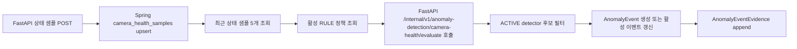

# TAS 2차 병합 수정 Workflow / Troubleshooting

작성일: 2026-06-18

## 0. 이번 단계 목표

이번 작업은 전체 예지보전 기능 완성이 아니라, 병합 즉시 깨지는 P0 계약을 먼저 줄이는 1단계 수정이다.

범위:

- FastAPI `Rule` 평가 요청 필드명을 API 계약서 ver2에 맞춤
- FastAPI adapter가 실제 `predictive_ml` dataclass 계약으로 변환하도록 수정
- 실제 `predictive_ml` dataclass 결과를 FastAPI API 응답 계약으로 정규화
- Spring Boot에 `POST /internal/v1/camera-health-samples` 수신 API 추가
- Spring Boot 상태 샘플 저장은 PostgreSQL `ON CONFLICT` upsert 사용

아직 하지 않은 범위:

- Spring Boot `/api/v1/predictive/**` 공개 API
- Spring Boot 5분 교통 맥락 집계 scheduler
- Spring Boot FastAPI 탐지 orchestration
- AnomalyEvent / MaintenanceTicket 전체 lifecycle
- demo/shared profile의 `ddl-auto=validate` 분리

## 1. 수정 파일 요약

### FastAPI

- `fastapi-server/app/schemas/predictive_detection.py`
  - `RulePolicy`의 `consecutiveWindows`를 제거하고 계약서 기준 필드로 변경
  - 추가 필드:
    - `warningConsecutiveWindows`
    - `criticalConsecutiveWindows`
  - evidence `context` 값 타입을 확장해 배열/객체형 근거도 받을 수 있게 조정

- `fastapi-server/app/services/predictive_detector_adapter.py`
  - FastAPI 요청 DTO를 그대로 `predictive_ml`에 넘기지 않도록 변경
  - `RuleDetectionInput` 변환:
    - 최신 상태 샘플을 `CameraSample`로 변환
    - 정책 코드 기준으로 metric별 consecutive window 계산
  - `DegradationDetectionInput` 변환:
    - 최신 상태 샘플을 `CameraSample`로 변환
    - API baseline을 `BaselineMetric` map으로 변환
    - 최근 상태 샘플을 metric별 `TrendPoint` list로 변환
  - `ModelPredictionInput` 변환:
    - 최근 상태 샘플 sequence를 `CameraSample` list로 변환
  - 실제 `predictive_ml`의 `DetectionResult`, `DetectionCandidate`, `Evidence`, `ShadowPredictionResult`를 API 응답 DTO 형태로 정규화
  - Rule detector가 sample 시각을 반환해도 API 응답의 `evaluatedAt`은 요청의 `evaluatedAt`으로 유지

- `fastapi-server/tests/predictive/test_predictive_adapter.py`
  - fake contract를 새 adapter 구조에 맞게 수정
  - 테스트 fixture의 Rule policy 필드를 ver2 계약명으로 변경

- `predictive_ml/fixtures/fastapi_handoff/camera_health_rule_warning_request.json`
  - `consecutiveWindows`를 `warningConsecutiveWindows`, `criticalConsecutiveWindows`로 변경

### Spring Boot

- `backend/traffic/src/main/java/com/example/traffic/controller/CameraHealthSampleInternalController.java`
  - 신규 추가
  - `POST /internal/v1/camera-health-samples`
  - `X-Internal-Api-Key` 검증
  - 응답은 계약서의 `{ sampleId, created }` 형태

- `backend/traffic/src/main/java/com/example/traffic/service/CameraHealthSampleIngestionService.java`
  - 신규 추가
  - camera 존재 여부 검증
  - `OffsetDateTime`을 서비스 기준 `Asia/Seoul LocalDateTime`으로 변환
  - 10분 초과 지연 샘플은 `is_late_sample=true`
  - `INSERT ... ON CONFLICT (camera_id, sampled_at) DO UPDATE ... RETURNING id, created` 방식으로 멱등 저장

### DB

- 이번 단계에서 DB migration 파일은 수정하지 않았다.
- 전제 schema:
  - `backend/traffic/src/main/resources/db/migration/007_predictive_maintenance_schema.sql`
  - `camera_health_samples` 테이블과 `UNIQUE(camera_id, sampled_at)` 제약이 필요하다.

## 2. 현재 실행 Workflow

### 2-1. DB 적용

현재 프로젝트에는 Flyway/Liquibase 자동 runner가 없다.

수동 적용 기준:

```powershell
docker compose up -d postgres-db

docker cp backend/traffic/src/main/resources/db/migration/007_predictive_maintenance_schema.sql traffic-postgres:/tmp/007.sql
docker cp backend/traffic/src/main/resources/db/migration/008_predictive_seed_policies.sql traffic-postgres:/tmp/008.sql

docker exec traffic-postgres psql -U postgres -d traffic -v ON_ERROR_STOP=1 -f /tmp/007.sql
docker exec traffic-postgres psql -U postgres -d traffic -v ON_ERROR_STOP=1 -f /tmp/008.sql
```

확인:

```powershell
docker exec traffic-postgres psql -U postgres -d traffic -c "\d camera_health_samples"
docker exec traffic-postgres psql -U postgres -d traffic -c "select detector_name, version, operating_mode, active from detector_versions;"
```

### 2-2. Spring Boot 빠른 확인

이번 수정 후 확인한 명령:

```powershell
cd backend/traffic
.\gradlew.bat compileJava
```

결과:

- `compileJava` 통과

### 2-3. FastAPI 빠른 확인

이번 수정 후 확인한 명령:

```powershell
python -m py_compile fastapi-server\app\schemas\predictive_detection.py fastapi-server\app\services\predictive_detector_adapter.py fastapi-server\tests\predictive\test_predictive_adapter.py
```

결과:

- Python 문법 compile 통과

주의:

- 현재 기본 Python 환경에는 `pydantic`이 없어 실제 FastAPI 테스트 실행은 하지 못했다.
- FastAPI 테스트는 프로젝트 의존성이 설치된 venv 또는 Docker 이미지 안에서 실행해야 한다.

## 3. 상태 샘플 수신 Smoke Test

Spring Boot와 DB가 떠 있고 007 migration이 적용된 뒤 다음 요청을 보낸다.

```powershell
$body = @{
  idempotencyKey = "camera-1-20260618T120000+0900"
  cameraId = 1
  processorCode = "edge-01"
  sampledAt = "2026-06-18T12:00:00+09:00"
  sampleWindowSeconds = 60
  fpsAvg = 11.2
  frameDropRate = 0.21
  latencyP95Ms = 1600
  blurScoreAvg = 0.42
  brightnessScoreAvg = 0.51
  detectionCount = 9
  ocrAttemptCount = 8
  ocrFailureCount = 2
  ocrFailRate = 0.25
  cpuUsagePct = 91.3
  memoryUsagePct = 74.1
  diskUsagePct = 61.5
  networkRttMs = 84
  lastFrameAt = "2026-06-18T12:00:58+09:00"
  dataSource = "REAL"
  qualityStatus = "COMPLETE"
  isImputed = $false
} | ConvertTo-Json

Invoke-RestMethod `
  -Method Post `
  -Uri "http://localhost:8080/internal/v1/camera-health-samples" `
  -Headers @{ "X-Internal-Api-Key" = "traffic-ai-internal-key-2026" } `
  -ContentType "application/json" `
  -Body $body
```

기대 응답:

```json
{
  "sampleId": 1,
  "created": true
}
```

같은 `cameraId + sampledAt`으로 다시 보내면 같은 row를 update하고 `created=false`가 나와야 한다.

## 4. Troubleshooting

### 4-1. `POST /internal/v1/camera-health-samples`가 404

가능 원인:

- Spring Boot 코드가 최신이 아님
- `CameraHealthSampleInternalController`가 compile/classpath에 포함되지 않음

확인:

```powershell
cd backend/traffic
.\gradlew.bat compileJava
```

### 4-2. 401 또는 403

가능 원인:

- `X-Internal-Api-Key` 누락 또는 값 불일치
- Spring 설정의 `app.api.internal-key`와 FastAPI `BACKEND_INTERNAL_API_KEY`가 다름

확인 위치:

- Spring: `backend/traffic/src/main/resources/application.yml`
- Docker: `docker-compose.yml`의 `BACKEND_INTERNAL_API_KEY`

### 4-3. `camera_health_samples` 테이블 없음

가능 원인:

- 007 migration 미적용
- 빈 DB volume에서 Spring만 먼저 실행됨

조치:

- 007/008 SQL을 수동 적용
- 시연 전에는 DB volume을 초기화할지 유지할지 결정

### 4-4. unique violation 발생

가능 원인:

- 같은 `idempotencyKey`를 다른 `cameraId + sampledAt` 조합으로 재사용
- 계약상 idempotency key는 샘플 고유키와 일관되어야 한다.

조치:

- FastAPI의 idempotency key 생성 규칙 확인
- 현재 규칙: `camera-{cameraId}-{sampledAt}`

### 4-5. FastAPI Rule 평가가 400 validation error

가능 원인:

- 요청 policy가 아직 구버전 `consecutiveWindows`를 사용

수정:

```json
{
  "policyCode": "FPS_DEGRADATION_RULE_V1",
  "warningThreshold": 10.0,
  "criticalThreshold": 5.0,
  "warningConsecutiveWindows": 3,
  "criticalConsecutiveWindows": 3
}
```

### 4-6. FastAPI가 `predictive_ml.* 입력 계약을 사용할 수 없습니다` 반환

가능 원인:

- FastAPI 컨테이너에 `predictive_ml` wheel이 설치되지 않음
- `fastapi-server/vendor/*.whl`이 비어 있음

확인:

```powershell
docker exec traffic-fastapi-server python -c "import predictive_ml; print(predictive_ml.__file__)"
```

조치:

- `predictive_ml` wheel을 빌드해서 `fastapi-server/vendor`에 넣거나
- Dockerfile에서 로컬 `predictive_ml` 패키지를 설치하도록 변경

## 5. 2단계 진행 내역: Spring Boot 공개 조회 API

2단계에서는 Frontend가 mock 없이 예지보전 조회 화면을 붙일 수 있도록 공개 조회 API 5개를 먼저 열었다.

추가 파일:

- `backend/traffic/src/main/java/com/example/traffic/controller/PredictiveDashboardController.java`
- `backend/traffic/src/main/java/com/example/traffic/service/PredictiveDashboardQueryService.java`

수정 파일:

- `backend/traffic/src/main/java/com/example/traffic/repository/AnomalyPolicyRepository.java`

추가된 endpoint:

```http
GET /api/v1/predictive/summary?dataSource=REAL
GET /api/v1/predictive/cameras?zoneId=3&healthStatus=DEGRADED&dataSource=REAL&page=0&size=20&sort=healthScore,asc
GET /api/v1/predictive/cameras/{cameraId}/health-history?from=2026-06-18T11:00:00%2B09:00&to=2026-06-18T12:00:00%2B09:00&dataSource=REAL
GET /api/v1/predictive/traffic-context?cameraId=1&zoneId=3&from=2026-06-18T00:00:00%2B09:00&to=2026-06-19T00:00:00%2B09:00&dataSource=REAL
GET /api/v1/predictive/policies?enabled=true
```

구현 방식:

- 최신 카메라 상태는 `camera_health_samples`의 카메라별 최신 row를 PostgreSQL `LATERAL` query로 조회한다.
- Health Score는 최신 샘플의 FPS, frame drop, latency, blur, OCR fail rate, CPU, memory, network RTT를 현재 정책 threshold에 가까운 고정 기준으로 점수화한다.
- 샘플이 없거나 유효 지표가 4개 미만이면 `INSUFFICIENT_DATA`로 응답한다.
- anomaly/ticket/model prediction 카운트는 현재 DB 원장 테이블 기준으로 집계한다.
- 조회 API는 Entity를 직접 반환하지 않고 기존 response DTO를 사용한다.

제한 사항:

- 아직 `AnomalyEvent` 생성 흐름이 연결되지 않았으므로 `openAnomalies`는 기존 DB에 들어온 값이 없으면 0이다.
- 아직 `TrafficContextSample` 집계 scheduler가 없으므로 `/traffic-context`는 샘플이 적재되어 있어야 응답 데이터가 나온다.
- Health Score는 1차 조회용 최소 구현이며, 계약서의 전체 가중치/정책 기반 정교화는 다음 단계에서 보강해야 한다.
- `/api/v1/predictive/**`는 `SecurityConfig` 기준 `OPERATOR`, `MAINTAINER`, `ADMIN` 권한 JWT가 필요하다.

2단계 검증:

```powershell
cd backend/traffic
.\gradlew.bat compileJava
```

결과:

- `compileJava` 통과

### 5-1. 공개 API Troubleshooting

#### `/api/v1/predictive/**`가 403

가능 원인:

- JWT가 없거나 role이 `OPERATOR`, `MAINTAINER`, `ADMIN`이 아님

확인:

- `backend/traffic/src/main/java/com/example/traffic/config/SecurityConfig.java`

#### `/api/v1/predictive/cameras`가 500

가능 원인:

- 007 migration이 적용되지 않아 `camera_health_samples`, `anomaly_events`, `model_prediction_logs` 테이블이 없음

조치:

- 007/008 migration 적용 후 Spring 재기동

#### `/api/v1/predictive/cameras` 정렬 요청이 400

허용 sort:

```text
cameraName, healthScore, latestSampledAt
```

예:

```http
GET /api/v1/predictive/cameras?sort=latestSampledAt,desc
```

#### `/api/v1/predictive/traffic-context`가 빈 배열

가능 원인:

- 아직 `traffic_context_samples`에 집계 데이터가 없음
- 5분 집계 scheduler는 다음 단계 작업 범위

조치:

- demo seed 또는 수동 insert로 `traffic_context_samples`를 먼저 채운다.

## 6. 3단계 진행 내역: Spring Boot Rule 탐지 orchestration

3단계에서는 상태 샘플 저장 후 즉시 Rule 평가를 FastAPI에 넘기고, ACTIVE detector 후보를 `AnomalyEvent`와 `AnomalyEventEvidence`로 저장하는 최소 흐름을 연결했다.

추가 파일:

- `backend/traffic/src/main/java/com/example/traffic/service/PredictiveRuleEvaluationOrchestrationService.java`
- `backend/traffic/src/main/java/com/example/traffic/service/PredictiveAnomalyEventIngestionService.java`

수정 파일:

- `backend/traffic/src/main/java/com/example/traffic/controller/CameraHealthSampleInternalController.java`
- `backend/traffic/src/main/java/com/example/traffic/client/PredictiveDetectionClient.java`
- `backend/traffic/src/main/java/com/example/traffic/domain/AnomalyEvent.java`
- `backend/traffic/src/main/java/com/example/traffic/repository/CameraHealthSampleRepository.java`
- `backend/traffic/src/main/java/com/example/traffic/repository/AnomalyEventRepository.java`
- `backend/traffic/src/main/java/com/example/traffic/repository/AnomalyPolicyRepository.java`

동작 흐름:



구현 기준:

- 상태 샘플 저장은 먼저 완료한다.
- Rule 평가 실패는 상태 샘플 저장을 롤백하지 않는다.
- FastAPI 호출 실패, 정책 seed 누락, detector version 누락 등은 warning log로 남기고 수집 응답은 유지한다.
- FastAPI 요청에는 최근 eligible 상태 샘플 최대 5개를 보낸다.
- eligible 조건:
  - 같은 `cameraId`
  - 같은 `dataSource`
  - `is_late_sample=false`
- 정책은 `anomaly_policies`에서 `detection_method=RULE`, `enabled=true`만 사용한다.
- 동일 카메라/이상유형의 활성 이벤트가 있으면 새 이벤트를 만들지 않고 기존 이벤트를 갱신한다.
- 활성 상태 기준:
  - `OPEN`
  - `ACKNOWLEDGED`
  - `RECOVERED`
- `RECOVERED` 이벤트가 다시 감지되면 `OPEN`으로 복귀시키고 recurrence count를 증가시킨다.
- evidence는 append-only로 추가한다.

아직 하지 않은 범위:

- 기준선/추세 5분 평가 orchestration
- `shadowCandidates`를 `model_prediction_logs`에 저장하는 degradation 평가 흐름 연결
- 정상 3회 연속 자동 `RECOVERED`
- 30분 내 재발 cooldown 정교화
- MaintenanceTicket 자동 생성
- Rule 평가 실패 재처리 queue

3단계 검증:

```powershell
cd backend/traffic
.\gradlew.bat compileJava
```

결과:

- `compileJava` 통과

### 6-1. Rule orchestration Troubleshooting

#### 상태 샘플은 저장되는데 이벤트가 생성되지 않음

가능 원인:

- FastAPI가 내려가 있음
- `anomaly_policies`에 RULE seed가 없음
- `detector_versions`에 `camera-rule / 1.1.0 / ACTIVE` seed가 없음
- 최근 샘플 개수가 정책의 consecutive window 조건보다 부족함
- 샘플 `qualityStatus`가 `COMPLETE`가 아님

확인:

```powershell
docker exec traffic-postgres psql -U postgres -d traffic -c "select policy_code, detection_method, enabled from anomaly_policies order by policy_code;"
docker exec traffic-postgres psql -U postgres -d traffic -c "select detector_name, version, operating_mode, active from detector_versions;"
```

#### FastAPI 호출이 401

가능 원인:

- Spring `app.api.internal-key`와 FastAPI `BACKEND_INTERNAL_API_KEY` 불일치

확인:

- Spring: `backend/traffic/src/main/resources/application.yml`
- Docker: `docker-compose.yml`

#### 같은 이벤트가 계속 새로 생김

기대 동작:

- 같은 `cameraId + anomalyType`의 활성 이벤트가 있으면 기존 이벤트 갱신

확인 SQL:

```powershell
docker exec traffic-postgres psql -U postgres -d traffic -c "select target_camera_id, anomaly_type, status, count(*) from anomaly_events group by target_camera_id, anomaly_type, status order by 1,2,3;"
```

활성 상태에서 중복이 보이면 partial unique index 적용 여부를 확인한다.

```powershell
docker exec traffic-postgres psql -U postgres -d traffic -c "\d anomaly_events"
```

#### evidence가 많아짐

현재 구현은 판단 근거를 append-only로 남긴다.
같은 활성 이벤트가 반복 감지되면 evidence row가 누적되는 것이 정상이다.
정리 정책은 보관 정책 단계에서 별도로 다룬다.

## 7. 4단계 수정 내역: 기준선/추세/SHADOW/집계/티켓

### 7-1. 수정 파일

Spring Boot:

- `backend/traffic/src/main/java/com/example/traffic/service/PredictiveDegradationEvaluationOrchestrationService.java`
- `backend/traffic/src/main/java/com/example/traffic/service/TrafficContextAggregationService.java`
- `backend/traffic/src/main/java/com/example/traffic/etc/PredictiveMaintenanceScheduler.java`
- `backend/traffic/src/main/java/com/example/traffic/service/PredictiveShadowPredictionService.java`
- `backend/traffic/src/main/java/com/example/traffic/service/PredictiveAnomalyEventIngestionService.java`
- `backend/traffic/src/main/java/com/example/traffic/repository/MaintenanceTicketRepository.java`
- `backend/traffic/src/main/java/com/example/traffic/repository/CameraRepository.java`
- `backend/traffic/src/main/java/com/example/traffic/client/PredictiveDetectionClient.java`

### 7-2. Degradation orchestration

추가된 동작:

1. 5분마다 활성 카메라를 순회한다.
2. `camera_health_samples`에서 최근 60분 상태 샘플을 조회한다.
3. 최근 14일 상태 샘플로 metric별 `median`, `mad` 기준선을 만든다.
4. 최신 `traffic_context_samples`를 보조 컨텍스트로 붙인다.
5. FastAPI `/internal/v1/anomaly-detection/camera-degradation/evaluate`를 호출한다.
6. ACTIVE 후보는 `anomaly_events`, `anomaly_event_evidence`에 저장한다.
7. SHADOW 후보는 `model_prediction_logs`에 저장한다.

주의:

- 기준선은 현재 14일 전체 샘플 기준이다. 계약서의 “동일 시간대 bucket”까지 엄밀히 맞추는 고도화는 다음 개선 범위다.
- 최근 60분 상태 샘플이 없거나 `CAMERA_TREND_PROJECTION_V1` 정책이 없으면 평가를 건너뛴다.
- FastAPI 장애는 카메라 단위로 로그만 남기고 다음 카메라 처리를 계속한다.

### 7-3. TrafficContext 5분 집계

추가된 동작:

1. 매 5분마다 직전 완료 window를 계산한다.
2. `vehicle_flow_events`에서 차량 수, 평균 속도, IN/OUT 수를 집계한다.
3. `detection_analysis_results`와 `detection_logs`에서 OCR 성공/실패를 집계한다.
4. `speed_violations`에서 과속 건수를 집계한다.
5. `traffic_context_samples`에 `ON CONFLICT (camera_id, zone_id, sampled_at) DO UPDATE`로 upsert한다.

확인 SQL:

```powershell
docker exec traffic-postgres psql -U postgres -d traffic -c "select camera_id, zone_id, sampled_at, vehicle_count, ocr_attempt_count, speed_violation_count, quality_status from traffic_context_samples order by sampled_at desc limit 20;"
```

### 7-4. SHADOW 저장 정책

변경된 동작:

- FastAPI 응답의 `shadowCandidates`는 event/ticket을 만들지 않는다.
- `camera-lstm-autoencoder / 1.0.0` detector version으로 `model_prediction_logs`에 저장한다.
- shadow 후보에 필수 score/threshold 값이 없으면 저장하지 않는다.

확인 SQL:

```powershell
docker exec traffic-postgres psql -U postgres -d traffic -c "select camera_id, predicted_anomaly, predicted_severity, evaluated_at from model_prediction_logs order by evaluated_at desc limit 20;"
```

### 7-5. MaintenanceTicket 자동 생성

추가된 동작:

- ACTIVE 후보 중 `severity=CRITICAL`이면 P1 티켓을 자동 생성한다.
- 같은 anomaly event에 이미 티켓이 있으면 중복 생성하지 않는다.
- 티켓 번호는 `maintenance_ticket_number_seq`를 사용해 `MNT-YYYYMMDD-0001` 형태로 만든다.
- P1 SLA 기본값:
  - `due_ack_at`: 감지 시각 + 15분
  - `due_start_at`: 감지 시각 + 1시간

확인 SQL:

```powershell
docker exec traffic-postgres psql -U postgres -d traffic -c "select ticket_number, anomaly_event_id, priority, status, due_ack_at, due_start_at from maintenance_tickets order by created_at desc limit 20;"
```

### 7-6. 4단계 Troubleshooting

#### Degradation 이벤트가 생성되지 않음

확인 대상:

- `camera_health_samples`에 최근 60분 샘플이 있는지 확인한다.
- `anomaly_policies`에 `CAMERA_TREND_PROJECTION_V1`이 있는지 확인한다.
- `detector_versions`에 FastAPI 응답 detector와 같은 `detector_name/version`이 있는지 확인한다.
- Spring `app.fastapi.base-url`, `app.api.internal-key`와 FastAPI 환경변수가 일치하는지 확인한다.

#### TrafficContext가 생성되지 않음

확인 대상:

- 직전 5분 window에 `vehicle_flow_events`, `detection_analysis_results`, `speed_violations` 중 하나라도 데이터가 있는지 확인한다.
- 데이터가 전혀 없으면 현재 집계 서비스는 빈 context row를 만들지 않는다.
- `traffic_context_samples`의 `idempotency_key` unique 충돌이 있으면 로그와 DB 제약을 확인한다.

#### 티켓이 생성되지 않음

확인 대상:

- 후보 severity가 `CRITICAL`인지 확인한다. `WARNING`은 티켓 자동 생성 대상이 아니다.
- 같은 `anomaly_event_id`로 이미 티켓이 있으면 중복 생성하지 않는다.
- DB에 `maintenance_ticket_number_seq`가 있어야 한다.

## 8. 5단계 진행 내역: Spring Boot 운영 API

진행일: 2026-06-19

이번 단계에서는 이미 연결된 수집/평가/자동 티켓 생성 흐름 위에 운영자가 사용할 공개 API를 추가했다.
빌드는 사용자가 별도로 진행 중이므로, Codex는 코드 수정과 가벼운 정적 확인만 수행했다.

### 8-1. 추가 파일

- `backend/traffic/src/main/java/com/example/traffic/controller/PredictiveOperationsController.java`
- `backend/traffic/src/main/java/com/example/traffic/service/PredictiveOperationsService.java`

### 8-2. 수정 파일

- `backend/traffic/src/main/java/com/example/traffic/domain/AnomalyEvent.java`
  - `acknowledge`, `resolve`, `dismiss` 상태 변경 메서드 추가
  - 서비스가 JPA 필드를 직접 조작하지 않도록 도메인 메서드로 상태 전이를 제한

- `backend/traffic/src/main/java/com/example/traffic/domain/MaintenanceTicket.java`
  - `assign`, `changeStatus` 메서드 추가
  - 상태 변경 시 `acknowledgedAt`, `startedAt`, `resolvedAt`, `closedAt` 시각을 함께 기록

- `backend/traffic/src/main/java/com/example/traffic/domain/AnomalyPolicy.java`
  - `updateRuntimePolicy` 추가
  - 정책 수정 API가 `predictionHorizonMinutes`, `minimumSampleCount`, `config`, `enabled`만 좁게 바꾸도록 제한

- `backend/traffic/src/main/java/com/example/traffic/dto/request/predictive/AnomalyEventSearchRequest.java`
  - `from`, `to` query parameter에 ISO date-time 바인딩 명시

- `backend/traffic/src/main/java/com/example/traffic/repository/AnomalyEventRepository.java`
- `backend/traffic/src/main/java/com/example/traffic/repository/MaintenanceTicketRepository.java`
  - 목록 필터링을 위해 `JpaSpecificationExecutor` 추가

- `backend/traffic/src/main/java/com/example/traffic/repository/AnomalyEventEvidenceRepository.java`
  - 이벤트 상세 근거 목록 조회 추가

- `backend/traffic/src/main/java/com/example/traffic/repository/ModelPredictionLogRepository.java`
  - 이벤트 상세에서 같은 카메라의 최신 SHADOW 결과를 표시하기 위한 조회 추가

### 8-3. 추가된 endpoint

```http
GET /api/v1/predictive/anomaly-events
GET /api/v1/predictive/anomaly-events/{eventId}
POST /api/v1/predictive/anomaly-events/{eventId}/acknowledge
POST /api/v1/predictive/anomaly-events/{eventId}/resolve
POST /api/v1/predictive/anomaly-events/{eventId}/dismiss
GET /api/v1/predictive/maintenance-tickets
POST /api/v1/predictive/maintenance-tickets
POST /api/v1/predictive/maintenance-tickets/{ticketId}/assign
POST /api/v1/predictive/maintenance-tickets/{ticketId}/status
PATCH /api/v1/predictive/policies/{policyCode}
```

구현 기준:

- Controller, Service, Repository, DTO 계층을 분리했다.
- JPA entity를 API 응답으로 직접 반환하지 않고 기존 predictive response DTO로 변환한다.
- 목록 API는 계약서 기준 sort whitelist를 적용한다.
  - anomaly-events: `firstDetectedAt`, `lastDetectedAt`, `severity`, `anomalyScore`
  - maintenance-tickets: `createdAt`, `dueAckAt`, `dueStartAt`, `priority`
- 권한은 기존 `SecurityConfig` 규칙을 따른다.
  - 이벤트 acknowledge/resolve/dismiss: `OPERATOR`, `ADMIN`
  - 티켓 생성/배정: `OPERATOR`, `ADMIN`
  - 티켓 상태 변경: `OPERATOR`, `MAINTAINER`, `ADMIN`
  - 정책 수정: `ADMIN`
- 인증 사용자는 JWT의 email로 `Member`를 다시 조회해 `updatedBy`, `createdBy`, `changedBy`, `acknowledgedBy`, `resolvedBy`에 반영한다.
- 수동 티켓 생성은 같은 `anomalyEventId`에 기존 티켓이 있으면 `409 CONFLICT`로 중복 생성을 막는다.
- 티켓 상태 변경은 기존 `MaintenanceTicketStateTransitionService`의 허용 전이/권한 검사를 사용한다.
- 티켓 생성/배정/상태 변경은 `MaintenanceTicketHistory`에 append-only로 남긴다.

### 8-4. 현재 한계

- 이상 이벤트 acknowledge/resolve/dismiss 자체에는 별도 event history 테이블이 없어 이벤트 필드만 갱신한다.
- 이벤트 상세의 `shadowModel`은 현재 같은 카메라/dataSource의 최신 SHADOW 결과를 붙인다. 계약서의 “이벤트 평가 시각과 가장 가까운 SHADOW 결과 매칭”은 다음 고도화 범위다.
- `RECOVERED` 자동 전환, WARNING 지속/재발 기반 P2 자동 티켓 생성은 아직 미구현이다.
- Spring `compileJava`/테스트/실행 검증은 사용자가 별도 build에서 확인해야 한다.

### 8-5. 5단계 Troubleshooting

#### 목록 API sort 요청이 400

허용된 sort만 사용해야 한다.

```http
GET /api/v1/predictive/anomaly-events?sort=firstDetectedAt,desc
GET /api/v1/predictive/maintenance-tickets?sort=createdAt,desc
```

#### 이벤트 acknowledge가 409

현재 구현은 `OPEN` 이벤트만 acknowledge할 수 있다.
이미 `ACKNOWLEDGED`, `RESOLVED`, `DISMISSED` 상태인 이벤트인지 확인한다.

#### 티켓 생성이 409

같은 `anomalyEventId`에 이미 티켓이 있으면 중복 생성하지 않는다.

확인 SQL:

```powershell
docker exec traffic-postgres psql -U postgres -d traffic -c "select id, anomaly_event_id, ticket_number, status from maintenance_tickets where anomaly_event_id = 101;"
```

#### 티켓 상태 변경이 409

허용 상태 전이만 처리한다.

```text
OPEN -> ASSIGNED -> IN_PROGRESS -> RESOLVED -> CLOSED
```

`RESOLVED`로 변경할 때는 `note`가 필수다.

## 9. 다음 단계 제안

### 6단계: 실제 시연 테스트 준비

우선순위:

1. PostgreSQL에 007/008 migration 적용
2. Spring, FastAPI 환경변수의 internal key 일치 확인
3. FastAPI 서버 기동
4. Spring 서버 기동
5. 상태 샘플 ingest 요청 후 event/evidence/ticket 생성 확인
6. 대시보드 조회 API 확인

### 7단계: demo profile 정리

우선순위:

1. `application-demo.yml` 추가
2. `ddl-auto=validate`
3. `spring.sql.init.mode=never`
4. docker compose에서 demo profile 사용
5. seed 재실행 없이 migration 기반 기동 확인

### 8단계: 테스트 보강

우선순위:

1. Rule orchestration service 단위 테스트
2. Degradation orchestration service 단위 테스트
3. SHADOW 후보가 event/ticket을 만들지 않는 테스트
4. TrafficContext aggregation SQL 통합 테스트
5. MaintenanceTicket 중복 생성 방지 테스트

## 10. 현재까지 검증 결과

통과:

- Spring `compileJava`
- FastAPI 관련 Python 파일 `py_compile`
- 2026-06-19 코드 수정 후 `git diff --check`

미실행:

- Spring full build/test
- FastAPI pytest
- Docker compose E2E
- 실제 FastAPI -> Spring 상태 샘플 전송

미실행 사유:

- 현재 기본 Python 환경에 `pydantic` 등 FastAPI 의존성이 설치되어 있지 않음
- 사용자가 전체 build는 직접 진행 예정

## 11. 최종 병합 검수 메모

검수일: 2026-06-18

계약서와 일치하는 범위:

- `POST /internal/v1/camera-health-samples` 수신, 내부 API key 검증, `ON CONFLICT` upsert
- 상태 샘플 저장 후 FastAPI Rule 평가 호출
- FastAPI Rule 정책 필드 `warningConsecutiveWindows`, `criticalConsecutiveWindows`
- FastAPI `/internal/v1/anomaly-detection/camera-health/evaluate`
- FastAPI `/internal/v1/anomaly-detection/camera-degradation/evaluate`
- Spring public 조회 API 중 summary, cameras, health-history, traffic-context, policies
- `traffic_context_samples` 5분 집계와 upsert
- ACTIVE 후보만 `anomaly_events`와 evidence로 저장
- SHADOW 후보는 `model_prediction_logs`에만 저장
- CRITICAL ACTIVE 이벤트의 P1 유지보수 티켓 자동 생성
- 이상 이벤트 목록/상세/acknowledge/resolve/dismiss API
- 유지보수 티켓 목록/생성/배정/상태 변경 API
- 정책 수정 `PATCH /api/v1/predictive/policies/{policyCode}`

계약서 대비 남은 범위:

- 기준선 산출의 동일 30분 시간대 bucket 정밀화
- 정상 3회 연속 `RECOVERED`, WARNING 지속/재발 기반 P2 티켓 정책
- SHADOW와 이벤트 상세 화면의 근접 평가 시각 매칭
- 통합 테스트와 실제 시연 데이터 검증

다음 컨텍스트 인계 파일:

- `docs/phase2-predictive-maintenance/next_context_todo_2026-06-18.md`
