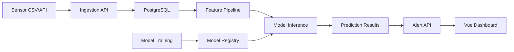

# 교통흐름 분석 프로젝트 회고와 다음 예지보전 프로젝트 준비 가이드

작성일: 2026-06-02  
용도: 프로젝트 1 마무리 회고, 프로젝트 2 시작 전 기준서  
관점: 실무 개발자 관점의 냉정한 평가와 다음 프로젝트 실행 기준

---

## 1. 문서의 목적

이번 교통흐름 분석 프로젝트는 한 달 동안 진행되었고, 본사 발표까지 마무리되었다. 발표 후 받은 핵심 피드백은 다음과 같다.

- 프로젝트 개발 전에 요구사항 정의서를 작성해야 한다.
- 우리가 만들 프로그램의 목적과 방향을 먼저 정해야 한다.
- 필요한 아키텍처, 기능, 작업 방식을 미리 정의해야 한다.
- 교통흐름 분석도라면 DB 관리와 데이터 처리 방식에 대한 설계가 명확해야 한다.

이 문서는 발표 후 정리 문서의 완성도를 평가하기 위한 문서가 아니다. 정확히 말하면 지금은 작업 후 산출물 제작 기간이므로, 최종 문서는 별도로 정리하면 된다.

이 문서에서 다루는 핵심은 다음이다.

- 개발 초반에 요구사항과 데이터 설계를 충분히 고정했는가
- 한 달이라는 시간을 기능 구현, 검증, 안정화에 균형 있게 썼는가
- 실무자가 봤을 때 데이터 기반 시스템으로 설득력이 있었는가
- 다음 예지보전 프로젝트에서는 어떤 순서로 접근해야 하는가

---

## 2. 한 줄 총평

이번 프로젝트는 "데모 가능한 end-to-end 시스템"은 만들었지만, "실무자가 신뢰할 수 있는 데이터 기반 운영 시스템"으로 설득하기에는 요구사항, 데이터 설계, 재현성, 운영 관점이 부족했다.

평가를 점수로 표현하면 다음과 같다.

| 기준 | 평가 |
| --- | --- |
| 학원 5개월차 팀 프로젝트 기준 | 70점 |
| 실무 PoC 기준 | 45~55점 |
| 포트폴리오 소재 가치 | 있음 |
| 그대로 실무형 완성 프로젝트라고 주장할 수 있는가 | 어려움 |
| 다음 프로젝트에 반영할 학습 가치 | 매우 큼 |

중요한 것은 실패 여부가 아니다. 이번 프로젝트는 "기능을 붙이는 프로젝트"와 "데이터 시스템을 설계하는 프로젝트"의 차이를 배운 사례다.

---

## 3. 잘한 점

### 3.1 시스템 범위가 작지 않았다

이번 프로젝트는 단순 CRUD나 정적인 화면 프로젝트가 아니었다.

- Vue 3 프론트엔드
- Spring Boot 백엔드
- FastAPI AI 추론 서버
- PostgreSQL
- Docker Compose
- YOLO 차량/번호판 탐지
- OCR
- Raspberry Pi 클라이언트
- 이미지 저장 및 정적 파일 서빙
- 과속 위반 저장과 검토 화면

이 정도 범위를 한 달 안에 연결한 것은 쉬운 일이 아니다. 특히 학원 5개월차 팀이 진행했다면 시행착오가 많은 것은 자연스럽다.

### 3.2 계층 분리의 흔적이 있다

Spring Boot 쪽은 controller, service, repository, domain, dto가 분리되어 있다. JPA 엔티티를 그대로 API 응답으로 내보내지 않으려는 방향도 있다.

FastAPI 쪽도 router, schema, service 중심으로 나누려는 구조가 있다. Pydantic schema를 통해 외부 API 필드명을 관리하려는 시도도 있다.

이 방향은 좋다. 다음 프로젝트에서도 유지해야 한다.

### 3.3 end-to-end 흐름을 만들었다

이미지 또는 영상 프레임을 받아 AI 서버에서 탐지하고, Spring Boot로 결과를 보내고, DB에 저장하고, 프론트에서 보여주는 흐름이 있다.

실무자는 완성도 부족을 지적할 수 있지만, 최소한 "화면만 있는 데모"는 아니다. 실제 파이프라인을 연결하려고 했다는 점은 장점이다.

### 3.4 테스트가 일부 존재한다

Spring Boot 통합 테스트가 있고, FastAPI 테스트도 있다. 실제 확인 결과 Spring 테스트는 통과했고, Docker Compose 설정도 유효했다.

테스트가 아예 없는 프로젝트와 비교하면 이 부분은 분명히 좋은 점이다.

---

## 4. 아쉬웠던 점

이번 프로젝트의 핵심 문제는 "코드를 못 짰다"가 아니다. 더 근본적인 문제는 "무엇을 만들고 있는지, 어떤 데이터로 증명할 것인지, 어떻게 운영 가능한 구조로 만들 것인지"가 늦게 정리된 것이다.

### 4.1 요구사항 정의가 기능 목록 수준에 머물렀다

교통흐름 분석 프로젝트라면 처음에 다음 질문에 답했어야 한다.

- 교통흐름을 무엇으로 정의할 것인가?
- 차량 수, 평균 속도, 체류 시간, 혼잡도, 방향별 흐름 중 무엇을 핵심 지표로 볼 것인가?
- 사용자는 누구인가?
- 사용자는 이 시스템으로 어떤 결정을 내리는가?
- 실시간성이 중요한가, 사후 분석이 중요한가?
- OCR 실패 데이터는 분석에서 제외하는가, 실패율 지표로 관리하는가?
- 중복 감지는 몇 초 또는 어떤 기준으로 제거하는가?
- 과속 위반은 교통흐름 분석의 일부인가, 별도 단속 도메인인가?

이 질문에 대한 답이 선명하지 않으면 화면은 커져도 프로젝트 목적은 흐려진다.

### 4.2 데이터 설계가 프로젝트 중심축이 되지 못했다

교통흐름 분석도에서 가장 중요한 것은 데이터다. 하지만 발표 피드백처럼 DB와 데이터 처리 방식이 프로젝트의 중심 설명이 되지 못했다.

실무자는 단순히 "테이블이 있냐"를 보지 않는다. 다음을 본다.

- 원천 데이터와 분석 결과가 분리되어 있는가?
- 데이터 grain이 명확한가?
- 이벤트 중복과 누락을 어떻게 처리하는가?
- 스키마 변경을 재현 가능하게 관리하는가?
- 운영 중 장애가 나도 데이터 정합성이 유지되는가?
- 집계 데이터가 원천 이벤트와 추적 가능한가?

현재 프로젝트에는 테이블과 DTO가 존재한다. 즉 "DB가 전혀 없다"는 평가는 정확하지 않다. 다만 실무자가 납득할 만큼 데이터 정책과 스키마 변경 방식이 프로젝트의 중심에 서 있지는 못했다.

특히 `ddl-auto:update`와 수동 SQL이 섞여 있는 구조는 학습용 개발 환경에서는 편하지만, 운영 가능한 DB 설계로 설명하기 어렵다.

### 4.3 데모 안정화와 실제 운영 구조가 섞였다

프론트에는 localStorage 기반 데모 계정, fallback 데이터, 임시 queue가 들어가 있다. 발표를 안정적으로 하기 위한 장치로는 이해할 수 있다.

하지만 실무자 앞에서는 다음이 명확히 구분되어야 한다.

- 실제 DB에서 오는 데이터
- 백엔드 실패 시 보여주는 fallback 데이터
- 발표용 localStorage 데이터
- 아직 API가 붙지 않은 mock 데이터

이 네 가지가 화면에서 섞이면 "이 시스템은 실제로 동작하는가?"라는 의심을 받는다.

### 4.4 재현성이 개발 중 계속 관리되지 못했다

좋은 프로젝트는 발표자의 PC에서만 돌아가면 안 된다. 개발 중간부터 다음을 계속 확인해야 한다.

- 의존성 설치
- DB 시작
- 스키마 적용
- seed 데이터 주입
- 백엔드 실행
- AI 서버 실행
- 프론트 실행
- 테스트 실행
- 데모 시나리오 재현

현재 프로젝트는 Docker Compose 설정은 유효했지만, 프론트 테스트는 `vite` 패키지를 찾지 못해 시작 실패했다. 이것은 산출물 제작 문제가 아니라 개발 중간부터 테스트 실행 가능성을 계속 관리했는가의 문제다.

### 4.5 설계 기준이 늦게 잡혔다

이번 프로젝트에서 가장 아쉬운 점은 발표 후 정리 문서의 완성도가 아니다. 지금은 발표 이후 산출물 제작 단계이므로, 최종 문서는 별도로 정리하면 된다.

진짜 문제는 개발 초반에 다음 기준이 팀 내부에서 충분히 고정되지 않았다는 점이다.

- 요구사항의 우선순위
- 교통흐름 분석 지표
- 원천 데이터와 분석 결과의 분리 기준
- OCR 실패, 중복 감지, 정상 차량, 과속 차량의 데이터 정책
- FastAPI와 Spring Boot 사이의 API 계약
- DB 스키마 변경 방식
- 실제 데이터와 데모 데이터의 구분

이 기준이 초반에 잡혀 있었다면 후반 작업은 기능 추가보다 검증과 완성도 개선에 더 많이 쓰였을 것이다.

---

## 5. 한 달이 길었는가?

냉정하게 말하면, 지금 결과물은 AI 도움을 잘 활용하고 초반 설계를 제대로 했다면 2~3주 MVP로도 가능했을 수 있다.

하지만 이것은 팀을 비난하기 위한 말이 아니다. Vue, Spring Boot, FastAPI, PostgreSQL, Docker, YOLO/OCR, Raspberry Pi까지 다루면서 학원 5개월차 팀이 한 달을 쓴 것은 완전히 비정상은 아니다.

문제는 기간 자체가 아니다. 문제는 시간 사용 방식이다.

좋은 흐름은 다음과 같아야 했다.

```text
요구사항 정의
  -> 데이터 모델 정의
  -> API 계약 정의
  -> 핵심 MVP 구현
  -> 테스트/재현성 확보
  -> 화면 완성도 개선
  -> 발표 시나리오 정리
```

실제로는 다음 흐름에 가까웠을 가능성이 높다.

```text
화면/기능 구현
  -> AI 연동 시도
  -> DB/API 불일치 수정
  -> 오류 대응
  -> 발표용 안정화
  -> 뒤늦은 설계 기준 정리
```

이 차이가 실무 프로젝트와 학원식 프로젝트를 가른다.

---

## 6. 프로젝트 1을 포트폴리오로 정리할 때의 전략

이 프로젝트를 포트폴리오에서 버릴 필요는 없다. 다만 포장 방식을 바꿔야 한다.

나쁜 설명:

> AI 기반 실시간 교통흐름 분석 시스템을 완성했습니다.

좋은 설명:

> Vue, Spring Boot, FastAPI, PostgreSQL을 연결해 차량 프레임 분석부터 OCR 결과 저장, 과속 후보 검토까지 end-to-end 파이프라인을 구현했습니다. 발표 이후 데이터 모델, 마이그레이션, 분석 지표 정의의 부족을 확인했고, 이를 바탕으로 데이터 중심 설계 개선안을 정리했습니다.

실무자는 완벽한 척보다 정확한 자기 평가를 더 신뢰한다.

포트폴리오에는 다음을 강조하는 것이 좋다.

- 맡은 역할
- 해결한 기술 문제
- FastAPI와 Spring Boot API 계약 정렬
- OCR 실패/중복 감지 상태 분리
- 이미지 저장 경로와 DB 저장 정책
- Docker 기반 실행 구조
- 한계와 개선안

감추면 안 되는 한계도 명확히 적는 것이 좋다.

- 실제 운영용 마이그레이션 도구 미도입
- 데모 fallback 데이터 존재
- OCR/속도 추정 정확도 검증 부족
- 실시간 처리 성능 한계
- 교통 지표 정의 부족

이렇게 정리하면 오히려 성장 가능성이 보인다.

---

## 7. 다음 프로젝트 2의 방향: 예지보전

다음 프로젝트는 예지보전이다. 예지보전은 화면보다 데이터 정의와 평가 설계가 훨씬 중요하다.

예지보전에서 실무자가 보고 싶은 것은 다음이다.

- 어떤 설비를 대상으로 하는가?
- 어떤 고장을 예측하는가?
- 어떤 센서 데이터를 쓰는가?
- 고장 label을 어떻게 정의했는가?
- 미래 데이터가 feature에 섞이지 않도록 했는가?
- 어느 시점에 경고를 띄우는가?
- false alarm을 어떻게 관리하는가?
- 모델 성능을 어떤 지표로 평가했는가?
- 예측 결과가 DB에 어떻게 저장되고 추적되는가?

즉, "AI 모델 붙였다"가 아니라 "고장 예측 문제를 데이터 제품으로 정의했다"가 핵심이다.

---

## 8. 예지보전 프로젝트 요구사항 정의 예시

### 8.1 프로젝트 목적

설비 센서 데이터를 기반으로 고장 위험을 사전에 예측하고, 정비 담당자가 고장 발생 전에 점검 우선순위를 결정할 수 있도록 지원한다.

### 8.2 사용자

| 사용자 | 관심사 |
| --- | --- |
| 현장 정비 담당자 | 어떤 설비를 먼저 점검해야 하는가 |
| 설비 관리자 | 어느 라인의 고장 위험이 높은가 |
| 운영 관리자 | 정비 비용과 다운타임을 줄일 수 있는가 |
| 데이터/ML 담당자 | 모델 성능과 예측 근거가 추적 가능한가 |

### 8.3 핵심 기능

- 설비 목록 조회
- 설비별 센서 시계열 조회
- 고장 위험도 예측
- 위험 설비 알림
- 예측 결과 상세 조회
- 모델 버전별 성능 조회
- 정비 이력 등록
- 고장 이벤트 등록
- 예측 결과와 실제 고장 비교

### 8.4 비기능 요구사항

- 모든 예측 결과는 모델 버전과 함께 저장한다.
- 모든 센서 데이터는 timestamp와 equipment_id를 기준으로 저장한다.
- API 응답은 페이지네이션과 필터를 지원한다.
- 학습/검증/테스트 데이터는 시간 기준으로 분리한다.
- 모델 threshold는 임의로 정하지 않고 precision/recall trade-off를 기준으로 선택한다.
- 운영 중 누락 데이터가 발생해도 입력 schema가 깨지지 않아야 한다.

---

## 9. 예지보전 데이터 정의

예지보전에서 가장 먼저 정해야 할 것은 dataset grain이다.

추천 grain:

```text
equipment_id + timestamp
```

예시 센서 데이터:

| 필드 | 설명 |
| --- | --- |
| equipment_id | 설비 ID |
| timestamp | 센서 측정 시각 |
| temperature | 온도 |
| vibration | 진동 |
| current | 전류 |
| pressure | 압력 |
| rpm | 회전수 |
| operating_mode | 운전 모드 |
| load_rate | 부하율 |

고장 label 정의 예시:

```text
failure_event가 발생하기 24시간 전부터 label=1
그 외 정상 구간은 label=0
정비 직후 안정화 구간은 학습에서 제외
```

반드시 명시해야 할 항목:

- 예측 horizon: 1시간 후, 24시간 후, 7일 후 중 무엇인가
- feature window: 최근 10분, 1시간, 24시간 평균/최대/표준편차 중 무엇을 쓰는가
- label window: 고장 전 몇 시간을 위험 구간으로 볼 것인가
- leakage risk: 고장 이후 값, 정비 결과, 미래 집계가 feature에 들어가지 않는가
- missing-data policy: 보간, 제거, 별도 flag 중 무엇인가

---

## 10. 예지보전 추천 DB 스키마

최소 테이블은 다음과 같다.

### 10.1 equipment

설비 기본 정보.

```text
equipment_id
equipment_code
equipment_name
line_name
equipment_type
installed_at
status
created_at
updated_at
```

### 10.2 sensor_readings

센서 원천 데이터.

```text
reading_id
equipment_id
measured_at
temperature
vibration
current
pressure
rpm
load_rate
created_at
```

추천 인덱스:

```text
(equipment_id, measured_at)
(measured_at)
```

### 10.3 maintenance_events

정비 이력.

```text
maintenance_id
equipment_id
maintenance_type
started_at
ended_at
description
operator
created_at
```

### 10.4 failure_events

실제 고장 이벤트.

```text
failure_id
equipment_id
failed_at
failure_type
severity
description
resolved_at
created_at
```

### 10.5 model_versions

모델 버전 관리.

```text
model_version_id
model_name
version
algorithm
feature_window_minutes
prediction_horizon_minutes
threshold
trained_at
metrics_json
artifact_path
is_active
```

### 10.6 prediction_runs

예측 실행 단위.

```text
prediction_run_id
model_version_id
started_at
ended_at
status
input_range_start
input_range_end
created_at
```

### 10.7 prediction_results

설비별 예측 결과.

```text
prediction_result_id
prediction_run_id
equipment_id
predicted_at
risk_score
risk_level
predicted_label
top_features_json
input_snapshot_json
created_at
```

### 10.8 alert_events

알림 이력.

```text
alert_id
prediction_result_id
equipment_id
alert_level
message
status
acknowledged_by
acknowledged_at
created_at
```

---

## 11. 예지보전 시스템 아키텍처



핵심은 모델보다 데이터 흐름이다.

센서 데이터가 들어오고, DB에 저장되고, feature가 계산되고, 모델이 예측하고, 결과가 저장되고, 화면이 그 결과를 보여줘야 한다. 이 흐름이 명확하면 모델이 단순해도 프로젝트 수준이 올라간다.

---

## 12. ML 설계 기준

예지보전에서는 accuracy 하나로 평가하면 안 된다. 고장 데이터는 보통 불균형하기 때문이다.

반드시 보고해야 할 지표:

- precision
- recall
- F1
- ROC-AUC
- PR-AUC
- confusion matrix
- false alarm rate
- lead time

추천 baseline:

1. Logistic Regression
2. Random Forest
3. XGBoost 또는 LightGBM

처음부터 PyTorch로 가지 않아도 된다. 표 형태 센서 데이터에서는 전통적인 tabular 모델이 더 빠르고 설명하기 쉽다.

데이터 분리는 반드시 시간 기준으로 한다.

```text
train: 과거 기간
validation: 그 다음 기간
test: 가장 최근 기간
```

랜덤 split을 쓰면 미래 데이터가 과거 학습에 섞여 성능이 과장될 수 있다.

---

## 13. 예지보전 API 계약 예시

### 13.1 설비 목록

```http
GET /api/equipment?status=ACTIVE&page=0&size=20
```

응답:

```json
{
  "items": [
    {
      "equipmentId": 1,
      "equipmentCode": "MOTOR-001",
      "equipmentName": "Main Motor 1",
      "lineName": "Line A",
      "status": "ACTIVE",
      "latestRiskLevel": "HIGH",
      "latestRiskScore": 0.87
    }
  ],
  "page": 0,
  "size": 20,
  "totalElements": 134
}
```

### 13.2 센서 데이터 조회

```http
GET /api/equipment/{equipmentId}/sensor-readings?from=2026-06-01T00:00:00&to=2026-06-02T00:00:00
```

### 13.3 예측 결과 조회

```http
GET /api/predictions?equipmentId=1&from=2026-06-01T00:00:00&to=2026-06-02T00:00:00
```

### 13.4 정비 이벤트 등록

```http
POST /api/equipment/{equipmentId}/maintenance-events
```

요청:

```json
{
  "maintenanceType": "INSPECTION",
  "startedAt": "2026-06-02T09:00:00",
  "endedAt": "2026-06-02T10:30:00",
  "description": "High vibration inspection",
  "operator": "maintenance-team-a"
}
```

---

## 14. 다음 프로젝트 시작 전 체크리스트

프로젝트 2는 이 체크리스트를 통과한 뒤 구현을 시작한다.

### 14.1 요구사항

- [ ] 프로젝트 목적을 한 문장으로 설명할 수 있다.
- [ ] 사용자 역할을 정의했다.
- [ ] 사용자가 이 시스템으로 내릴 결정을 정의했다.
- [ ] 핵심 기능과 제외 기능을 구분했다.
- [ ] MVP 범위를 2주 안에 구현 가능한 수준으로 줄였다.

### 14.2 데이터

- [ ] dataset grain을 정의했다.
- [ ] timestamp 기준을 정의했다.
- [ ] equipment_id 기준을 정의했다.
- [ ] label 정의를 문서화했다.
- [ ] missing-data 정책을 정의했다.
- [ ] leakage risk를 문서화했다.
- [ ] train/validation/test 분리 기준을 정했다.

### 14.3 DB

- [ ] ERD를 작성했다.
- [ ] 원천 데이터와 예측 결과를 분리했다.
- [ ] 모델 버전 테이블을 만들었다.
- [ ] 인덱스와 제약조건을 정의했다.
- [ ] Alembic 또는 Flyway/Liquibase 등 마이그레이션 도구를 도입했다.
- [ ] seed 데이터와 데모 데이터를 구분했다.

### 14.4 API

- [ ] 요청/응답 DTO를 먼저 정의했다.
- [ ] 날짜 포맷을 통일했다.
- [ ] enum 값을 문서화했다.
- [ ] 페이지네이션, 필터, 정렬 방식을 통일했다.
- [ ] 에러 응답 형식을 통일했다.
- [ ] OpenAPI 문서에서 예시 payload를 확인할 수 있다.

### 14.5 ML

- [ ] feature window를 정의했다.
- [ ] prediction horizon을 정의했다.
- [ ] baseline 모델을 정했다.
- [ ] 평가 지표를 정했다.
- [ ] threshold 선택 기준을 정했다.
- [ ] 모델 버전과 metrics 저장 방식을 정했다.

### 14.6 프론트

- [ ] 실제 API 데이터와 mock 데이터를 명확히 분리했다.
- [ ] loading, empty, error 상태를 구현했다.
- [ ] 위험 설비 목록, 상세, 센서 차트, 예측 근거 화면을 정의했다.
- [ ] 관리자/정비자 역할별 화면 차이를 정했다.

### 14.7 재현성

- [ ] `docker compose up`으로 핵심 서비스가 실행된다.
- [ ] 테스트 명령이 정리되어 있다.
- [ ] 테스트가 실제로 통과한다.
- [ ] 발표 데모 시나리오가 명령어 단위로 정리되어 있다.
- [ ] 다른 팀원이 같은 절차로 실행할 수 있다.

---

## 15. 이번 프로젝트에서 다음 프로젝트로 가져갈 교훈

### 교훈 1. 화면보다 데이터가 먼저다

화면은 데이터를 보여주는 결과물이다. 데이터 정의 없이 화면을 먼저 만들면 나중에 mock, fallback, 임시 변환이 늘어난다.

### 교훈 2. 요구사항 정의서는 형식 문서가 아니다

요구사항 정의서는 팀이 길을 잃지 않기 위한 기준이다. "무엇을 만들지"보다 "무엇을 만들지 않을지"를 정하는 데 더 중요하다.

### 교훈 3. DB는 마지막에 붙이는 저장소가 아니다

데이터 프로젝트에서 DB는 핵심 설계다. 원천 데이터, 분석 결과, 모델 버전, 알림 이력이 어떻게 연결되는지 먼저 정해야 한다.

### 교훈 4. AI 모델보다 평가 기준이 중요하다

예지보전에서 accuracy 99%는 의미가 없을 수 있다. 고장 데이터가 거의 없으면 전부 정상이라고 예측해도 accuracy는 높다. 실무자는 recall, false alarm rate, lead time을 본다.

### 교훈 5. 데모와 실서비스를 구분해야 한다

발표용 fallback은 필요할 수 있다. 하지만 코드와 화면에서 명확히 구분해야 한다. 그렇지 않으면 프로젝트 전체가 가짜처럼 보인다.

### 교훈 6. "AI가 코드를 짜줬다"는 약점이 아니라, 설계 부족이 약점이다

바이브코딩을 쓴 것은 문제가 아니다. 실무에서도 AI 도구를 쓴다. 문제는 AI가 만든 코드를 검증하고, 구조화하고, 요구사항과 데이터 계약에 맞게 통제했는가다.

---

## 16. 프로젝트 2 발표 때 목표로 삼을 문장

다음 프로젝트 발표에서는 아래 수준의 설명을 목표로 한다.

> 저희는 설비별 1분 단위 센서 데이터를 기준으로, 고장 발생 24시간 전부터를 positive label로 정의했습니다. 시간 누수를 막기 위해 날짜 기준 train/validation/test split을 적용했고, recall을 우선하되 false alarm rate가 하루 설비당 2건을 넘지 않도록 threshold를 선택했습니다. 예측 결과는 model version과 함께 DB에 저장되며, 사용자는 설비별 위험도와 주요 근거 feature를 확인할 수 있습니다.

이 문장을 자연스럽게 말할 수 있다면 프로젝트 수준이 달라진다.

---

## 17. 마지막 정리

이번 프로젝트는 아쉬움이 크지만 버릴 프로젝트는 아니다. 오히려 다음 단계로 가기 위한 좋은 기준점이다.

다음 프로젝트에서 가장 중요한 변화는 세 가지다.

1. 요구사항 정의서를 먼저 쓴다.
2. 데이터 모델과 API 계약을 먼저 확정한다.
3. 모델 성능과 시스템 동작을 숫자와 테스트로 증명한다.

프로젝트의 수준은 코드 줄 수로 결정되지 않는다. 실무자는 "이 팀이 문제를 어떻게 정의했고, 데이터를 어떻게 다루며, 결과를 어떻게 검증했는가"를 본다.

다음 프로젝트는 그 기준으로 준비해야 한다.
